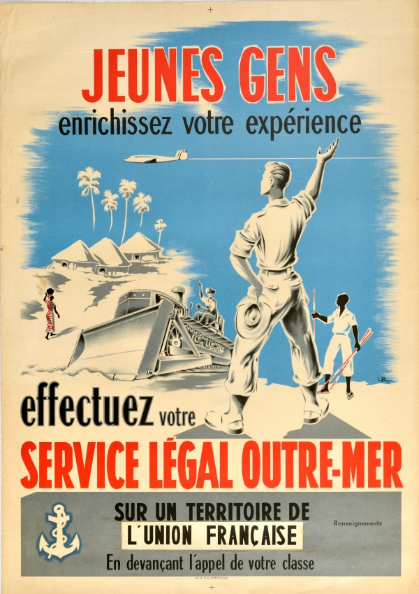
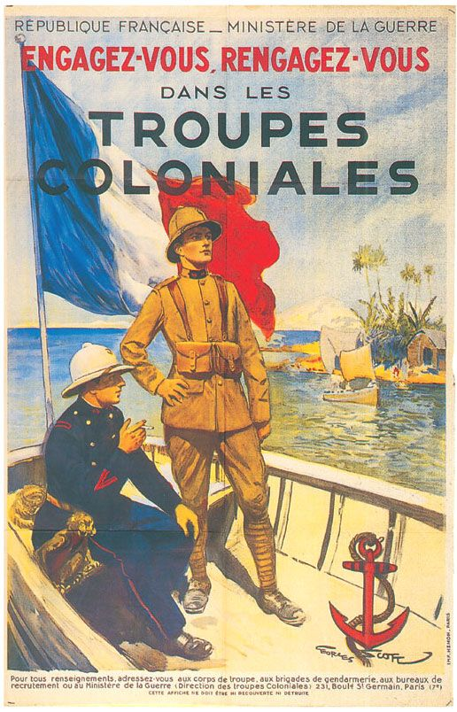
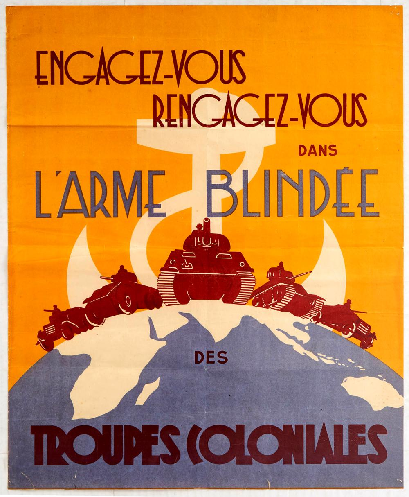
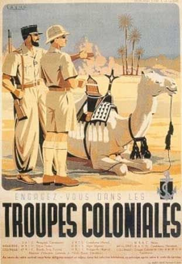
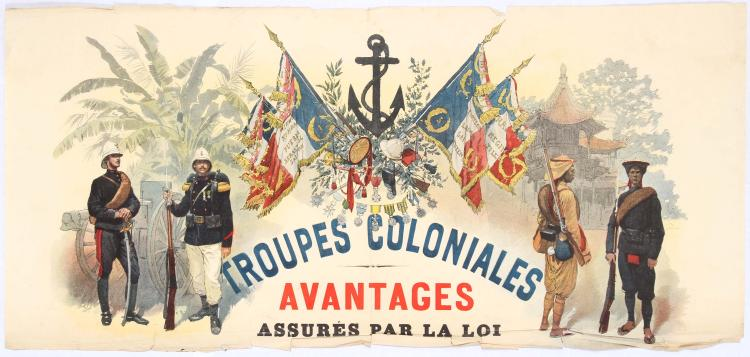

# Propagande coloniale

## Posters/images

- 
	- 1950s
- 
	- 1920s
- 
- 
- 

## Mots

- L'armée blindée = armored army
- Troupes = troops/forces
- Engagez-vous = join/commit

## Écriture

### Phrases

- Au premier plan, il y a
- En arrière plan, nous voyons
- Au centre,
- Du côté gauche/droite
- Faire la publicité/la pub pour
- Promouvoir
- Presuader/convaincre

### Poster

- Cette affiche montre comment les personnes qui ont rejoint l'armée française ont été récompensées.
- C'était dans le système, ils étaient récompensés par la loi.
- Sur la gauche il y a des soldats français
- et à droite il y a des soldats coloniaux.
- Les soldats sont de la même taille, mais ils sont seperaté.
- En arrière plan, nous voyons un bâtiment qui je pense sont des colonies de France.
- Au centre, il y a des drapeaux avec les couleurs français
	- Ils ont du texte et des symboles, mais ils sont flous.
- Aussi, il y a des médailles, qui montrent l'honneur que l'on peux gagner si vous rejoignez.
- L'affiche a été créée en 1920 qui est après la première guerre mondiale.
