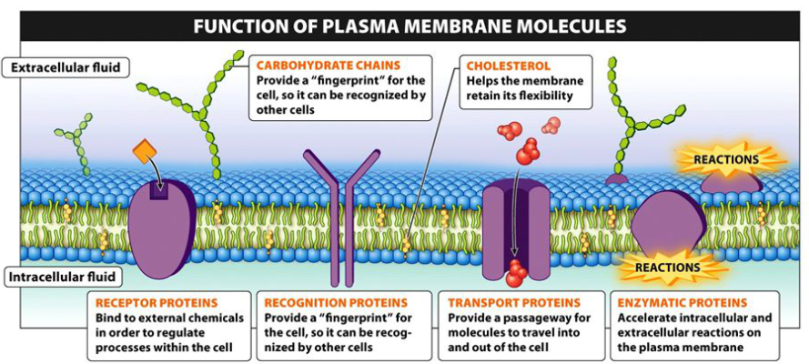
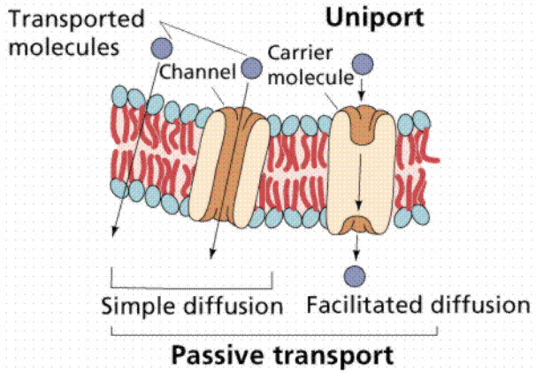
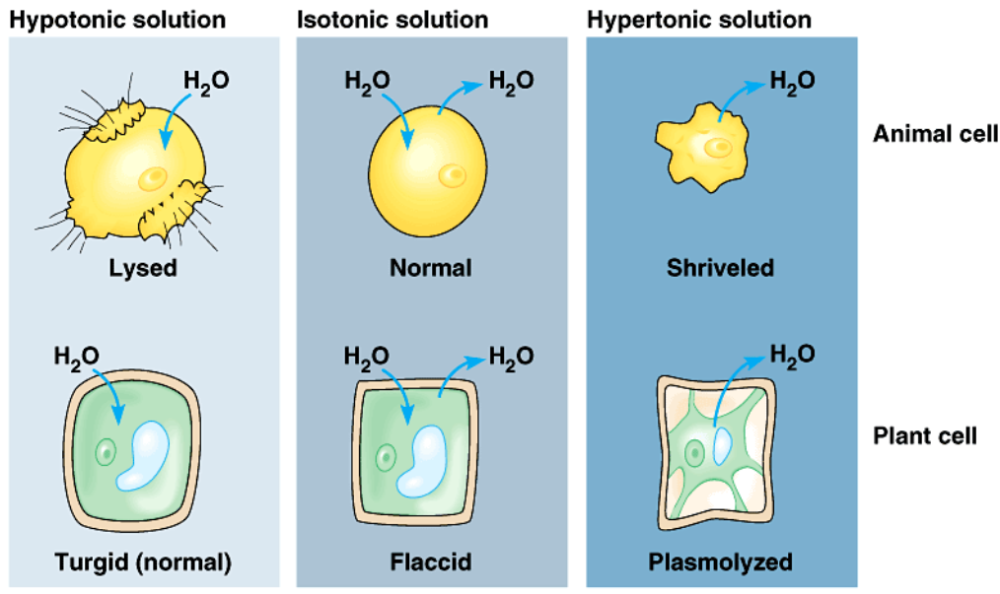

# Class Notes

## 8/19

- Structure/function relation starts are molecular level
    - 1 small difference in structure can impact the function
- Life requires only 25 of 100+ elements
    - 6 most common: SPONCH
        - Sulfur
        - Phosphorus
        - Oxygen
        - Nitrogen
        - Carbon
        - Hydrogen
    - Rest are called the trace elements
- Structure of atom:
    - Protons and neutrons in nucleus
    - Atomic number = number of protons
    - Atomic mass = protons + neutrons
    - Charge on proton: positive
    - Charge on electron: negative
    - Protons hold electrons by charge
        - Eletrons further away
    - Valence electrons: eletrons in outmost cell
    - Shells/orbits:
        - 2 eletrons in first
        - 8 eletrons in second
        - 8 electrons in third
    - **A filled valence shell is a happy shell**
        - Purpose of chemical reactions: fill valence shell
- Carbon
    - Atomic number: 6
    - Atomic mass: 12
    - Eletrons: 6
- Ionic bonds
    - Transfer of electrons
    - Example: NaCl
        - Na: 11 - 2, 8, *1*
        - Cl: 17 - 2, 8, *7*
        - The 1 from Na transfers to fill the 3rd shell of Cl
            - Na lost a negative: Na+
            - Cl gained a negative: Cl-
- Covalent bonds
    - Share electrons
        - Non-polar covalent bond: electrons shared equally
            - Example: O2
                - O: 8 - 2, *6*
                - Both O's share 2 electrons to fill the outer shell
        - Polar colavent bonds: not shared equally
            - Example: H2O
                - O has more electro negativity, shared more towards O

## 8/23

- Intra: within
- Inter: between
- Water:
    - Polar covalent bonds
    - O: slightly negative (δ-)
    - H: slightly positive (δ+)
    - Hydrogen bonds between O of one molecule and H of another molecule
        - Represented by a dotted line in diagrams
        - Ice less dense than water
    - Solid &rarr; liquid &rarr; gas = breaking hydrogen bonds
- Acid:
    - Chemical compound that **dontes** H+ to solutions
    - More acidic &rarr; higher [H+] &rarr; lower pH
- Base:
    - Chemical compound that **accepts** H+ from solutions
    - More basic &rarr; lower [H+] &rarr; higher pH
- `pH = 1/[H+]`
    - `pH 4 = 0.00001 = 10^-4 mol/l`

### Capillary action

- Water moves "shoots to roots"
- TACT:
    - **T**ranspiration: release of water through **stomata** in leaves
    - **A**dhesion: water molecules "stick" to the cells of **xylem**
    - **C**ohesion: water molecules "stick" to each other via **hydrogen bonds**
    - **T**ension: force created on a **pulling** object
- **Osmosis** moves water from soil &rarr; roots &rarr; xylem

## 8/24

- Isomers
    - Big, complex
    - Made from SPONCH
- Organic:
    - Carbon based
- From SPONCH
    - Carbohydrates (sugars, strarches)
    - Lipids and phospholipids (fats, oils, waxes, some steroids)
    - Proteins (enzymes and some steroids)
     - Nucleic acids (DNA, RNA)
        - MRNA: message RNA
        - DNA: the boss, sends info to RNA
        - RNA: makes the proteins
- Carbon
    - Tetravalent: 4 valence electrons
        - Compatible with many elements (especially SPONCH)
        - **Must form 4 covalent bonds**
    - Forms single of double bonds
 
### Diagramming

 - Single line: covalent bond
 - Double line: 2 covalent bonds
 - Red: oxygen
 - Black: carbon
 - White/grey: hydrogen
 - Blue: phosphate

### Functional groups

- Replace an H on the the carbon skeleton
- Can be polar or non polar

```
Hydroxyl group (alcohol) "-OH"
Carbonyl group (aldehyde or ketone) "C=O"
Carboxyl group (carboxylic acid) "-COOH"
    (H+ can break off - weak acid)
Amine group (amines) "-NH2"
Sulfhydryl group (thiols) "-SH"
Phosphate group "H3PO4"
```

## 8/26

- Four groups of macromolecules
    1. Carbohydrates
    2. Lipids
    3. Proteins
    4. Nucleic aicds
- Monomer
    - Relativly small molecule
    - Combine to make a polymer
    - Cellulose (a polymer) is made from 100s of glucose (monomer)
- Dehydration synthesis
    - "Building by losing water"
    - Monomer1 + Monomer2 &rarr; H2O + Polymer
    - Monomer1 loses OH (from OH), Monomer2 loses an H (from OH)
    - Monomer1 has covelant bond to O which has a covalent bond to Monomer2
- Hydrolysis
    - "Breaking apart by adding water"
    - Reverse of dehydration synthesis

### Carbohydrates

- CH2O (C and H2O)
    - Glucose 6(CH2O) &rarr; C6 H12 O6
- Monosaccharides
    - Monomers of carbohydrates
    - Glucose, ribose
- Disacharides
    - Di = two
    - Maltose, sucrose
- Polysaccharides
    - Poly = many (>2 = many)
    - Glycogen, cellulose, starch
- Glycosidic linkage
    - Bond between monosaccharides
    - `1-4 glycosidic linkage`: OH from carbon 1, H from carbon 4
- Two forms (sometimes): Alpha and Beta

### Lipids

- Fats, oils, phospholipids, steroids, waxes
- Two compoents that make up lipids
    1. One molecule of glycerol
    2. Up to 3 fatty acid tails
        - 3 tails: triacylglycerols
    - Connected by dehydration synthesis
- Nonpolar, hydrophobic
- Saturated vs unsaturated fats
    - Saturated: only single bonds
    - Unsaturated: at least one carbon-carbon double bond
        - Causes a "kink" or bend (not straight)

## 8/29

- Ester linkage
    - Bond between gylcerol and fatty acids (of lipids)
    - Bond formed by dehydration synthesis
- Phospholipid
    - Mixed: part hydrophobic, part hydrophilic
        - Polar 'heads' will always face the water
    - Replaced one fatty acid tail with a phosphate functional group
- Lumen of cell
    - Water outside of cell
    - Caused phospholipids to form two layers
        - Tails all point inward

### Proteins

- Amino acids: monomers of proteins
    - 20 total, differ in R groups
    - 20 'letters'
    - Polar/nonpolar/charged based on R groups
        - "-ine": usually nonpolar 
        - Carboxyl group can make something an acid (it can lose and H+)
- 4 levels of structure:
    - Primary: polypeptide chain
        - Sequence ('word') of amino acids (string of pearls)
            - Linked by dehydration synthesis
        - Peptide bond: between N of an amino acid and the carbonyl carbon of the other
    - Secondary
        - Alpha Helix
        - Beta pleated sheet
        - R groups of primary structures interacting 
    - Tertiary
        - Knotted slinky
        - Pulls the structure into knots
        - Most enzymes
    - Quaternary
        - More than one tertiary put together
- Can be denatured
    - Don't like high temperatures or low pH
    - Can't really be undenatured
    - Interput the shape and function
- Hemoglobin
    - Quaternary protein
    - Donut shaped
- Folding can affect function

## 8/30

### Nucleic acids

- Examples:
    - DNA
    - RNA
- Nucleotides: monomers

## 9/7

### Introduction to Cells and Membranes

- Cells
    - Organized
    - Seperated (phospholipid bilayer, etc)
    - Usally small: efficient
        - Surface area to volume ratio (bigger better)
- If it ain't broke, don't fix it
    - Evolve to keep working "mechanics"

### Domains of life

- Bacteria
    - Cyanobacteria, Heterotrophic bacteria
    - No nucleus
    - Ubiquitous (everywhere)
    - Symbotic relationships
- Archaea
    - Halophiles, Thermophiles
    - No nucleus
    - Ancient group of cells
        - First cells from here (likely)
        - Halophiles: salt loving
        - Thermophiles: heat loving
- Eukarya
    - Plants, Animals, Fungi, Chromists, Alveolates, Rhodophytes, Flagellates, Basal protists
    - Has nucleus

### Major cell types

- All cules:
    - Cell membrane
    - Ribosomes
        - Synthesize proteins
    - DNA
- Eukaryote
    - DNA in nucleus (chromosomes)
- Prokaryote
    - DNA in cytoplasm (losely coiled in cell)
    - No membrane bound organelles (no phosolipid bilayer)
    - Cell wall outside of cell membrane
        - Extra protection from environment
    - Flagellum
        - Used to move around
- Cloroplast and mitochondria
    - Chloroplast: photosynthesis
    - Mitochondria: cellular respiration
    - Own DNA seperate, cells within cells

### Microscopy

- Dissecting microscope
    - Lowest magnification
- Light microscope
    - 450x magnification
    - Needs to be plugged in
- Electron microscope
    - Best magnification
    - Emit radiation

## 9/12

- **Shared, conserved core features or processes**
    - Provde evience for *relatedness*, *evolution*
- What features do all cell have in common?
    - "Shared, conserved core *features*
- All cells carry out glycolysis
    - Shared *process*

### Eukaryotic cells

- Have a nucleus
    - DNA in nucleus
- Complex
- Some have cell walls
- Have plasma membrane
    - Phospholipid bilayer
- **Membrane-bound organelles**
- Some in tissues, some "solo"
- Sigma: "red eye spot"
    - Rods: light sensor

### Tour of cell

- Cells are small because outside stuff can only get into the cells through diffusion
    - Bigger Surface area:volume ratio = better
- Prokaryotic
    - No nucleus
    - Bateria
    - Archaea
- Eukaryotic
    - Has nucleus
    - Organelles
    - Plants, animals, fungi, protists

#### Eukaryotic organelles

- Nucleolus
    - Ribiosomes are assembles
- Nucleus
    - DNA
    - Control the cell: makes and directs the proteins
    - Has holes
- Ribosomes
    - Messenger RNA moves through
    - Builds proteins
- Rough ER
    - Ribosomes are attached
    - Protein synthesis
- Vesicle
    - Stores stuff
- Golgi body
    - Packages proteins
        - Modifies the proteins
    - "Post office"
- Cytoskeleton
    - Gives cell its structure
    - Like a bridge
        - Has supports (microtubal)
        - And the ropes connecting the supports to the road (microphilaments)
- Mitochondria
    - Powerhouse of the cell
    - Produce ATP
    - Cellular respiration
    - Has its own DNA
- Vacuole
    - In plants (mostly)
    - Stores water
- Smooth ER
    - Produces stuff that detoxifies the cell
- Lysosome
    - Suicide sack
    - Breaks itself or neighboring cells down

## 9/17

### Origin of Eukaryotic Cell

- Endosymbiont hypothesis
    - Endo: in (compared to outside)
    - Symbotic:
        1. Mutalalism: both benefit
        2. Commencialism: one benefit, one unaffected
        3. Parisitism: one benefit, one suffers for it
- For 1 billion years, only Archaea and Bateria cells

#### Energy converters

- Mitochondria
    - Cellular respiration
- Chloroplast
    - Photosynthesis
- Both:
    - Double cell membrane
        - Inner is bent/folded
            - Increase surface area
    - Have DNA (just not in nucleur)
    - Have ribosomes
    - Basically prokaryotes

#### Phagocytosis

- Phagocytosis: cell eating
- Began infolding of plasma membrane
    - Nucleus forms to help protect the DNA
- Could ingest energy converters
    - Endosymbiosis
    - The ingested cells get access to the cell's protection and resources
    - The cell no longer has to worry about energy as much
- 

### Structure and function of cell membranes

- Cell membrane = plasma membrane
- Phospholipid bilayer
- Proteins in the phospholipid bilayer
    - Allow hydrophilic/polar resources through the membrane
    - Like the phospholipids, they can have hydrophobic and hydrophilic parts
- Fluid mosaic model
    - Fluid:
        - Move
        - Proteins float in the phospholipid bilayer
    - Mosaic:
        - Made of many different smaller pieces
- Perpheral proteins
    - On the outside of the membrane
- Integral proteins
    - Transmembrane proteins
    - Go from one side of the membrane to the other
- Cholesterol
    - Makes the membrane more rigid
    - Helps keep the membrane from breaking
- Glycolipid
    - Directly attached to the phospholipid bilayer
    - Sugar attached to the lipid
- Glycoprotein
    - Sugar attached to a protein
    - Attached to a protein which is attached membrane



#### Transport proteins

- Integral proteins
- Provide a passageway for molecules to move through the membrane
    - Both in and out of the cell

#### Recogiition proteins

- Provide a "fingerprint" for the cell
- So it can be recognized by other cells

#### Receptor proteins

- Bind to external chemicals in order to regulate processes within the cell

#### Enzymatic proteins

- Accelerate intracellular and extracellular reactions on the cell membrane

## 9/21

Membrane transport

### Diffusion

- Passive transport: no energy required
- Movement of molecules from high to low concentration
    - End up fairly equally spread out
- Simple diffusion
    - If a molecule is small and nonpolar, it can diffuse through the membrane
    - If the molecule is big, it can't fit slip through the membrane, but can go through a channel
- Facilitated diffusion
    - If the molecule is big or polar, it might need help getting through the membrane
        - Goes through a carrier molecule
    - Uniport: one molecule going one direction
    - Symport: two molecules going one direction
    - Antiport: one molecule going one direction, a different going the other direction
- 

#### Osmosis

- Diffusion of water across a membrane
- Phospholipid bilayer is always in motion (fluid)
    - Gaps open
- Water is polar, but is small enough to slip through the membrane
- Aquaporin (protein in the membrane)
    - Water channel
    - Allows bulk flow of water across the membrane
        - In addition to the normal diffusion
    - Usually always open

#### Tonic

- Solvent: dissolver
- Solute: dissolved
- Distilled water: pure water (100% water)
- Tonic: solute
- Hypotonic: less solute outside the cell than inside the cell
    - Water will move into the cell
    - Cell will swell (and possibly burst, but not for plant cells)
- Isotonic: equal solute outside the cell than inside
    - No net movement of water (water moves in and out at the same rate)
    - Cell stays the same size
- Hypertonic: more solute outside the cell than inside
    - Water moves out of the cell
    - Cell shrinks
- 

### Active transport

- Requires energy (ATP)
- 

### Bulk transport

- Phagocytosis: cell eating
    - Cell membrane folds around the other cell
- Pinocytosis: cell drinking
    - Vesicle forms around a liquid
        - The vesicle temporarily merges with the cell membrane

# 10/4

## Mini intro/review quiz

1. How do you speed up a reaction?
    - Enyzmes
        - Biological catalysts
    - Add heat
2. What is a reactant, product?
    - Reactant: left side
        - What you start with
    - Product: right side
        - What you end with
3. What is a catalyst?
    - Speeds up a reaction
4. Two properties of catalysts
    - Not consumed in the reaction
    - Can be used over and over again
5. Whare are the monomers/building blocks of proteins?
    - Amino acids
6. How many protein monomers?
    - At least 20
7. 4 levels of protein structure?
    - Primary, Secondary, Tertiary, Quaternary
8. What is the primary structure of a protein?
    - The order/sequence of the amino acids
9. How are amino acids linked together?
    - Peptide bonds
10. What is amino acid R group?
    - The side chain
    - Go off the centeral carbon
11. Connect between R groups and formation of the teriary structure?
    - Form bonds between the R groups
        - Folds/knots the protein
    - Hydrogen bonds
    - Ionic bonds
    - Hydrophobic interactions
    - Disulfide bonds

## Metabolic pathways

- Metabolism
- Catabolic pathways
    - Break down molecules
    - Release energy
- Anabolic pathways
    - Build molecules
    - Require energy

## Thermodynamics

1. First law of thermodynamics
    - Energy can be transferred and transformed
    - It cannot be created or destroyed
2. Second law of thermodynamics
    - Entropy: disorder
    - Entropy tends to increase in the universe
- Exothermic
    - Cellular respiration
    - Breaking down (catabolic)
    - Releases energy
- Endothermic
    - Photosynthesis
    - Building up (anabolic)
    - Requires energy

## Energy

- Free energy: available energy
    - Energy that can be used to do work
- In **sponstaneous** reactions
    - Delta G < 0
- Using energy:
    - Gravitational motion
        - Potential energy
        - Took work to climb up a slide, then released the energy to go down the slide
    - Diffusion
        - Movement of molecules from high to low concentration
    - Chemical reactions
        - Breaking of bonds

## Enzymes

- Catalytic proteins
    - Speed up chemical reactions
    - But the reaction could proceed without enzymes
- 
- Usually tertiary structure
- Reduces **activation energy**
    - Energy needed to start a reaction
- Retain their structure (not consumed by the reaction)
- Specific to their substrate
    - Like a lock and key
    - Active site
        - Where the substrate fits just perfectly
- Require optimal conditions
    - Temperature
    - pH
    - Otherwise could unfold/denature

## Substrate specific

- Substrate(s) &rarr; product(s)
- Sucrase
    - Sucrose + H2O &rarr; glucose + fructose
- Naming is often based on the substrate
    - Sucrose &rarr; sucr**ase**
- Temporary bond between the enzyme and the substrate
    - Induced fit model
        - Enzyme changes shape slightly to perfectly fit with substrate
    - Substrate fits into the active site
        - Not perfect fit
        - Held in shape by hydrogen bonds
    - Substrate is now bound to the enzyme

# 10/7

## Enzyme regulation

- Allosteric site
    - Not the active site
    - But if something (allosteric effecteur) goes into a allosteric site, the shape of the active site changes
        - Can "shut off"/inhibite the active site and thus the enzyme
- Non-competitive (allosteric) inhibition
    - The inhibitor binds to the allosteric site
        - Changes the shape of the active site
        - Prevents the substrate from binding
    - Also part of the inhibitor could litterally block the active site
        - (But the inhibitor is binded on the allosteric site, not the active site)
- Competitive inhibition
    - The substrate competes with the inhibitor for the same active site
    - Litterally blocks the substrate from attaching to active site
- 
- Enzymes like optimal conditions
    - Usually don't like: high temperature, low pH
    - Salt concentration, and other environmental variables can also effect it
- Some enzymes are built, but require cofactors/coenzymes to turn on/activate/function
    - Cofactor
        - Inorganic (not carbon based)
    - Coenzyme
        - Organic
- Gene regulation
    - Don't build enzymes until they are needed
- Feedback inhibition
    - The product of a pathway inhibits an earlier enzyme in the pathway
    - Prevents the pathway from continuing
        - Prevents the cell from wasting energy/resources/space
    - 

# 10/19

## Photosynthesis

- Starts with the sun
- Autotrophs
    - Make their own food/energy
    - Photoautotrophs
        - Use light energy (the sun)
        - Often aquatic and terrestrial plants, protists, some bacteria
    - Chemoautotrophs
        - Use inorganic molecules
        - Often bacteria and archaea
    - Heterotrophs
        - Cannot make their own food
        - Must eat other organisms
        - Ex: humans
- 
- Plants do both photosynthesis and cellular respiration
    - Photosynthesis:
        - In chloroplasts
        - Light energy to chemical energy
    - Cellular respiration:
        - In mitochondria
        - Chemical energy to ATP
    - Radiant light &rarr; chemical energy &rarr; ATP
    - Humans only do cellular respiration
- Overall reaction:
    - 12(H2O) + 6(CO2) + light energy &rarr; C6H12O6 [glucose] + 6(O2) + 6(H2O)
    - Similar to the opposite of cellular respiration

## Visable light

- Shorter wavelength = higher energy (purple, 380 nm)
- Longer wavelength = lower energy (red 750 nm)

## Chloroplast

- Double membrane
- Was once a prokaryotic cell
    - Endosymbiotic theory
- 

## Where does photosynthesis occur?

- 
- Stoma (stomata)
    - Small openings in the leaf
    - Allows CO2 to enter and O2 to exit
    - Plant can also lose water through the stomata

## Oxidation and reduction

- Oxidation
    - Loss (transfer) of electrons
- Reduction
    - Gain (transfer) of electrons
- 

### Cycle

- 
- NADPH
    - Another energy carrier to ATP
    - Exists in the oxidized form in the normal pH of cells
        - NADPH &rarr; NADP+ (ox) by the calvin cycle
        - Hungry for electrons
            - NADP+ + 2e- + 2H &rarr; NADPH
- If the cell runs out of ATP or NADPH, it will stop the calvin cycle
    - The cell will store up ATP/NADPH from the sun and but the calvin cycle will run as long as there is ATP/NADPH

## Light dependant reactions

- Take place in the presence of sunlight
- Occur *within* the thylakoid and *across* the thylakoid membrane
- H2O is split
    - Releases O2 as waste
        - But it is used in cellular respiration
- ATP and NADPH are produced
- 
- Photosystems:
    - PS I
    - PS II
        - Comes before PS I
- 
- 
    1) P680 - wavelength 680
    2) Wavelength 680 is short enough (powerful enough) to split H2O
        - Releases electrons which are used to replace the 2e- that was "bounced" up
    4) Allows for the creation of ATP
        - ATP synthase embedded in the membrane
    5) P700 - wavelength 700
    - 

- Different types of chlorophyll:
    - Chlorophyll a
        - Found in all higher plants
        - Algae and cyanobacteria
    - Chlorophyll b
        - Found in higher plants and green algae
        - CHO instead of CH3
    - More types
        - If have a or b &rarr; kingdom plant

# 10/31

- `Anaerobic` respiration
    - No O2
    - C6H12O6 &rarr; CO2 + alcohol + energy
    - Most common in bacteria
        - Some don't do well in oxygen environments
- `Aerobic` respiration
    - C6H12O6 &rarr; CO2 + H2O + energy
        - CO2 + H2O = byproducts
    - More energy compared to anaerobic respiration
- Glycolysis
- Electron transport chain

# 11/7

## Cellular respiration

- 
- Gain more energy
- A cycle
    - Constant balance of spending and gaining energy
- 3 main pathways:
    - Glycolysis
    - Pyruvate oxidation
    - Krebs cycle
    - Oxidative phosphorylation

### Glycolysis

- Cytosol/cytoplasm
- 1x *glucose* &rarr; 2x *pyruvate*
- 2 ATP in, 4 ATP out, 2 NADH out
    - Net gain of 2 ATP
    - From substrate level phosphorylation
- ATP in:
    - Glucose &rarr; glucose-6-phosphate
        - Hexokinase
    - Fructose-6-phosphate &rarr; fructose-1,6-bisphosphate
        - Phosphofructokinase
- ATP out:
    - 2x *3-phosphoglycerate* &rarr; 2x *2-phosphoglycerate*
        - 1 ATP our per
    - 2x *phosphoenolpyruvate* &rarr; 2x *pyruvate*
        - 1 ATP our per
        - Pyruvate kinase
- NADH out:
    - 2x *1,3-bisphosphoglycerate* &rarr; 2x *3-phosphoglycerate*
        - 1 NADH our per

### Bridge reaction

- Pyruvate into the mitochondria matrix
    - Requires sufficient oxygen
- Pyruvate &rarr; acetyl CoA
    1. 1 CO2 out
    2. 1 NADH out
    3. Uses Coenzyme A ("CoA")

### Krebs cycle

- Mitochondria
    - Matrix
- Completes oxidation of organic fuel into CO2
    - Acetate from acetyl CoA + oxaloacetate &rarr; citrate
    - Oxaloacetate is recycled and acetate is broken down to CO2
- In:
    - Pyruvate from glucose
        - 2 per glucose
    - (CoA)
    - NAD+
    - FAD
    - ADP + Pi 
- Turns carbon bonds into energy and CO2
- Hyopxia = low oxygen
- Per pyruvate (2x for each glucose):
    - Bridge:
        - 1 CO2 out
        - 1 NADH out
    - Krebs:
        - 2 CO2 out
        - 3 NADH out
        - 1 FADH2 out
        - 1 ATP out
    - Result:
        - NADH and FADH2 &rarr; oxidative phosphorylation
        - CO2 follows gradient to go away
        - ATP (already used)

### Electron transport chain and oxidative phosphorylation

- 
- Mitochondria
    - The folds
    - Cristae
- ATP
    - Chemiosmosis (oxidative phosphorylation)
    - Only 4 without this
        - 2 from glycolysis and 2 from krebs
    - Most comes from energy in the electrons of NADH and FADH2
        - Powers moves H+ to power ATP synthase
- ATP synthase
    - Powered by H+ moving with the gradient
        - Works by spinning to turn ADP + Pi into ATP
    - "Oxidative phosphorylation"
    - NADH &rarr; 3ish ATP
        - 10 NADH &rarr; 30ish ATP
    - FADH2 &rarr; 2ish ATP
        - 2 FADH2 &rarr; 4ish ATP
- Oxygen = final electron acceptor
    - Oxygen will take electrons in any "form"
    - Electrons lose a bit of energy when they are passed down the chain to move H+

### Overall

- C6H12O6 + 6O2 + 6H2O &rarr; 6CO2 + 12H2O + energy
    - 60% of energy is released as heat
    - 34-36x (ADP + P &rarr; ATP)
- 

### Anaerobic respiration

- Glycolysis makes 2 ATP with (`aerobic`) or without (`anaerobic`) oxygen
- Without oxygen, various fermentation pathways generate ATP and recycle NAD+
    - Needs NAD+ to continue glycolysis
- Alcohol fermentation
    - Pyruvate into ethanol
    - 2x pyruvate &rarr; 2x acetaldehyde + 2x CO2 &rarr; 2x ethanol
- Lactic acid fermentation
    - Pyruvate is reduced directly by NADH into lactate
    - Muscle cells switch from aerobic to anaerobic respiration when oxygen is low
        - Creating "burning" sensation
        - Allows for a little more energy to be made
        - Latic acid eventually goes to liver
- Makes 2 ATP and 2 NAD+

# 11/9

- Only red blood cells have no mitochondria
- Skeletol muscle cells can to aerobic or anaerobic respiration
    - In case of emergency, they can switch to anaerobic respiration
- Latic acid makes muscles sore
    - Acidic (low pH)
    - Liver can convert it back into a sugar
- Pyruvate is a junction between glycolysis and the Krebs cycle or fermentation

## Glycolysis

- Glycolysis can accept a range of carbohydrates
    - Polysaccharides (starch, glycogen) can be hydrolyzed into glucose monomer
    - Other hexoses (fructose, galactose) can be modified to undergo glycolysis
- Protiens and fats can also enter respiratory pathways
- Carbohydrates, fats, and protiens can all be catabolized through the same pathways
- 

## Regulation of respiration

- Rate of cartabolism is regulated by participants and level of ATP
    - If ATP drops, catabolism speeds up to make more
- Control of catabolism is based on regulating activity of eznyzmes at points in catabolic pathways
- 

## Fermentation vs Respiration

- Fermentation
    - Glycolysis only
    - Cytoplasm
    - 2 ATP
    - Lactic acid or ethanol
- Respiration
    - Glycolysis + Krebs cycle + ETC
    - Cytoplasm + mitochondria
    - 36-38 ATP

## Photosynthesis vs respiration

- Photosynthesis
    - ATP from chemiosmosis
    - Not a lot of ATP
    - Builds G3P (for glucose)
    - Reactants: CO2 + H2O
    - Products: O2 + C6H12O6 + H2O
- Respiration
    - ATP from chemiosmosis
    - Aerobic and anaerobic to make ATP
    - Breaks down glucose
    - Reactants: C6H12O6 + O2
    - Products: CO2 + H2O

## Evolution of energy conversion

- Anaerobic respiration
    - Little ATP
    - No O2
    - Small heterotrophs
- Photosynthesis - PSI
    - Little ATP
    - Used sunlight
    - No PSII (no spliting O2 and no ETC)
    - No Calvin cycle (no sugar)
- Photosynthesis - PSII
    - ATP with sunlight
    - PSII (P680) powerful enough to split H2O
        - Electron transport chain
        - Released O2

## Photosynthesis

- Trophs:
    - Authotrophs
        - Photoautotrophs
            - Use light/solar energy
        - Chemoautotrophs
            - Use chemicals (deep sea vents)
    - Heterotrophs
        - Eat other organisms
    - Detritivores
        - Eat dead organisms
- Visible light: 380-750 nm
    - Shorter wavelengths have more energy
- Chloroplast
    - Like mitochondria, likely evolved from a prokaryote
        - Own DNA
        - Double membrane
    - Have stacks of thylakoids (grana)
    - Stroma space between thylakoids
    - Stomata are like the mouth of the chloroplast
        - Open and close to let CO2 in and O2 out
        - Guard cells control stomata
            - Careful to not let too much water out
            - Must loss some water (transpiration)
- Equation:
    - 6CO2 + 12H2O + light energy &rarr; C6H12O6 + 6O2 + 6H2O
    - Endergonic (sunlight added)
    - Similar to respiration
        - The opposite
- Redox:
    - OIL RIG
        - Oxidation is loss of electrons
        - Reduction is gain of electrons
    - Reducing agent is the electron donor
    - Oxidizing agent is the electron acceptor
- 6CO2 for 1 glucose
- C3 Plants
    - Rice, wheat, soy
    - "Regular plants"
        - No counter photorespiration
    - Hot days: stomata close
        - CO2 used, O2 builds up
    - Cooler nights: stomata open
- C4:
    - Sugarcane, corn
    - Light and dark reactions physically separated
        - Calvin cycle occurs in chloroplasts located in bundle sheath cells (near leaf veins)
            - Bundle sheath cells area has no affinity for O2
    - Plant adaptation to outcompete C3 plants in bright/dry conditions
- CAM:
    - Cactus, succulents, pineapples
    - Light and dark reactions are seperated by time
        - Plants collect and store CO2 in the nighttime and use it during the day without opening stomata
            - CO2 converted to something else
    - Plant can survive in hot/dry conditions
- Photorespiration
    - Wasteful pathway that occurs when the Calvin cycle enzyme rubisco acts on oxygen rather than carbon dioxide
    - Happens more when stomata are closed
        - O2 build up
    - The majority of plants are C3 plants, which have no special features to combat photorespiration
    - C4 plants minimize photorespiration by separating initial CO2 fixation and the Calvin cycle in space, performing these steps in different cell types
    - Crassulacean acid metabolism (CAM) plants minimize photorespiration and save water by separating these steps in time, between night and day

# 11/15

- DNA stuff
- ON GOOGLE DOC

# 11/16

## Mitosis and the cell cycle - Chapt 12

- Cell division purposes:
    - Create new organiisms
        - Prokaryotic and unicellular cells
    - Reproduction
    - Growth and development
    - Tissue and renewal and repair
- Mitosis is part of cell division
- Gametes
    - The germ/reproductive cells
    - 1/2 DNA (1N)
- Genome
    - A cell's entire collection of DNA
    - Entire genetic library
- Somatic cells
    - Body cells
        - All cells but reproductive cells
    - 2N - diploid
- Chromatin
    - Complex of DNA and proteins that make up eukaryotic chromosomes
    - Uncoiled DNA
- Chromosome
    - Long DNA molecule + proteins (histones)
    - Highly coiled and compact
    - Visable during mitosis
- 2 types of cell division
    - Mitosis
        - DNA replication &rarr; division
        - Diploid &rarr; 2 identical diploids
    - Meiosis
        - Only makes gametes
        - DNA replication &rarr; division &rarr; division
        - Diploid &rarr; 4 haploids (gametes)
- Mitosis vs cytokinesis
    - Mitosis
        - Nuclear division after DNA replication resulting in 2 identical genomes
        - 5 stages
    - Cytokinesis
        - Division of cytoplasm to form 2 seperate daughter cells
        - Occours after mitosis or meiosis
- The cell cycle
    - [Cell Cycle](./Photos/CellCycle.png)
    - Interphase
        - G1
            - Gap of growth phase
            - Prepare cell for DNA replication
        - S
            - DNA synthesis
        - G2
            - Prepare for mitosis

# 11/28

- DNA &rarr; (transcription) RNA &rarr; (translation) protein
    - mRNA
    - Nucleotides &rarr; Nucleotides &rarr; amino acids
- DNA does not leave the nucleus
    - Needs ribosomes to make protein (and they are not in the nucleus)
        - Need to build a messenger molecule: mRNA (transcription)
    - The mRNA is "read" for polypeptide chains (proteins) to be assembled on ribosomes
- 
    - Note the 5' to 3' RNA while the DNA is 3-5

## RNA

- RNA is ribonucleic acid
    - DNA is deoxyribonucleic acid
- It contains ribose instead of deoxyribose
    - DNA has 1 less oxygen
- It is typically a single-stranded molecule
- It has URACIL instead of THYMINE

## Genetic code

- The Triplet Code:
    - Three-letter "words" on the DNA
    - CODON: on mRNA
    - ANTICODON: on tRNA
        - Pattern that is the opposite of the codon on the mRNA
- Appropriate amino Acids are biochemically attracted to the other end of the tRNA

### Important codons ("words") on mRNA

- Start: AUG
- Stop: UAA, UGA, UAG

## Transcription

- Occurs in the **nucleus**
- **RNA polymerase** opens DNA to expose a gene
- A gene is simply a “recipe” of a long sequence of DNA base-pairs
- DNA is opened at the **promotor** region
- The gene ends at the **terminator** region
- Therefore, mRNA is made by literally copying the gene
    - Complementary copy
        - Ex: C &rarr; G
- Before the mRNA can leave the nucleus, finishing touches must be made
- 3 phases of transcription:
    - Initiation
        - RNA polymerase binds to the promotor region
        - RNA polymerase unwinds the DNA
        - RNA polymerase begins to make a complementary copy of the gene
    - Elongation
        - RNA polymerase continues to make a complementary copy of the gene
    - Termination
        - RNA polymerase reaches the terminator region
        - RNA polymerase releases the mRNA
        - mRNA leaves the nucleus
- 
    - Note the 5-3 directions
        - The DNA side that is "read" to make the RNA (template strand): *antisense*
            - The RNA is complementary to the "read" strand
            - The other strand (nontemplate strand) is the *sense* strand (or coding strand)
                - Because the RNA is identical to the coding strand (other than T &rarr; U)
- Initiation of transcription for a  eukaryotic promoter:
    - 
- 
    - RNA nucleotides from what you eat or from recycled RNA
    - Direction the RNA is reading from: downstream

### mRNA

- 
    - Pic: after it is assembled and processed
- Special ends to slow down degradation
    - 5' Cap: G + 3 phosphates (methylguanine)
    - Poly-A tail: "buffer" of As
    - mRNA is temporary
        - Created when needed and should be destoyed when its down
        - But still should last long enough for translation
- Processing the mRNA transcript
    - Adding the methylguanine cap and Poly-A tail

#### pre-mRNA (primary transcript, "rough draft")

- DNA &rarr; pre-mRNA &rarr; mRNA
- 
    - Exon: 'ex' = expressed = viewed = used
    - The same DNA will make the same pre-RNA
    - This step allow the same DNA to be used to make multiple different mRNA (and thus multiple different proteins)
- 
    - The intron pieces are not used for translation
        - Are sent away to be recycled
    - Finished mRNA is sent to the cytoplasm for translation
    - snRNPs: small nuclear ribonucleoproteins 

## Translation

- 
- 3 sites within the ribose:
    - E: *e*xit
        - "Empty" tRNA leaves
            - "Drops off" the amino acid
    - P: binding (*p*eptidylt-tRNA binding site)
        - Where the *p*olypeptide chain is being build
    - A: entry (*a*rrival)
        - Single amino acids come in
- Codons: "3 letter words"
- Ribosome uses all 3 types of RNA:
    - mRNA: messenger RNA
        - "Instructions" for the protein
    - tRNA: transfer RNA
        - Transfers amino acids
        - The type of tRNA used in translation can only hold on to a single amino acid
            - The amino acid depends on the tRNA (anticodon)
            - Charging the tRNA:
                - 
                    - The 3 dangling bits on the tRNA are the anticodon
                - Uses ATP to build it
                    - The energy is released when the amino acid is broken off at A site
    - rRNA: ribosomal RNA
        - Make up ribosomes
- 
    - Starts reading from the 3' side

### Initalization of Translation 

- 
- Ribosome attaches to the start codon (AUG) of the mRNA
- An initiation complex forms where the small subunit combines with mRNA, and initiator tRNA attaches with its amino acid

### Elongation of Translation

- 
- Endergonic
    - Requires energy to slide to read the next codon ("word")

### Termination of Translation

- 
1. Stops at an mRNA stop codon by the binding of proteins
    - Release factors: the last tRNA does not carry an amino acid, but these special proteins instead
        - Is unable to "pick up" the polypeptide chain that is built at the P site
2. The last tRNA is released from the ribosome and everything separates
    - Ribosome subunits break and are recycled
3. New polypeptide (protein) is released

### Overview of Translation

- Occurs in the cytoplasm & on ribosomes
- mRNA attaches to the ribosome
- INITIATION
    - “Start” codon is read
- ELONGATION
    - One at a time, amino acids are brought over to ribosomes by specific tRNA’s
    - Amino acids covalent bond to one another forming a polypeptide chain
- TERMINATION
    - A “stop” codon is read & terminates the process

## Transcription and translation overview

- 
- Triplet (DNA) &rarr; codon (mRNA) &rarr; anticodon (tRNA) &rarr; amino acid

# 11/29

## 5' and 3'

- DNA and RNA are *made* in its 5' to 3' direction
- The template strand *read* in its the 3' to 5' direction

## Eukaryotic vs. prokaryotic protein synthesis

- Prokaryotes don’t have nuclei, so they need not wait for mRNA to exit the nucleus
- Very little RNA processing in prokaryotes, so mRNA is translated very quickly
- Ribosomes attach to mRNA and protein synthesis begins before transcription is complete
- Both:
    - Many copies of the proteins can be made at a time from the same mRNA
        - Once one ribosome has moved along the mRNA, another can attach and do the same
        - Example - polyribosomes:
            - 
- 

## Mutations

- 
- Mutation: any change in the nucleotide sequence
- Transposable elements
    -  "jumping genes"
    - Sequences that move from one location on the genome to another
- Cause of mutations:
    - Radiation
        - Ex: from UV, x-rays, gamma rays, beta rays, etc
    - Carcinogens
        - Cancer causing agents
            - Spreads the mutations
        - All carcinogens are mutagens
        - Metastasis: the development of secondary malignant growths at a distance from a primary site of cancer
- Mutagen: something that causes/increases mutations
- Cells most at risk: those that divide more often
    - More chances to make a mistake
    - Ex: skin cells

### Point mutations

- 
- "Point": just thing 1 is changed/substituted
    - If it is on the DNA, then it will last and effect all the mRNA that is made from it
    - If it is on the mRNA, it only effects the proteins made on that 1 batch of proteins made from that mRNA
- Mutations occurring in DNA often show up during translation
- Base-pair substitution
    - A type of mutation involving replacement or substitution of a single nucleotide base with another in DNA or RNA molecule
        - 1 base is swapped for another
- **Wobble effect**:
    - During translation, often only the first 2 bases of the codon are used
        - 4^3 = 64, but only 20 amino acids
    - So, in many cases, if the 3rd base is changed, it could have no effect
- Missense: (a stop codon or an amino acid) &rarr; a different amino acid
- Nonsense: an amino acid &rarr; a stop codon

#### Sickle cell

- 
- Some (point mutation &rarr; amino acid switches) are not critical
- But in this example, the change is in an important structural part of the protein
    - Folds and shapes differently
        - Structure determins function

### Frameshift mutations

- 
- Insertion/deletion causes a **frameshift**
    - DNA and RNA is read in "frames"
        - 3 bases at a time
    - Adding or deleting 1 base will offset all the remaining bases
        - Could change all the amino acids
- If you delete or add a multiple of 3 bases, then there will be deleted or added amino acids
    - But the rest of the polypeptide chain will be unaffected

## Meiosis

### ASEXUAL REPRODUCTION

- 
- 
- One parent alone produces offspring
- Offspring inherits same # of chromosomes (& genes on it)
- Theoretically, the offspring is a “clone” of its parent
- Binary fission
- Basically mitosis & cytokinesis (for eukaryotes)
- Gets genetic variation from mutations

### SEXUAL REPRODUCTION

Involves:
- Meiosis
- Production of gametes
    - Sex cells: sperm and egg
    - Haploid: 1 set of chromosomes
- Fertilization

### The Human Genome

- 23 pairs of chromosomes
    - Pairs 1-22: AUTOSOMAL chromosomes
        - 1 = biggest, 22 = smallest
    - Pair 23: SEX chromosomes
- Paired chromosomes-”HOMOLOGOUS” chromosomes
    - Homologous: relatively same size & shape
- Pair 23 different for males
    - Not homologous in males

### MEIOSIS

- 
- Occurs in germ cells
    - Germs cells (& somatic cells) are DIPLOIDS (2n)
        - For humans 2n = 46
    - Germ cells undergo meiosis to form gametes (sperm & egg)
- DIPLOID (2n) &rarr; HAPLOID (1n)
- 2 sets of cell division:
    - Meiosis I
    - Meiosis II

#### Meiosis I

- 
- 4 stages: 
    - Prophase I
        - Same as mitosis + some other steps
        - Synapsis: homologous chromosomes pair up
            - Homologous = similar/matching
                - Have same gene in same location (but not necessarily same alleles)
            - Tetrad: 4 sister chromatids
                - 2 homologous chromosomes
        - Crossing over: homologous chromosomes exchange/swap genetic material
            - Happens only on "inside" chromatids
                - Will retain 1 unaltered chromatids
            - Creates genetic variation
    - Metaphase I
    - Anaphase I
    - Telophase I
- 1x Diploid (2n) &rarr; 2x Haploid (1n)
    - Double the number of chromosomes

#### Meiosis II

- 
- Basically the same as mitosis
- 4 stages: 
    - Prophase II
    - Metaphase II
    - Anaphase II
    - Telophase II
- 2x Haploid (1n) &rarr; 4x Haploid (1n)
    - Split sister chromatids
- At the end of meiosis II, four daughter cells are produced
    - Each of these resulting daughter cells is haploid

# 11/30

## Meiosis

### Mitosis vs. Meiosis

- 
- Similar
    - Both started with diploid cells
        - In humans: 46 chromosomes
    - Both make new cells (and divide)
    - Similar prophase, metaphase, anaphase, telophase, cytokinesis
- Different
    - Mitosis: 1 cell &rarr; 2 diploid cells
        - Meiosis: 1 cell &rarr; 4 haploid cells
    - Mitosis: daughter cells are identical to parent cell
        - Meiosis: daughter cells are not identical to parent cell or each other

### Independent assortment

- 
- During meiosis I, homologous chromosomes line up randomly
- Independent assortment
    - The way one chromosome lines up has no effect on the way the other chromosome lines up
```
n = number of pairs of chromosomes
2^n = number of possible combinations just by independent assortment
humans: 2^23 = 8,388,608
but because 2 people are involved it is actually (2^23)^2
and there is almost infinite possible cross over combinations
result: basically infinite possible combinations
```

### Crossing over

- 
- During prophase I, homologous chromosomes exchange genetic material
- Crossing-Over
    - Occurs when homologous chromosomes “cross-over” one another and “swap” some DNA
    - Leads to variation in gametes

### Gametogenesis

- 
- Females are born with them, but males constantly make them
- Oogenesis
    - Unequal
        - 1 egg with a lot of cytoplasm and 3 small discarded polar bodies
    - Only 1 sperm can fertilize the egg
        - 
        - Sperm + egg = zygote

##  Chromosomes vs chromatids

| | Chromosome | Chromatid | |
| :-: | :-: | :-: | :- |
| G1 | 2n | 2n | interphase status - chromatids = chromosomes |
| G2 | 2n | 4n | replicated the DNA | 
| After M1 | n | 2n | split into 2 haploid daughter cells (+ cross over happens) |
| After M2 | n | n | sister chromatids split into 2 haploid daughter cells |

# 12/7

## Gene Regulation

- Is the gene affecting stuff?
    - Is it expressed?
- Some cells have common genes
    - Some cells have unique genes

### Bacterial Reproduction

- No meiosis occurs and there is no fertilization
- Sometimes bacteria reproduce via cloning (like mitosis) or asexual means
    - Makes exact copies
- But if bacterial DNA is changed, there are four ways:
    - Mutation, transformation, transduction, or conjugation

#### Bacterial Transformation

- The alteration of a bacterial cell’s genotype and phenotype by the uptake of naked, foreign DNA from the surrounding environment
    - Genotype:
        - The alleles of a gene
            - What version of the gene
        - Ex: "Bb"
            - (Think the punit squares from 7th grade)
    - Phenotype:
        - Expression of the gene
        - Ex: blue eyes
- When bateria die, the cell wall decays and the cytoplasm sort of leaks out
    - Other living bacteria can take up the DNA
        - "Slurps" it up
- 

#### Bacterial Transduction

- Phages carry bacterial genes from one host cell to another
    - Phages:
        - Viruses that infect and replicate only in bacterial cells
- The phages covelantly bond (chemically attracted)
    - The viruses use bateria to reproduce
    - The bateria explodes and the viruses are released and spread
    - However, sometimes the host DNA from the bateria is also spread
        - Packaged with (or instead of) the virus
- 

#### Bacterial Mutation

- Mutations occur at the same rate as in humans
    - But they reproduce much much more than humans
        - Up to once every 20 minutes

#### Bacterial Conjugation

- Direct transfer of genetic material between two bacterial cells that temporarily join
- Under some conditions, certain bateria will form a Pilus
    - The bateria sends partial copies of its DNA across
- Random:
    - What DNA is is copied and sent
    - How long the connection remains
- 
    - Baterial DNA is in rings
        - 1 big main ring and smaller rings of extra DNA(plasmids)
- 
    - F: fertility
        - F+ = can transfer DNA
        - F- = cannot transfer DNA
    - R: resistance
        - Survival of the fittest
            - Bateria that can survive the antibiotic will survive and reproduce

### Gene Control

- Why is it important to be able to control the expression of genes?
    - 
- Regulatory Proteins
    - Intervene before, during & after gene transcription
    - Some genes build proteins that regulate other genes
    - Negative Control: “repressors”
        - Slows activity – typical of anabolic pathways
    - Positive Control: “activators”
        - Promote or enhance activity
            - Initiate certain actions/genes
        - Growth factors
        - Examples of positive control:
            - Promotors-signal start of a gene
            - Enhancers-binding sites for activator proteins

#### Gene Control in E. coli

- Genes are typically grouped together in succession
    - Only 1 chromosome (compared to 23 in humans)
- Promoter Region:
    - RNA polymerase must attach here to start transcription
- Operator Region:
    - Near promoter region, site for controlling transcription
- Operon:
    - Promoter, operator, and associated genes
    - Ex: TRP, LAC
- Regulatory Gene:
    - Codes for the repressor protein
- Repressor:
    - Blocks transcription by binding to the operator region (ex. tryptophan)
- 3 Important genes in LAC operon:
    - Lac Z &rarr; ß-galactosidase
    - Lac Y &rarr; Permease
    - Lac A &rarr; Transacetylase

# 12/8

## Operons

### TRP operon

- TRP: tryptophan
    - An amino acid
- Represible operon: on until turned off
- 
    - Something &rarr; enzymes &rarr; tryptophan
    - Feedback inhibition
        - Stop when enough tryptophan is made

#### TRP Operon: On

- 
- Repressor protein binds to the operator
    - Blocks RNA polymerase from binding/moving forward
- Repressible operon
    - Transcription is usually on but can be inhibited if tryptophan binds to a regulatory protein
- Takes energy to build it
    - So only build it when wanted
    - Anabolic pathway (building something)

#### TRP Operon: Off

- 

### LAC Operon

- LAC: lactose
    - A sugar
- Inducible operon: off until turned on
    - Is usually off but can be induced when a specific molecule interacts with a regulatory protein
    - Catabolic pathway (breaking something down)
        - Turned on when trying to digest something

#### LAC Operon: Off

- 

#### LAC Operon: On

- 

## Operon summary

- Repressible enzymes
    - Suspend production of an end product when it is in sufficient quantity
        - Normally “on” (tryptophan pathway)
            - On until turned off
    - These enzymes are typical of anabolic pathways
        - Saving energy by not producing products that are already present
- Inducible enzymes
    - Their synthesis is induced by a chemical signal
        - Normally “off” (lactose pathway).
            - Off until turned on
    - These enzymes are typical of catabolic pathways
        - Saving energy/resources and not producing proteins that are not currently necessary
- Both are examples of negative control of genes
    - The operons are switched off by the active form of the repressor protein

### Eukaryotic gene expression is regulated at many stages

- All organisms must regulate which genes are expressed at any given time
- In multicellular organisms regulation of gene expression is essential for cell specialization

## Differential Gene Expression

- Almost all the cells in an organism are **genetically** identical
    - Somatic cells
- Differences between cell types result from **differential gene expression**
    - The expression of different genes by cells with the same genome
- Abnormalities in gene expression can lead to diseases including cancer
- Gene expression **can be** regulated at many stages

### Regulated/changed/etc at different places, times

- 
- 
- Alternative splicing
    - Rearranging the exons in the pre-mRNA

## Effects on mRNAs by MicroRNAs and Small Interfering RNAs

- MicroRNAs (miRNAs) are small single-stranded RNA molecules that can bind to mRNA
    - Match base pairs (like codon-anticodon) but instead block the mRNA from being translated
    - Or speed up the degradation of the mRNA
- Another way of regulating and changing the expression from DNA &rarr; protein
- 
- The phenomenon of inhibition of gene expression by RNA molecules is called RNA interference (RNAi)
- RNAi is caused by small interfering RNAs (siRNAs)
- siRNAs and miRNAs are similar but form from different RNA precursors
    - Both can associate with the same proteins, resulting in similar results

## Genetic changes that can turn proto-oncogenes into oncogenes

- Proto-oncogenes
    - Normal genes that can become oncogenes if mutated
        - Tumor, unregulated cell growth/division
    - Rapid cell division
        - Important for growth and development
- 

### Oncogenes and the Cell Cycle

- Proto-oncogene vs. oncogenes
    - Proto-oncogens: regulated
    - Oncogenes: unregulated

#### RAS

- RAS gene makes RAS protein
    - A class of small protein called GTPase involved in cellular signal transduction
    - Normally “off” without proper growth factor
- Mutations in RAS gene keep signaling active, resulting in overactive cell growth and division
- 30% of all human cancers have Ras mutations and inhibitors are being studied
- 
    - Growth factor: signal to start cell division
        - Ex: cut on skin &rarr; make more skin cells
    - RAS mutations cause the cells to ignore the check points
        - Allows the creation of bad cells (at a high rate)

#### p53

- The p53 gene codes for a tumor suppressor protein
- Anti-cancer functions
    - Inhibiting cell cycle at the G1/S checkpoint if DNA is damaged and can be repaired
    - Can initiate apoptosis if DNA cannot be repaired
- Mutation(s) in p53 can allow damaged DNA to be passed to daughter cells during mitosis
    - HPV (human papilloma virus) can inactivate p53, leading to cervical cancer (e.g., Henrietta Lacks)
- 

## The Multistep Model of Cancer Development

- Multiple mutations are generally needed for full-fledged cancer
    - Thus the incidence increases with age
- At the DNA level, a cancerous cell is usually characterized by at least one active oncogene and the mutation of several tumor-suppressor genes
    - Too much gas and no brakes

### Inherited Predisposition and Other Factors Contributing to Cancer

- Individuals can inherit oncogenes or mutant alleles of tumor-suppressor genes
    - Ex: inherited mutations in the tumor-suppressor gene adenomatous polyposis coli are common in individuals with colorectal cancer
    - Ex: Mutations in the BRCA1 or BRCA2 gene are found in at least half of inherited breast cancers and ovarian cancers can be tested for using DNA sequencing to detect these mutations

## Evolution

- Natural selection does not design, it tinkers
- Once a particular problem is solved, that solution is used over and over
- The harder the problem, the more universal the solution is

## Cell Signaling

- Signaling evolved early in history of life
1. “sex” and yeast mating strains
    - Cells cannot think
2. signal-transduction pathways
    - Process by which a signal on a cell’s surface is converted (probably originated in early prokaryotes)
- 
    - Mom and dad combine

### Communicating cells may be close together or far apart

1. Paracine signaling
    - Short distances
    - Growth factors – non-specific)
2. Synaptic signaling
    - Short distances
    - Neurotransmitters – specific
    - Synapse: junction between two neurons
3. Hormone signaling
    - Long distances
4. Direct contact
    - Gap junctions (animals) and plasmodesmata (plants)
        - Spaces in the cell membrane/wall
    - Cell-to-cell communication
        - Some cells "dock" with other cells
            - Specific receptors
    - 
- If a cell responds to a signal, it is called a target cell
- 

### Stages of Cell Signaling

- Role of epinephrine in the breakdown of glycogen
    - Fight or flight response
- 
1. Reception
    - Target cell’s detection of outside signal
    - Conformational change in reception protein when a signal binds
        - Signal is often attracted to the reception protein
            - Chemical or charge based
2. Transduction
    - Conversion of signal to a form that can elicit a response
3. Response
    - Transduced signal triggers a specific response
        - Ex: epinephrine released to promote conversion of glycogen to glucose
            - Glycogen is in 100s-1000s of stored glucose molecules

#### Signal Reception and Transduction

- Signal binds to reception protein
- “Lock and key” specificity
    - "Structure determines function"
    - Reception protein is specific to the signal
- Ligand: a small molecule that specifically binds to another larger one
    - Doesn't last long
        - Don't want signals from years ago
            - Should be a quick reaction
    - Ligand binding results in change in shape of reception protein

### Types of Signal Receptors

1. G-protein linked receptors
2. tyrosine-kinase receptors (omit, not really important rn)
3. ion channel receptors
	- ligand-gated ion channels
	- example: synapses between neurons
4. Intracellular receptors
	- proteins located in cytoplasm or nucleus (in the cell), not membrane
	- e.g. lipids, steroid hormones
        - Things that can move through the cell membrane (diffusion)

#### G-protein linked receptors

- G-proteins embedded in cell membranes
- Many molecules use G-protein receptors
    - Yeast mating factors, epinephrine, hormones, and neurotransmitters
- Involves use of GDP and GTP
    - GDP: inactive
    - GTP: active

##### What G-proteins receptors do 

- Molecule binds to outside portion of receptor
- Either binding of molecule or subsequent change in molecule changes shape of receptor
- Shape change inside membrane changes association with a specific G-protein
- The G-protein goes off and does its job, whatever that might be
- 
    - If the GDP is on the G-protein, it is inactive ("off")
    - Signled to be active ("on") by the binding of GTP
    - G-protein goes to an enzyme and activates it
        - The enzyme then does its job
    - GTP replaced with GDP and the G-protein is inactive again
        - Goes back to the receptor and waits for another signal

##### Examples of how G-protein receptors are used

- Transduce light (photosynthesis and phototaxis)
- Receptors for sexual pheromones 
- Identify safe food
- Directional migration of cells
- Identify invaders
- Identify members of clan
- Receptors for peptide hormones
- Detect everything you smell

#### Ion channel receptors

- 

#### Intracellular receptors

- 

### Signal Transduction Pathways

- Pathways involve protein interaction
- Protein phosphorylation (gets a phosphate)
	1. mechanism for regulating protein activity
	2. involves protein kinase
        - An enzyme which transfers phosphate from ATP to protein
	3. results in a cascade of reactions
- 2% of human DNA codes for kinases
- 

# 1/6

- Heritable features: ”characters” - genes
- Variations of characters: ”traits” - alleles

## Terms

- Dominant (P_) vs. Recessive (pp): Complete Dominance
- Homozygous (PP or pp)
- Heterozygous (Pp)
- Phenotype (physical appearance of traits)
- Carrier: have but not expressed
- Genotype (actual alleles)
- Testcross (unknown genotypes- used to determine alleles)
- Dihybrid cross (looking at 2 traits)
- Incomplete Dominance (FRFW-pink flower)
- Codominance (FBFY-blue w/ yellow blotches)

## Breeds

- True-breeds: 2 copies of same allele
    - Different version of a gene
- Hybrids: Results when you cross 2 different true-breds
- 
- 
- 

## Dihybrid Crosses

- Two genes/traits involved

### Phenotype Ratios

| | S | s |
| :-: | :-: | :-: |
| S | SS | Ss |
| s | Ss | ss |

- In monohybrid crosses: 3:1

| | SY | sY | Sy | sy |
| :-: | :-: | :-: | :-: | :-: |
| SY | SSYY | SSYy | SsYY | SsYy |
| sY | SsYY | SsYy | ssYY | ssYy |
| Sy | SsYY | SsYy | ssYY | ssYy |
| sy | ssYY | ssYy | ssyy | ssyy |

- In dihybrid crosses: 9:3:3:1


## Mendel's Second Law

- The Principle of Independent Assortment
- Each pair of alleles segregates independently of each other pair of alleles during gamete formation
    - Rules apply only to genes on different chromosomes
- Heredity is determined by discrete physical elements for each trait (genes)

## Allele interactions

- Not always just dominate vs. recessive
- Incomplete dominance
    - Offspring have an intermediate (mixed) phenotype
    - Ex: Red (dominant) flower + white (recessive) flower = pink (incomplete dominance) flower
    - Notation:
        - (traitLetter)^(traitStatus)
    - Ratio: 1:2:1
        - Phenotypic ratio = genotypic ratio
- Codominance
    - Both alleles are expressed
    - 2 alleles affect the phenotype in different ways
    - Ex: Red (dominant) flower + white (recessive) flower = red and white (codominance) flower (ex: stripped)
- Multiple alleles
    - When there are more than 2 alleles in the population
    - Ex: blood type (codominance): A, B, AB, O
        - AA || AO: A
        - BB || BO: B
        - AB: AB
        - OO: O

## Pleiotropy inheritance

- When a single gene has multiple phenotypic effects
- Ex: cystic fibrosis, sickle cell anemia
- 1 genetic mutation/change can have 1+ of multiple phenotypic effects

## Polygenic inheritance

- An additive effect of two or more genes on a single phenotypic character
    - Gives a continuous bell curved variation
- Ex: human height, skin color

## Epistasis

- The phenotypic expression of a gene at one locus alters (masks) that of a gene at a second genetic location

# 1/10

## Heterozygous Advantage Hypothesis

- The heterozygote genotype has a higher relative "fitness" than either homozygous genotype
- AA: no sickle cell, susceptible to malaria
- Aa: mild sickle cell, resistant to malaria
    - Still compromising, but best of both options
- aa: severe/fatal sickle cell, resistant to malaria

## The Chromosomal Basis of Inheritance

- Mendel left us with “hereditary factors” 
- Now: genes located on chromosomes
- We can “see” a gene by tagging chromosomes with fluorescent dyes attached to complementary sequences

## Karyotype

- 
- Chromosomes 1-22: autosomes
    - Homologous pairs
- Sex determination in humans
    - Female: XX
    - Male: XY
- Because sex chromosome don’t always come in homologous pairs, the genes they carry show unique, distinctive patterns of inheritance
- The X chromosome has MANY genes
    - Only some are involved in sex determination
- The Y-chromosome has 60-70 genes, about half of which are active only in the testes
    - The SRY gene acts as a “master switch”
        - It encodes a protein that turns on other genes required for male development
            - XX &rarr; no SRY &rarr; develop as female
            - XY &rarr; SRY &rarr; develop as male
- In males: X came from mom
    - Y came from dad

## X-linked genes

- When a gene is on the X-chromosome, but not the Y chromosome it is said to be X-linked
    - Ex: Human color-blindness is an X-linked trait
- Females: 
    - X*B*X*B* = dominant normal vision
    - X*B*X*b* = dominant normal vision
        - Carrier, heterozygous
    - X*b*X*b* = recessive color blind
- Males: 
    - X*B*Y = dominant normal vision
    - X*b*Y = recessive color blind
- X-linked diseases are much more common in men than they are in women
    - If a man has an affected X they have the disease (just needs 1 copy, even for recessive)!
    - 

## Fruit Flies

- 
    - If the gene is X-linked and mom has the recessive phenotype (white eyes): ALL male offspring have white eyes and none of the females

## Genetic Linkage

### Independent/equal splits

- When genes are on separate chromosomes, or very far apart on the same chromosome, they assort independently
    - Gametes are exactly what you would expect from parent
    - Further apart: more crossing over
        - Approaches 50% split (like independent assortment) 
- 

### Linked

- When genes are very close together on the same chromosome instead of assorting independently, the genes tend to “stick together” during meiosis
    - The genes are linked
- 
    - Now we see gamete types in very unequal proportions
    - Gametes more often look like their parents (parental gametes) but occasionally there was crossing over between the “a” and “b” gene resulting in recombinant gametes

## Recombinant Chromosomes

- 
    - Crossing over between two genes that are far apart is very common
    - Crossing over between two genes that are close together is rare
- Thomas Hunt Morgan used this as a way to find the relative distance between genes on a chromosome
    - Tightly linked genes (genes very close to each other) will have very few recombination events, while unlinked genes (genes on separate chromosomes or very far part) will show a lot of recombination

### Calculating Recombination Frequency

- ??????????????????
- If you don't see the expected ratio: genes are linked
- 
- Measure the linkage by calculating recombination frequency
    - Recombination frequency = (recombinants / total offspring) * 100%

### Determing gene map

- A linkage map is a genetic map of a chromosome based on recombination frequencies
- Higher recombination frequency = farther apart
- 
    - The largest RF – outermost genes. 
    - The smallest RF – innermost genes. 
- Distances between genes can be expressed as map units: 1 map unit = 1 centiMorgan = 1% recombination

# 1/11

## X-Inactivation in Female Mammals

- But human females have two X-chromosomes (XX), while human males have just one (XY). 
- 

### X-Inactivation in Calico cats

- Here is a female cat heterozygous for black and tan alleles of a coat color gene found on the X-chromosome. 
- Random X-inactivation in different cells during development causes a tortoiseshell coat pattern. 
- 

## Nondisjunction (bad separation) during Meiosis

- Pairs are important in genetics!
    - If a chromosome pair loses or gains a member &rarr; trouble!
- Anueploidy: having an abnormal number of chromosomes (too many or too few!)
- 
    - Monosomy: missing a chromosome
    - Trisomy: extra chromosome (tri: 3 instead of 2)
- 

## Chromosomal Rearrangements

- Deletion: a part of a chromosome is removed or deleted
- Duplication: a part of a chromosome is copied
- Inversion: a chromosomal region is flipped around so that it points in the opposite direction
- 

### Translocation

- A piece of a chromosome gets attached to another chromosome
- Reciprocal Translocation: involves two chromosomes swapping segments
- Non-Reciprocal Translocation: a chunk of one chromosome moves to another
- 

## Chi-square

- To test how likely it is that an observed distribution is due to chance
    - A "goodness of fit" statistic
    - It measures how well the observed distribution of data fits with the distribution that is expected
- When you collect data, is the variation in your data due to chance or is it due to something else? 
    -Ex: is your genetics expected or different due to gene linkage
- 
    - `Oi` = observed values
        - What you actually got in expirements
    - `Ei` = expected values
        - What Mendelian genetics expects based on the total numbers
    - Sum: for everyone outcome (phenotype), run the calculation
- Goal: accept/reject the null hypothesis
    - Null hypothesis: there is no significant difference between the observed and expected frequencies

### Dihybrid

- Cross AaBa x AaBa
    - Ratio: 9:3:3:1
        - 9: double dominant (A?B?)
        - 3: recessive for a, dominant for B (aaB?)
        - 3: dominant for a, recessive for B (A?bb)
        - 1: double recessive (aabb)

### Chi-Square Table

- 
- Degrees of Freedom: the degrees of freedom is the number of outcomes minus one
- Critical Values:
    - How certain we are of the data
    - We will use 0.05 value.
        - 0.05 = 5% chance of being wrong
    - If your # < critical value = ACCEPT null hypothesis 
    - If your # > critical value = REJECT null hypothesis
        - There is something going on (ex: linkage)

# 1/20

## Biotech

### The DNA Toolbox

- Restriction Enzymes (molecular scissors)
- Complementary Base Pairing and DNA ligase (glue)
- Gel Electrophoresis (separate pieces of DNA)
- Polymerase Chain Reaction (PCR – make many copies of a piece DNA)
- DNA Sequencing (give up the sequence of base pairs)

#### Restriction Enzymes

- Restriction Enzymes cut DNA as specific sequences called **restriction sites**
    - Doesn't cut straight across
        - Often leaves single stranded overhanging “sticky ends”
    - "Blunt" ends: cut straight across
- Matches a specific sequence of 6-8 bases
    - The restriction site is a palindrome/flipped:
    - 
- 
- 
    - Two different pieces of DNA cut with the same enzyme can come together
    - Can glue different pieces of DNA with ligase
- Recombinant DNA: combining DNA from two different sources into the same DNA molecule
    - 


### DNA Analysis Methods

#### Polymerase Chain Reaction (PCR) 

- Make millions of copies of a specific DNA region *in vitro*
- 

### Gel Electrophoresis

- Technique used to separate DNA fragments according to their size
- Visual representation of DNA fragments

### DNA Sequencing

- Determine the sequence of nucleotides (A, T, C, and Gs) in a piece of DNA

### Polymerase Chain Reaction (PCR)

- 
- Similar to DNA replication
- Extra notes:
    - Because of high heat for denaturing, a heat resistant polymerase is used
        - Taq polymerase
- Three Repeating Steps:
    1. Denaturation (96˚C) to separate DNA double helix
    2. Annealing (~60˚C) of primers to complementary DNA
    3. Extension (72˚C) of heat stable DNA polymerase
    - 

#### PCR in forensic science

- DNA ladder: a set of known DNA fragments of known sizes
    - Used to compare the size of the DNA fragments in a sample
- 
- 
    - Guilt only has marker 2 &rarr; only matches suspect 3

### Gel Electrophoresis

1. DNA samples loaded into well at top of gel 
2. Electrical current is  applied 
3. (-) DNA fragments move toward positive electrode
4. Large DNA is slower than small DNA 
5. Gel stained with DNA-binding dye to analyze results

# 1/23

## What is a bacterial plasmid?

- Plasmid: small round DNA
    - Extra DNA to helpt bacteria survive
    - Plasmids are passed from one generation to the next
        - And can be shared between bacteria
- 

### Elements of a plasmid: 

- Origin of replication (S-phase)
- Promoter 
- Target gene 
- Antibiotic resistance (selection)
- 

## Bacterial Transformation and Selection

- 
- Heat shock: allows the bacteria to take up the plasmid (weakens the membrane)

## Gene Cloning

- 
- 
1. Cut “gene of interest” out of one organism & cut your plasmid
2. Put it into a plasmid
3. Transform bacteria (get plasmid inside)
4. Bacteria grows and copies plasmid (makes “clones” of your gene)

# 2/9

- Evolution: change over time
    - In bio: all the changes that have happened to life on earth since the first cell
- Descent with modification: all living things are related
    - All living things have parents
    - Next generation is slightly different from parents
    - Mutation creates the modification
    - = evolution
- Niche: unique role in the environment
    - Ex: prey, pollinator, predator, decomposer, etc
- Natural selection: organisms that are best suited to their environment survive and reproduce
    - Survival of the fittest/strongest
    - Fittest = best suited to the environment
    - If a modification is beneficial, it will be passed on to the  offspring
    - Mechanism of evolution
- Adaptation: inherited trait that increases an organism’s chance of survival
    - Ex: camouflage, mimicry, etc
- Transitional fossils: fossils that show the change from one species to another
    - Evidence of an "in-between" forms/species
        - Land mammal -> transitional -> whale
- Homologous structures: similar structures that have different function
    - Ex: human arm and whale flipper/cat leg/bat wing
- Vestigial structures: structures that have no current function
    - Ex: appendix, wisdom teeth, etc
- Convergent evolution: similar traits in unrelated species
    - Ex: wings on birds and bats
    - Similar selection pressures
- Analogous structures: similar structures that have the same function
    - Similar features found in different lineages.
    - Ex: wings on birds and bats
    - Shows convergence of function
- Embryology: study of embryos
    - Similarities in embryos of different species

## Darwin and finches/turtles/fossils

- Darwin traveled to the Galapagos Islands (and other places)
- Darwin noticed that the finches on the Galapagos Islands were different but similar
- Adaptation to their environment
    - Traits/features match the environment
- Noticed similarites between fossils and current living things

## Darwin influences

- Jean-Baptiste Lamarck (1744-1829)
    - Organisms on Earth have changed over time and that they are suited to particular environments
    - Use and disuse: use a body part and it will grow, don’t use it and it will shrink
        - Wrong
- Charles Lyell: Earth is really old
    - Bible might not be right on this one
- Georges Cuvier: Paleontology
- Thomas Malthus: exponential population growth
- Alfred Wallace: similar idea to Darwin, but Darwin published first

## Artificial Selection/Selective Breeding

- Humans select for traits that they want
    - Ex: dogs, plants, farming, etc

## Mutation

- Mutation: change in the DNA sequence
    - Can be beneficial, neutral, or harmful
    - Can be passed on to offspring
- Mutations are random
    - Not directed
    - *Tested* by natural selection to see if it is beneficial

## Evidence for evolution

### Biogeography

- Geographic distribution of species – plants and animals are similar in same geographic region
- Pangea breaks apart 200mya
- Continents as of today 20mya
- Similar species occur nearby in space because descended from common ancestor

### Paleontology

- The study of extinct lifeforms and their fossils
- Can find fossil's time period
    - Radioactive dating
    - Location of fossils in rock layers
- Fossils can be persrved if covered by fine dust

### Transitional fossils

- The identification of transitional fossils in particular is considered strong evidence for evolution
- *Tiktaalik*:
    - Lived approximately 375 mya (fossils discovered in 2004 in Canada)
    - Is believed to be the intermediate form between certain fish (380 mya) fish and early tetrapods (365 mya)
    - Transitional fossil between fish and land animals

### Homologous structures

- Similar structures that have different functions
- Same ingredients, different recipe
- **Law of Used Parts**
    - Same bones (STRUCTURE), different uses (FUNCTION)
- Divergence of Structure and Function
    - Present structure/function derived from common ancestor

### Vestigial structures

- Structures that have no current function but are remnants of structures that had a function in an ancestor

### Convergent Evolution

- Not all organisms that appear similar are related by recent descent
- Ex: Sugar glider and flying squirrel
    - Both have similar adaptations to flying
    - But they are not related, no recent common ancestor
        - Sugar glider is a marsupial
        - Flying squirrel is a rodent
- Similar selection pressures can lead to similar adaptations
- Different geographic areas have populations or groups of plants and animals that exhibit similar appearance… even thought distantly related
    - Best example: marsupials and placentals
- 

### Embryology

- Embryology: the study of embryos and development
- Embryos of different species look similar in early stages of development
- 

### Molecular Record

- Genes, DNA
- Hemoglobin
    - Can be compared to corresponding respiratory transport molecule in other species
    - Closely related organisms will exhibit fewer differences in the structure of this protein
- 

## Direct examplea

- New fruit introduced into Florida
    - With thinner skin
    - The beak length of the native insect became shorter
    - The selection pressure for longer beaks was removed

## Evolutionary Arms Race

- 
    - The mosquitos that were resistant to DDT survived and reproduced and passed on their genes to their offspring
    - Added DDT as a selection pressure
- Same for bacteria and antibiotics
- Some traits have costs
    - Ex: snake speed vs poison resistance

## Gene Variation

- Microevolution: “Adaptation by Natural Selection” 
	- Evolutionary changes in gene frequency
	- Leads to microevolution within a species
- Macroevolution: ”Accumulation of These Changes”
	- Creation of new species
	- Extinction of old ones