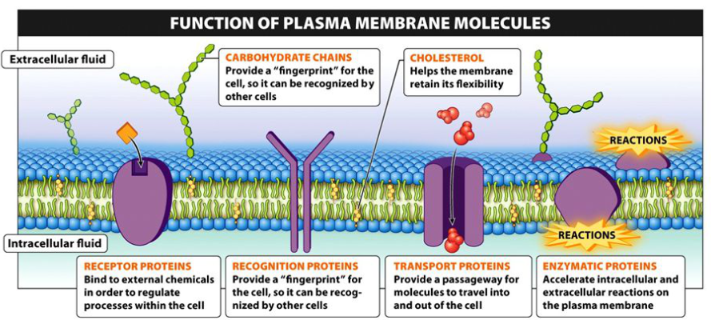
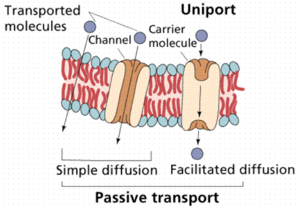
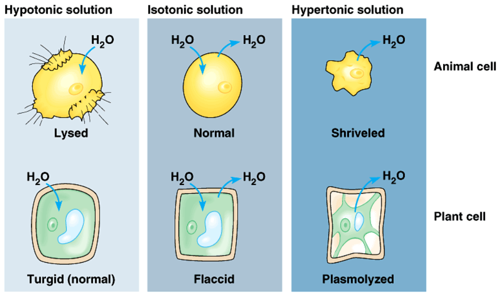
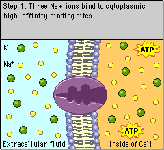

# Class Notes

## 8/19

- Structure/function relation starts are molecular level
    - 1 small difference in structure can impact the function
- Life requires only 25 of 100+ elements
    - 6 most common: SPONCH
        - Sulfur
        - Phosphorus
        - Oxygen
        - Nitrogen
        - Carbon
        - Hydrogen
    - Rest are called the trace elements
- Structure of atom:
    - Protons and neutrons in nucleus
    - Atomic number = number of protons
    - Atomic mass = protons + neutrons
    - Charge on proton: positive
    - Charge on electron: negative
    - Protons hold electrons by charge
        - Eletrons further away
    - Valence electrons: eletrons in outmost cell
    - Shells/orbits:
        - 2 eletrons in first
        - 8 eletrons in second
        - 8 electrons in third
    - **A filled valence shell is a happy shell**
        - Purpose of chemical reactions: fill valence shell
- Carbon
    - Atomic number: 6
    - Atomic mass: 12
    - Eletrons: 6
- Ionic bonds
    - Transfer of electrons
    - Example: NaCl
        - Na: 11 - 2, 8, *1*
        - Cl: 17 - 2, 8, *7*
        - The 1 from Na transfers to fill the 3rd shell of Cl
            - Na lost a negative: Na+
            - Cl gained a negative: Cl-
- Covalent bonds
    - Share electrons
        - Non-polar covalent bond: electrons shared equally
            - Example: O2
                - O: 8 - 2, *6*
                - Both O's share 2 electrons to fill the outer shell
        - Polar colavent bonds: not shared equally
            - Example: H2O
                - O has more electro negativity, shared more towards O

## 8/23

- Intra: within
- Inter: between
- Water:
    - Polar covalent bonds
    - O: slightly negative (δ-)
    - H: slightly positive (δ+)
    - Hydrogen bonds between O of one molecule and H of another molecule
        - Represented by a dotted line in diagrams
        - Ice less dense than water
    - Solid &rarr; liquid &rarr; gas = breaking hydrogen bonds
- Acid:
    - Chemical compound that **dontes** H+ to solutions
    - More acidic &rarr; higher [H+] &rarr; lower pH
- Base:
    - Chemical compound that **accepts** H+ from solutions
    - More basic &rarr; lower [H+] &rarr; higher pH
- `pH = 1/[H+]`
    - `pH 4 = 0.00001 = 10^-4 mol/l`

### Capillary action

- Water moves "shoots to roots"
- TACT:
    - **T**ranspiration: release of water through **stomata** in leaves
    - **A**dhesion: water molecules "stick" to the cells of **xylem**
    - **C**ohesion: water molecules "stick" to each other via **hydrogen bonds**
    - **T**ension: force created on a **pulling** object
- **Osmosis** moves water from soil &rarr; roots &rarr; xylem

## 8/24

- Isomers
    - Big, complex
    - Made from SPONCH
- Organic:
    - Carbon based
- From SPONCH
    - Carbohydrates (sugars, strarches)
    - Lipids and phospholipids (fats, oils, waxes, some steroids)
    - Proteins (enzymes and some steroids)
     - Nucleic acids (DNA, RNA)
        - MRNA: message RNA
        - DNA: the boss, sends info to RNA
        - RNA: makes the proteins
- Carbon
    - Tetravalent: 4 valence electrons
        - Compatible with many elements (especially SPONCH)
        - **Must form 4 covalent bonds**
    - Forms single of double bonds
 
### Diagramming

 - Single line: covalent bond
 - Double line: 2 covalent bonds
 - Red: oxygen
 - Black: carbon
 - White/grey: hydrogen
 - Blue: phosphate

### Functional groups

- Replace an H on the the carbon skeleton
- Can be polar or non polar

```
Hydroxyl group (alcohol) "-OH"
Carbonyl group (aldehyde or ketone) "C=O"
Carboxyl group (carboxylic acid) "-COOH"
    (H+ can break off - weak acid)
Amine group (amines) "-NH2"
Sulfhydryl group (thiols) "-SH"
Phosphate group "H3PO4"
```

## 8/26

- Four groups of macromolecules
    1. Carbohydrates
    2. Lipids
    3. Proteins
    4. Nucleic aicds
- Monomer
    - Relativly small molecule
    - Combine to make a polymer
    - Cellulose (a polymer) is made from 100s of glucose (monomer)
- Dehydration synthesis
    - "Building by losing water"
    - Monomer1 + Monomer2 &rarr; H2O + Polymer
    - Monomer1 loses OH (from OH), Monomer2 loses an H (from OH)
    - Monomer1 has covelant bond to O which has a covalent bond to Monomer2
- Hydrolysis
    - "Breaking apart by adding water"
    - Reverse of dehydration synthesis

### Carbohydrates

- CH2O (C and H2O)
    - Glucose 6(CH2O) &rarr; C6 H12 O6
- Monosaccharides
    - Monomers of carbohydrates
    - Glucose, ribose
- Disacharides
    - Di = two
    - Maltose, sucrose
- Polysaccharides
    - Poly = many (>2 = many)
    - Glycogen, cellulose, starch
- Glycosidic linkage
    - Bond between monosaccharides
    - `1-4 glycosidic linkage`: OH from carbon 1, H from carbon 4
- Two forms (sometimes): Alpha and Beta

### Lipids

- Fats, oils, phospholipids, steroids, waxes
- Two compoents that make up lipids
    1. One molecule of glycerol
    2. Up to 3 fatty acid tails
        - 3 tails: triacylglycerols
    - Connected by dehydration synthesis
- Nonpolar, hydrophobic
- Saturated vs unsaturated fats
    - Saturated: only single bonds
    - Unsaturated: at least one carbon-carbon double bond
        - Causes a "kink" or bend (not straight)

## 8/29

- Ester linkage
    - Bond between gylcerol and fatty acids (of lipids)
    - Bond formed by dehydration synthesis
- Phospholipid
    - Mixed: part hydrophobic, part hydrophilic
        - Polar 'heads' will always face the water
    - Replaced one fatty acid tail with a phosphate functional group
- Lumen of cell
    - Water outside of cell
    - Caused phospholipids to form two layers
        - Tails all point inward

### Proteins

- Amino acids: monomers of proteins
    - 20 total, differ in R groups
    - 20 'letters'
    - Polar/nonpolar/charged based on R groups
        - "-ine": usually nonpolar 
        - Carboxyl group can make something an acid (it can lose and H+)
- 4 levels of structure:
    - Primary: polypeptide chain
        - Sequence ('word') of amino acids (string of pearls)
            - Linked by dehydration synthesis
        - Peptide bond: between N of an amino acid and the carbonyl carbon of the other
    - Secondary
        - Alpha Helix
        - Beta pleated sheet
        - R groups of primary structures interacting 
    - Tertiary
        - Knotted slinky
        - Pulls the structure into knots
        - Most enzymes
    - Quaternary
        - More than one tertiary put together
- Can be denatured
    - Don't like high temperatures or low pH
    - Can't really be undenatured
    - Interput the shape and function
- Hemoglobin
    - Quaternary protein
    - Donut shaped
- Folding can affect function

## 8/30

### Nucleic acids

- Examples:
    - DNA
    - RNA
- Nucleotides: monomers

## 9/7

### Introduction to Cells and Membranes

- Cells
    - Organized
    - Seperated (phospholipid bilayer, etc)
    - Usally small: efficient
        - Surface area to volume ratio (bigger better)
- If it ain't broke, don't fix it
    - Evolve to keep working "mechanics"

### Domains of life

- Bacteria
    - Cyanobacteria, Heterotrophic bacteria
    - No nucleus
    - Ubiquitous (everywhere)
    - Symbotic relationships
- Archaea
    - Halophiles, Thermophiles
    - No nucleus
    - Ancient group of cells
        - First cells from here (likely)
        - Halophiles: salt loving
        - Thermophiles: heat loving
- Eukarya
    - Plants, Animals, Fungi, Chromists, Alveolates, Rhodophytes, Flagellates, Basal protists
    - Has nucleus

### Major cell types

- All cules:
    - Cell membrane
    - Ribosomes
        - Synthesize proteins
    - DNA
- Eukaryote
    - DNA in nucleus (chromosomes)
- Prokaryote
    - DNA in cytoplasm (losely coiled in cell)
    - No membrane bound organelles (no phosolipid bilayer)
    - Cell wall outside of cell membrane
        - Extra protection from environment
    - Flagellum
        - Used to move around
- Cloroplast and mitochondria
    - Chloroplast: photosynthesis
    - Mitochondria: cellular respiration
    - Own DNA seperate, cells within cells

### Microscopy

- Dissecting microscope
    - Lowest magnification
- Light microscope
    - 450x magnification
    - Needs to be plugged in
- Electron microscope
    - Best magnification
    - Emit radiation

## 9/12

- **Shared, conserved core features or processes**
    - Provde evience for *relatedness*, *evolution*
- What features do all cell have in common?
    - "Shared, conserved core *features*
- All cells carry out glycolysis
    - Shared *process*

### Eukaryotic cells

- Have a nucleus
    - DNA in nucleus
- Complex
- Some have cell walls
- Have plasma membrane
    - Phospholipid bilayer
- **Membrane-bound organelles**
- Some in tissues, some "solo"
- Sigma: "red eye spot"
    - Rods: light sensor

### Tour of cell

- Cells are small because outside stuff can only get into the cells through diffusion
    - Bigger Surface area:volume ratio = better
- Prokaryotic
    - No nucleus
    - Bateria
    - Archaea
- Eukaryotic
    - Has nucleus
    - Organelles
    - Plants, animals, fungi, protists

#### Eukaryotic organelles

- Nucleolus
    - Ribiosomes are assembles
- Nucleus
    - DNA
    - Control the cell: makes and directs the proteins
    - Has holes
- Ribosomes
    - Messenger RNA moves through
    - Builds proteins
- Rough ER
    - Ribosomes are attached
    - Protein synthesis
- Vesicle
    - Stores stuff
- Golgi body
    - Packages proteins
        - Modifies the proteins
    - "Post office"
- Cytoskeleton
    - Gives cell its structure
    - Like a bridge
        - Has supports (microtubal)
        - And the ropes connecting the supports to the road (microphilaments)
- Mitochondria
    - Powerhouse of the cell
    - Produce ATP
    - Cellular respiration
    - Has its own DNA
- Vacuole
    - In plants (mostly)
    - Stores water
- Smooth ER
    - Produces stuff that detoxifies the cell
- Lysosome
    - Suicide sack
    - Breaks itself or neighboring cells down

## 9/17

### Origin of Eukaryotic Cell

- Endosymbiont hypothesis
    - Endo: in (compared to outside)
    - Symbotic:
        1. Mutalalism: both benefit
        2. Commencialism: one benefit, one unaffected
        3. Parisitism: one benefit, one suffers for it
- For 1 billion years, only Archaea and Bateria cells

#### Energy converters

- Mitochondria
    - Cellular respiration
- Chloroplast
    - Photosynthesis
- Both:
    - Double cell membrane
        - Inner is bent/folded
            - Increase surface area
    - Have DNA (just not in nucleur)
    - Have ribosomes
    - Basically prokaryotes

#### Phagocytosis

- Phagocytosis: cell eating
- Began infolding of plasma membrane
    - Nucleus forms to help protect the DNA
- Could ingest energy converters
    - Endosymbiosis
    - The ingested cells get access to the cell's protection and resources
    - The cell no longer has to worry about energy as much
- 

### Structure and function of cell membranes

- Cell membrane = plasma membrane
- Phospholipid bilayer
- Proteins in the phospholipid bilayer
    - Allow hydrophilic/polar resources through the membrane
    - Like the phospholipids, they can have hydrophobic and hydrophilic parts
- Fluid mosaic model
    - Fluid:
        - Move
        - Proteins float in the phospholipid bilayer
    - Mosaic:
        - Made of many different smaller pieces
- Perpheral proteins
    - On the outside of the membrane
- Integral proteins
    - Transmembrane proteins
    - Go from one side of the membrane to the other
- Cholesterol
    - Makes the membrane more rigid
    - Helps keep the membrane from breaking
- Glycolipid
    - Directly attached to the phospholipid bilayer
    - Sugar attached to the lipid
- Glycoprotein
    - Sugar attached to a protein
    - Attached to a protein which is attached membrane



#### Transport proteins

- Integral proteins
- Provide a passageway for molecules to move through the membrane
    - Both in and out of the cell

#### Recogiition proteins

- Provide a "fingerprint" for the cell
- So it can be recognized by other cells

#### Receptor proteins

- Bind to external chemicals in order to regulate processes within the cell

#### Enzymatic proteins

- Accelerate intracellular and extracellular reactions on the cell membrane

## 9/21

Membrane transport

### Diffusion

- Passive transport: no energy required
- Movement of molecules from high to low concentration
    - End up fairly equally spread out
- Simple diffusion
    - If a molecule is small and nonpolar, it can diffuse through the membrane
    - If the molecule is big, it can't fit slip through the membrane, but can go through a channel
- Facilitated diffusion
    - If the molecule is big or polar, it might need help getting through the membrane
        - Goes through a carrier molecule
    - Uniport: one molecule going one direction
    - Symport: two molecules going one direction
    - Antiport: one molecule going one direction, a different going the other direction
- 

#### Osmosis

- Diffusion of water across a membrane
- Phospholipid bilayer is always in motion (fluid)
    - Gaps open
- Water is polar, but is small enough to slip through the membrane
- Aquaporin (protein in the membrane)
    - Water channel
    - Allows bulk flow of water across the membrane
        - In addition to the normal diffusion
    - Usually always open

#### Tonic

- Solvent: dissolver
- Solute: dissolved
- Distilled water: pure water (100% water)
- Tonic: solute
- Hypotonic: less solute outside the cell than inside the cell
    - Water will move into the cell
    - Cell will swell (and possibly burst, but not for plant cells)
- Isotonic: equal solute outside the cell than inside
    - No net movement of water (water moves in and out at the same rate)
    - Cell stays the same size
- Hypertonic: more solute outside the cell than inside
    - Water moves out of the cell
    - Cell shrinks
- 

### Active transport

- Requires energy (ATP)
- 

### Bulk transport

- Phagocytosis: cell eating
    - Cell membrane folds around the other cell
- Pinocytosis: cell drinking
    - Vesicle forms around a liquid
        - The vesicle temporarily merges with the cell membrane

# 10/4

## Mini intro/review quiz

1. How do you speed up a reaction?
    - Enyzmes
        - Biological catalysts
    - Add heat
2. What is a reactant, product?
    - Reactant: left side
        - What you start with
    - Product: right side
        - What you end with
3. What is a catalyst?
    - Speeds up a reaction
4. Two properties of catalysts
    - Not consumed in the reaction
    - Can be used over and over again
5. Whare are the monomers/building blocks of proteins?
    - Amino acids
6. How many protein monomers?
    - At least 20
7. 4 levels of protein structure?
    - Primary, Secondary, Tertiary, Quaternary
8. What is the primary structure of a protein?
    - The order/sequence of the amino acids
9. How are amino acids linked together?
    - Peptide bonds
10. What is amino acid R group?
    - The side chain
    - Go off the centeral carbon
11. Connect between R groups and formation of the teriary structure?
    - Form bonds between the R groups
        - Folds/knots the protein
    - Hydrogen bonds
    - Ionic bonds
    - Hydrophobic interactions
    - Disulfide bonds

## Metabolic pathways

- Metabolism
- Catabolic pathways
    - Break down molecules
    - Release energy
- Anabolic pathways
    - Build molecules
    - Require energy

## Thermodynamics

1. First law of thermodynamics
    - Energy can be transferred and transformed
    - It cannot be created or destroyed
2. Second law of thermodynamics
    - Entropy: disorder
    - Entropy tends to increase in the universe
- Exothermic
    - Cellular respiration
    - Breaking down (catabolic)
    - Releases energy
- Endothermic
    - Photosynthesis
    - Building up (anabolic)
    - Requires energy

## Energy

- Free energy: available energy
    - Energy that can be used to do work
- In **sponstaneous** reactions
    - Delta G < 0
- Using energy:
    - Gravitational motion
        - Potential energy
        - Took work to climb up a slide, then released the energy to go down the slide
    - Diffusion
        - Movement of molecules from high to low concentration
    - Chemical reactions
        - Breaking of bonds

## Enzymes

- Catalytic proteins
    - Speed up chemical reactions
    - But the reaction could proceed without enzymes
- Usually tertiary structure
- Reduces **activation energy**
    - Energy needed to start a reaction
- Retain their structure (not consumed by the reaction)
- Specific to their substrate
    - Like a lock and key
    - Active site
        - Where the substrate fits just perfectly
- Require optimal conditions
    - Temperature
    - pH
    - Otherwise could unfold/denature

## Substrate specific

- Substrate(s) &rarr; product(s)
- Sucrase
    - Sucrose + H2O &rarr; glucose + fructose
- Naming is often based on the substrate
    - Sucrose &rarr; sucr**ase**
- Temporary bond between the enzyme and the substrate
    - Induced fit model
    - Substrate fits into the active site
        - Not perfect fit
        - Held in shape by hydrogen bonds
    - Enzyme changes shape
    - Substrate is now bound to the enzyme