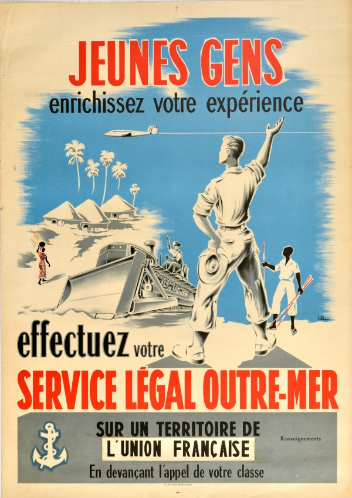
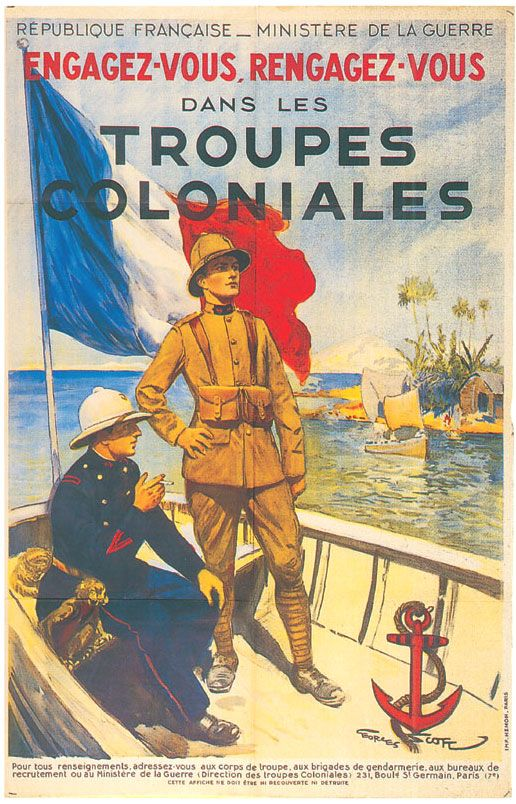
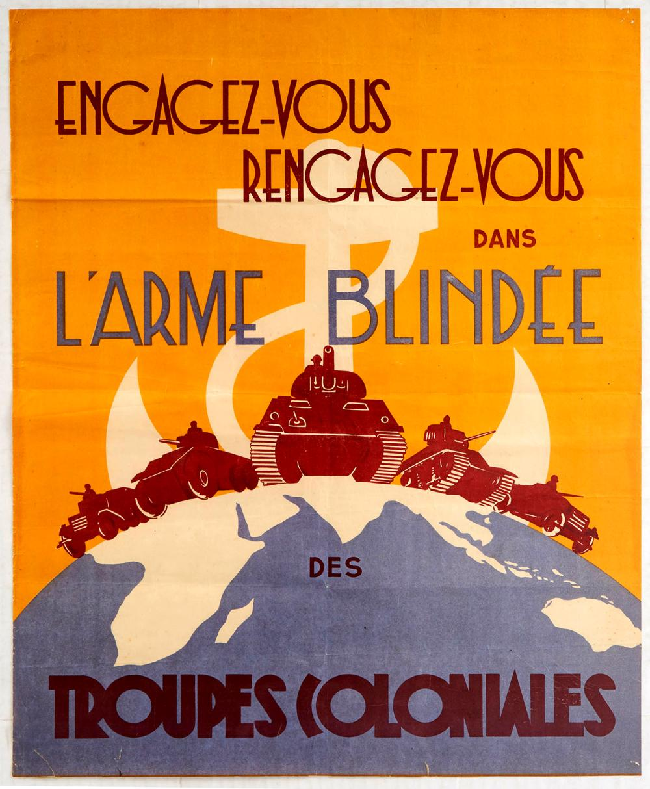
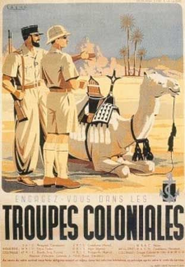
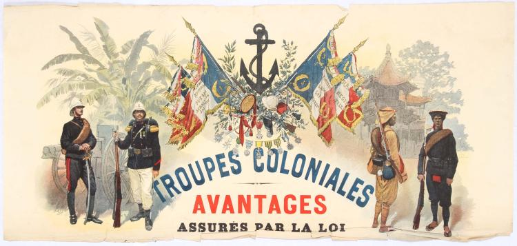

# Propagande coloniale

## Posters/images

- 
	- 1950s
- 
	- 1920s
- 
- 
- 

## Mots

- L'armée blindée = armored army
- Troupes = troops/forces
- Engagez-vous = join/commit

## Écriture

Cette affiche montre comment les personnes qui ont rejoint l'armée ont été récompensées.
C'était dans le système, ils étaient récompensés par la loi.