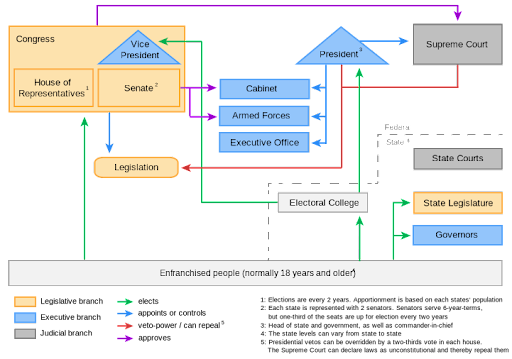
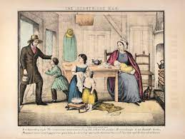
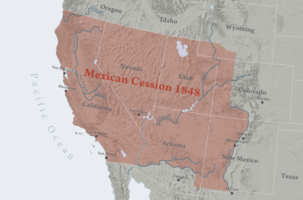
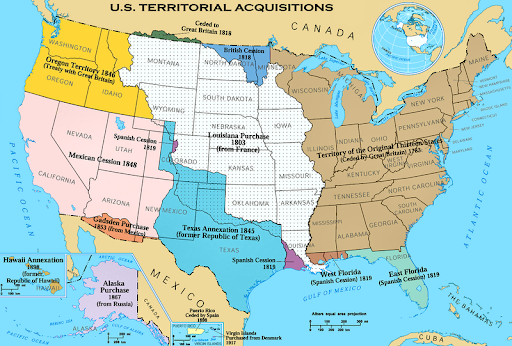

Honors US History - Period 3 - Valji

# Chapter 1 - A New World

## The First Americans

### The Settling of the Americans

- First arrived by crossing Bering Strait land bridge 15,000 to 60,000 years ago
- Spread to South America 11,000
- Climate warmed -> food crisis as hunted animals became extinct
    - 9,000 agriculture develops simultaneously in Near East and Mexico and Andes
    - Settled civilizations possible

### Indian Societies of the Americas

- When Europeans arrived, North/South Americas containted cities, roads, irrigation, trade networks, and large structures (pyramid-temples, etc)
    - Tenochtitlan
        - Captial of the Aztec empire
        - Pop. of 250,000
    - Inca kingdom:
        - Pop. 12 million
        - Roads spread 2,000 miles along Andes mountains
- Indian civilizations in North America were not as big/centralized as Aztec or Inca and not as technologly advanced as Europe
    - Used to justify European conquest
    - But had: farming, hunting, fishing, politics, religion, trade, communication

### Mound Builders of the Mississippi River Valley

- 3,500 years ago, Native Americans constructed a large community
    - Built on mounds (Poverty Point) overlooking the Mississippi River ("mound builders"
    - Center of trade routes and government
- After mound builders another culture centered around Cahokia emerged (~1200)
    - Fortified with pop. of 10,000 to 30,000
    - Highest pop. in US until 1800 (overtaken by New York and Philadelphia)

### Western Indians

- Between 900 and 1200, Hopi and Zuni thrived in Arizona
    - Built towns, dams, canals and conducted trade far off
    - Constructed Pueblo Bonita, largest building in US until 1880s
    - Moved due to drought
        - Either into the desert (Pueblo Indians) or to the West Coast

### Indians of Eastern North America

- Hundreds of tribes between Gulf of Mexico and Canada
    - Lived on squash, corn, beans, and hunted/fished
- Until 5th century, there was no central authority
    - Warred frequently
- Leagues/confederations emerged to unite local areas
    - Southeast: Choctaw, Cherokee, Chicksaw
    - Northeast: 5 Iroquois formed a **Great League of Peace**
        - Mohawk, Oneida, Cayuga, Seneca, Onondaga
- Each group was very different
    - Different politics, religions, languages
    - Identified locally (not countries, etc)

### Native American Religion

- Groups were similair in some ways
    - Focus on relgions, often in relation to hunting/farming
    - Spritual power/spirits infused in everything
        - Wanted the aid of the spirits
    - Religous rites and religious authority structure

### Land and Property

- Village leaders asssigned land to families
    - Families had a right to use the land, but did not own it (not real estate)
- Tribes claimed land for hunting
    - Unclaimed land could be used by anyone
- Sometimes moved often for new/better land
    - Didn't collect wealth/material goods
- Social status mattered, but reputation came from willingness to share goods
    - Trade was more than commerical (generosity was most valued)

### Gender Relations

- Women could divorce and have premarital relations
- Most societies were matrilineal: centered on clans/kinship were children joined mother's not father's
- Indian women owned the dwelling and tools
    - Husband moved into wife's place
- Men often away on hunt
    - Wife mangaged house and agriculture

### European Views of the Indians

- Extreme terms:
    - "Noble savages": gentle, friendly, superior in some ways
    - Uncivilized barbarians
- Negative veiws later overshadowed positive ones
- Barbaric on 3 areas:
    1. Religion - not genuine relgion or the devil
    2. Land use - land was a commodity, not a world of spirits
        - Spanish claimed land by right of conquest and papal authority
        - English/French/Dutch claimed land by saying the natives did not actually "use" the land
    3. Gender relations - weak men and mistreated women

## Indian Freedom and European Freedom

### Indian Freedom

- Europeans thought the Indians did not have "freedom"
    - Did not live under government or fixed laws
    - Did not use European definitions of authority
    - Lacked order and discipline present in Europe
    - Did not attatch freedom to individual autonomy or property ownership
- Indian freedom:
    - Free thinking, did not have to agree with the collective thought
    - Kinship ties, group autonomy, mutal obligations to group > individual autonomy
    - Freedom to follow spirtual values
    - Well-being and security of the community

### Christian Liberty

- Freedom from sin: abandon a life of sin ("Christian Liberty")
- Not related to religous toleration
- Religion inseparable from "secular" matters
    - Religion closely tied to economic, politcal, and social status
- Religous unity was important to pubic order

### Freedom and Authority

- Liberty = devotion to higher authority
    - Freedom = obedience to law
- Early European societies were hierarchical
    - Men > women and children
        - "Coverture": when a women married, she lost legal identity to husband
        - King over subjects = husband over family
            - Both "ordained" by God

### Liberty and Liberties

- Liberty came from fullfilling the duties appropriate to one's rank
- Most men lacked the freedom of economic independence
    - Largely controlled and dominated by upper classes
- Remenats of Middle Age "liberties"
    - Formal specific privilages: self-government, no taxes, right to practice a specific trade
    - Granted by contract, royal decree, or purchase
    - No criticism of authority

## Homework Question - 8/22

How can scienctific analysis help us understand history?
Please draw examples from the article and any other examples which come to mind.

Scienctific analysis can help us understand history by uncovering new previously unknown information.
For example, in one part of the article talks about the split between the Andes' lowland and highland people about 8,750 years ago.
Without scienctific analysis we would not have the ability to track the split and the differences of DNA between the highland and lowland people.
This would make it impossible to estimate the the amount of lives lost due to European contact, which is an import part of history.
Scienctific analysis also can help us look much further into the past.
For example it can provide insight on things like the end of the dinosaurs or the formation of universe.

## Class Notes - 8/24

- Most information from early colonial times
    - French/Spanish/British would take notes on encounters
    - Native Americans were inspired by European written language

### San Diego's First People - Kumeyaay Native Americans

- Lived here from 10,000 years ago
- Diverse land
    - Coast, desert, mountains
    - Moved with the seasons
    - Ate from everwhere (fishing, farming, gathering, hunting)
        - Lived from the land, everything was used (either food, medicine, etc)
    - Shaped the land
        - Couldn't leave it to nature
        - Planted trees, guarenteed they would be okay
- Not all 1 tribe
    - Advanced trade between them with estabilished trails
    - Make up a nation
- Pushed out of traditional lands
    - Private properties for countries, pioneers
    - Could not longer live they way they did
        - Had to adapt
- High importance on history
    - Cerimonies and connection to past as important as the actual food
- The people themselves did not know
    - Learned in school that they were "savages"

### Evidence from NA civilizations

- Archaeology
    - Materials, bones, etc (carbon dating)
- DNA evidence
- Oral tradition
    - Songs, stories, etc
    - Survivors
- Physical evidence
    - Differences in geography (trees)
    - Trails, rocks, etc
- Written documents
    - From natives
    - Or from Europeans
- Art and architecture
- Biological evidence
- Websites

## The Expansion of Europe

- Europeans wanted a direct sea route to Asia area
    - Wanted to eliminate the middlemen of the land trade

### Chinese and Portuguese Navigation

- In 15th century China (Admiral Zheng He) was exploring East Africa
    - China did not feel the need to expand overseas and stopped long distance sea voyages in 1433
- Portugal used new technologly such as **caravels** (ships), compasses, and quadrants
    - Sailed past the Sahara in 1434
    - They expanded and set up trading posts on the coast of Africa

### Freedom and Slavery in Africa

- Before Europeans intervened, Africa already had slaves
    - Usally criminals, debtors, or captives of war
    - Had basic rights like possessing proptery and marrying and could become free again
- Europeans increased the rate of buying/selling slaves turning into an economic thing
- Bartholomeu Dias had reached the Cape of Good Hope in 1487
- In 1498 Vasco da Gama sailed to India

### The Voyages of Columbus

- Columbus was a seasoned sailer
    - Knew the Earth was round, but thought it was a lot smaller (never knew of the Americas)
    - Got his info from the Bible and from Macro Polo's accounts
- Religous and commerical reasons
    - Spread Christianity (and take back Jerusalem from Muslim control)
    - Wanted a trade route to the East
- Sought various backers for his trip until Spain agreed
    - King Ferdinand and Queen Isabella's marriage in 1469 united Castile and Aragon into Spain
    - In 1492 they completed the **reconquista**
        - The "reconquest" of Spain from the Moors (African Muslims)

## Contact

### Columbus in the New World

- 1492: Columbus lands in Bahamas
    - Abandons 38 of his men, but takes back 10 natives for conversion to Christianity
- 1493: Returned and tried to set up a settlement on the island of Hispaniola
    - Fails, but in 1502 Nicola/s de Ovando succeeds
    - Thought he had found Asia/India
        - Name ("Indians") remains
- Amerigo Vespucci's discoveries in 1499-1502 proved that it was a new contient

### Exploration and Conquest

- Invention of printing press caused news to spread quickly
- Spanish lead based on a search for wealth, glory, and spread of Catholicism
    - Spanish **conquistadores**
- 1519-1522: Ferdinand Megellan led first trip around the world
- 1519: Herna/n Corte/s lands in Tenochtitla/n (center of Aztec empire)
    - Aztecs were violent warriors who had mass ritual sacrifices (alienated Europeans)
    - Corte/s conquered Aztecs with superior weapons, diesase, and enlisted the aid of certain groups of Aztecs
- Franciso Pizarro conquered Inca kingdom in a similar way
- Gold and silver were traveling to Spain rapidly

### The Demographic Disaster

- **Columbian Exchange**
    - Plants, animals, diseases, cultures, ideas now flowed between the worlds
- Because of lack of previous contact, the natives were not imunne to many of the diseases
    - In addition to military conquest and enslavement

## The Spanish Empire

- Rich, large, powerful
- Urban civilzation

### Governing Spanish America

- In theory the the Spanish America government reflected the Absolutism of Spain
- Royal officals were appointed from Spain rather than **creoles** (Europeans born in the New World)
- When Spain's power declined, the local elite took more power

### Colonists and Indians in Spanish America

- For the most part, they used natives (not imported slave labor) for large scale farms (**baciendas**)
- People moved to New World for better life
    - Chance to have your own labors
    - Could live like the upper classes in homeland
- The natives outnumered the Spanish
    - By 1600, **mestizos** (people of mixed origin) made up a large part of the population
    - Evolved into a hybrid culture

### Justifications for Conquest

- Europeans thought they and their religion were superior
    - The fact that the natives did not abandon their belifs further convinced the Europeans that they were uncivilized
- Relgious zeal refreshed by Protestant Reformation
    - Sway them to Christianity over Protestantism
- 1537: Pope Paul III outlawed Indian enslavement
    - Did not apply to Africans
    - Bartolome/ de Las Casas wrote about the unfair treatments

### Reforming the Empire

- 1542: New Laws
    - Indians can no longer be enslaved
- 1550: The **encomienda** system is removed
    - **Repartimiento** system: Indians were free and could have wages, but had to do a fixed amount of labor per year
        - Still allowed for abuses and it wasn't quite true freedom
- The **Black Legend**: image of Spain as a brutal colonizer
    - Spanish treatment did improve, and they did bring European medicine and education

### Exploring North America

- 1508: Spanish set up first permenent colony in US
    - In Puerto Rico, a US "commonwealth"
    - It had much gold
- 1513: Juan Ponce de Leo/n tried to explore Florida
    - Wanted wealth, slaves, and the fountain of youth
    - Was repelled by local Indians
- 1530s-1540s: Juan Rodriguez Cabrillo explored Pacific coast
- Many other expeditions to look for a 2nd Mexico
- Brought disease and death with them

### Spain in Florida and the Southwest

- Wanted a base in Florida to protect gold shipments from pirates
- Also wanted to stop French possessions in New World
    - Pedro Mene/bdez de Avile/s destoryed a Huguenot outpost
- 1598: Juan de On~ate explores North from Mexico

### The Pueblo Revolt

- 1680: New Mexico colonists and Indians had bad relations
    - Under Pope/'s leadership, the Indians united and attacked the colonists
    - The unity soon ended and Spain reconquered New Mexico

## Homework Questions - 8/24

1. According to this article, what are some of the reasons why Columbus might be considered a hero? A villain?

| Hero | Villain |
| :- | :- |
| - United the people of the world (trade of ideas, goods, etc) | - Brought slavery with him (and disease) |
| - Started the process of the creation of the US (and the good that came from it) | - Partially responsable for the things that came after him |

2. Dr. Fernández-Armesto lists several principles that should control our evaluation of historical people and events.
Which of these is the most interesting, intriguing or significant to you?
Do you disagree with any or would you add any?

I think the idea that contextalization is important is important, especally when looking at good and evil.
It would be unfair to say Columbus was a villain because he believed in slavery.
In the US, 4 of the first 5 presidents owned slaves, but they were still good people that helped many people.

3. What does the author mean when he says for some “moral indignation with Columbus is too precious to discard” and for others “kinship with a culture hero is too profound a part of America’s sense of identity to be easily excised”?
Being transparent about our own biases, which of these categories do you feel you are more likely to fall into?

The author means that people want to believe a partial version of a truth that fits their view of the world.
I think I fall somewhere inbetween.
I would be slightly biased towards "Columbus the villain" because I think it's easier to see the negative consquences than the benefits.
(Killing 1 person carries more weight than saving 1 person.)

4. So was Columbus a hero or a villain? Related to this, should we or should we not commemorate Columbus Day?

Life does not work in black and white.
He should not be be seen as a hero or a villain, but somewhere inbetween.
I think we should not celebrate "Columbus Day" as "Columbus" Day, but something that focuses more about both the new world wide connection and the downsides/consquences. (Celebrated as a day marking the beginning of change.)

## Class Notes - 8/25

### Political violence

- Prolitical is violence which is perpetrated in order to achieve political goals.
- Violence which is used by
    - A state against other states
    - A state against civilians and non-state actors
    - Violent non-state actors against states and civilians

### Pueblo Revolt

- The Pueblo's willing accepted some of the Spanish ideas/tech/religion
    - Add Spanish saints to their current "arsenal"
- Drought + being raided by enemy tribes
    - Popé concluded the spirits were displaced &rarr; wanted to kick invaders out
- Spanish crackdown
- Popé conviced the individual tribes to work together
    - Attacked all on the same day
- Killed settlers, priests, burned churches
    - Drove them out, but did not chase them
- Spanish returned and reconquered
    - But were less strict
    - Merge of Spanish and native cultures

# Chapter 2 - Beginnings of English America

- 1607: 3 ships of colonists from England land in Chesapeake Bay
    - Move inland (James River) to avoid Spanish warships
    - Establish Jamestown (named for King) in the colony of Virginia (named for last queen)
    - Sponored by the **Virginia Company**
        - Private buisness of merchants, aristocrats, and members of Parliment
        - Queen gave her blessing (before dying in 1603)
    - 104 people returned, rest stayed
        - All men, searching for gold/wealth not functioning society
- English North America was a place of opportunity
    - Chance of fortune
        - Escape of deprivation and inequality
    - Religious minorities could be more free
    - The settlers had more freedoms and rights
        - But not all were equal (slaves, etc)

## England and the New World

### Unifying the English Nation

- In 16th century, England was a second rate power
- Internal disunity
- Henry VIII established the **Anglican Church** when the pope did not annul his marriage
- Strife followed and English rulers switched between Catholicism and Anglicanism

### England and Ireland

- England attempt to control Ireland cost money/energy/time
    - Could have been used in the New World
- Ireland was viewed as a Catholic threat to Protestant rule in England
- Did not want to aborb Ireland/Irish people
    - Foreshadowed England policy in New World

### England and North American

- Queen Elizabeth I was first to focus on New World
- She granted Sir Humphrey Gilbert and Sir Walter Raleigh charters for colonies in the New World
    - At their own expense
- 1582: Gilber established a settlement in Newfoundland 1582
    - Failed quickly
- 1585: Raleigh sent up a base on Roanoke Island
    - The settlers abandon it the next year
    - 1586: Tried again, but its fate was never known

### Spreading Protestantism

- Spain was motivated by glory, gold, and relgion
    - Reformation put Spain as an enemy of England
        - And a failed Spanish armada in 1588
- England wanted to save the New World from Spanish terror/Catholicism
    - And of course glory and gold
    - And stimulate trade to benefit motherland

### The Social Crisis

- Enconomic growth < pop. growth
- **Enclosure movement** pushed many people into overcrowed cities
- Could use New World land/space/resources for the overflow of people

### Masterless Men

- The wandering/employed men were seen as dangerous
- However, many thought that the only want to be free was to control their own labor
    - Could get that in the New World

## The Coming of the English

### English Emigrants

- Diseases devasted locals and settlers
    - Required constant stream of immigrants
    - People still went because it was better than the homeland
- 1607-1700: > 500k people left England
    - Went to West Indies, Ireland, and North America
- Pop. of English colonies grew
    - All types of people came
    - Mostly young men who had nothing to lose (bottom of ladder in England)

### Indentured Servants

- Settlers who could pay for their voyage landed in the New World as free people
    - The rest traded voyage for time (usually 5-7 years) as an **indentured Servant**
- Very similar to slaves, but had a garenteed time of freedom
    - Many still died as servants

### Land and Liberty

- The English belived land was the basis of Liberty
    - Owning land gave right to vote
- The promise (chance) of owning land movivated all people to move to New World
- Land was also given as a reward from the King
- No one wanted to work the land of others, they all wanted to own land
    - Led to rise of slaves

### Englishmen and Indians

- Compared to Spanish, the English wanted to displace the natives and take their land
    - Rather than intermarry/mix and making them a part of the Spanish empire
- Some trade between English and natives, and some did marry
    - But most remained seperate
- The natives did not have a "real claim" for the land
    - Did not cultivate did, less permenent settlements
    - To avoid some conflict, some local colonial governments declared areas offlimits
        - Overall ineffective
- Constant conflict/warring between natives and English
    - Further drove them apart

### The Transformation of Indian Life

- Welcomed the newcomers' goods
    - Some had practical advantages (cloth, kettles, iron tools, guns, etc)
    - Some were decrorative/relgious (glass beads, copper, etc)
- Changed the way they lived/hunted/farmed/cooked
    - Both sides traded what they had in execess of what they had little of
        - Unequal though because English had military superiority
- The settlers also changed the land with new crops/animals
    - And cutting down trees, building fences, unsustainable hunting

## Settling the Chespeake

### The Jamsestown Colony

- High death rates and leadership turnovers
- The Virginia Company wanted profit
    - Often set underwheleming supplies
    - Set few farmers/workers, mostly people looking for gold
- Dispite more settlers coming from England, diease, lack of food, and winter killed many
    - Tried to abandon, but were intercepted by next shipment of people
- **John Smith** imposed military displine and forced labor
    - Held the colony together
    - Not liked by the colonists, but next leaders kept his iron fist policies
- 1618: the Virginia Company realized its gold plan wasn't working
    - Needed to trade and to grow food (as well as get more people)
    - **Headright system** gave land to those who paid for someone else to come to Jamestown
        - Rather than the company keeping the land for itself
    - **House of Burgesses** replaced autocratic government

### Powhatan and Pocahontas

- Powhatan was local and powerful leader of natives of area
    - He saw the benefits of trade with the newcommers
- For first two years, trade and relations between the England and natives where good/equal
    - Story of Smith being captured and then saved by Pocahontas (likely ceremony)
- Pocahontas became intermediary
    - Brought food and messages between the people
- 1614: Pocahontas marries John Rolfe (Englishman)
- 1616: She went to England and became a sign of harmony and sucess between the people
- 1617: Pocahontas dies
    - 1618: Powhatan dies

### The Uprising of 1622

- Became clear the English meant to stay
- 1622: Opechancanough (Powhatan's brother/sucessor) sprise attacks killing 1/4 of Virginia's pop.
    - Colonists strike back, massacring natives and destorying villages
- Governor Francis Wyatt saw this as a sign that the natives had no right/claim to any land
    - Wanted to push them out of Virginia
- 1644: Another failed attack led by Opechancanough
- Failed uprising shifted power into colonists' hands
    - Forced natives to move designated lands
- Virginia Company surrendered its charter and Virginia become a royal colony
    - The English government mostly ingored it at the start and the elite controlled it

### A Tobacco Colony

- King James I warned against tobacco
    - People thought it had health benefits (also people just liked it)
- Tobacco became Virginia's substitute for gold
- A new class of tobacco farmers emerged
    - Scramble for land
    - The powerful assigned good land to themselves (and become more powerful)
- The English crown benefited from custom dutes (taxes on incoming tobacco)
- Lead to a demand for field laborers
    - Temporarly filled by indentured servants
        - High death rate, yet people still came hoping to live long enough to get their own land
- Virginia society mirrored England's
    - Wealthy land owners at top
    - Small farmers/freed indentured servants in the middle
    - Large pop. of labors

### Women and the Family

- Colony family life was not stable
- Mostly men
    - Men:women = 4ish:1
    - Because most women came as indentured servants, they could not marry for a while
    - Low natural pop. growth
- Women in England had a claim to **dower rights**
    - Could claim 1/3 of husband's property if he died
- However, women in the colonies could have more rights
    - *Feme sole*: "women alone" who had indepenant legal identity
        - Could conduct buisness/contracts
        - Could not be married (and thus would have have children/family)

### The Maryland Experiment

- The second Chesapeake colony was similar to Virginia
    - Tobacco dominated
- 1632: Maryland estabilished as a proprietary colony
    - The land grant was to a single person, Cecilius Calvert
        - Who was the son of recently dead King Charles I
    - The charter gave him full, free, absolute power over everything (including government)
        - But the colonists were garenteed the rights of an Englishman
            - Including right to government (which caused conflict with Calvert)

### Relgion in Maryland

- Calvert was Catholic and he wanted Maryland to be a refuge for them
    - Wanted Protestants and Catholics to live in harmony
    - Caused instability
- High death rates
- Freedom dues included access to land
    - But most of the good land was already taken

## Homework Questions - 8/28

### John Smith's Letter to Queen Anne

1. What are John Smith’s motives in writing this letter to Queen Anne?

He was concerned that Pocahontas might not be given the reception he felt she deserved,
so he wrote a letter Queen Anne to personally vouch for the integrity and faithfulness of Pocahontas.

2. How does John Smith portray Pocahontas?

He portrays her as young women who is more than worthy of everyone's respect
with a compassionate pitiful heart.

### Pocahontas

1. What position does this article take on Pocahontas saving Smith from execution?

There is a significant chance that it was a mock execution and salvation ceremony
and her actions were part of a ritual.

2. How is Pocahontas portrayed in this article?

She is portrayed as a playful, frolicsome little girl who cares for all,
including the colonists.
She did not seem too bothered by her captivity or coversion to Christianity.

3. What new information did you learn from this article?

There were a lot more specific details and it suggests/says that parts of
Smith's accound was wrong or made up.

## The New England Way

### The Rise of Puritanism

- **Puritans** were English who thought the Church of England contained too many of the problems of the Catholic Church
- Saw church ceremonies and other random rules as "popery"
- Rejected religous power structure
    - "Congregationalists"
- Calvinism: predesination for hell/heaven

### Moral Liberty

- 1620s-1630s: King Charles I was sort of restoring Catholicism
    - Puritans emigrated to New England
        - Wanted to set up there and influence England
- Puritans hoping for right to worship and govern themselves freely in a Christian manner
    - Set up a "city upon a hill"
- John Winthrop, 1645 speech
    - "Natural liberty": acting without restraint
        - "Liberty to do evil"
        - Irish, Indians, bad Christians
    - "Moral liberty": liberty to do good
        - "Subjection to authority"

### The Pilgrams at Plymouth

- Pilgrams
    - Puritans
    - 1608: fled to Netherlands
    - 1620: came on Mayflower
- **Mayflower Compact**
    - Male adults of Mayflower all agreed to obey equal/just laws set by representives
- Natives already cleared by smallpox
- Most died to winter (rest saved by natives)
    - 1621: first Thanksgiving
- Principle of consent
    - More people could vote

### The Great Migration

- 1629: charter for Massachusetts Bay Company
- Group of London merchants (Puritans)
- 1629-1642: the **Great Migration** 21,000 Puritans move from England to Massachusetts
    - Base for stable society
- Most came in families
    - Compared to young single men

### The Puritan Family

- Male authority in house
- Adherence to the common-law tradition of limiting women's power/legal status
- Spirital equals (men and women)
- Women had about equal possible power in church
- Women spent more time doing kid stuff
    - Especially in New England where it was a better/stabler environment

### Government and Societ in Massachusetts

- Puritans feared individualism and lack of social unity
    - Massachusetts organized into self governing towns
- Settlers received land grants from the colony's government
    - Plenty of common land
- Each town had a Congregational Church
    - 1647: each had to have a school (to learn to read the Bible)
- 1636: Harvard founded to train educated ministry
- Massachusetts Bay Company moved to Americas
    - Wanted to avoid otherside/non-Puritans influence
- People of Massachusetts elected their governors

### Church and State in Puritan Massachusetts

- Puritans | Relgious unity good for social order
    - No religous toleration (one truth)
- 17th century New England society was hierachical
    - Better families had better land (etc)
    - Liberties are privilages based on place on social ladder
    - Allowed for slavery
    - Worse for women

## New England Divided

- Puritans | idea of "self" = bad
    - No modern individialism, privacy, personal freedom
    - Can't critize gov. or church

### Roger Williams

- Puritans | individual interpration of Bible
    - Clashed with idea of unity
- Roger Williams | seperate church and state, religous toleration

### Rhode Island and Connecticut

- William and followers banished from Massachusetts &rarr; founded Rhode Island
    - Eventuallly got a charter from London
- Rhode Island became beacon of religous freedom
    - And for **dissenters** (people who did not belong to the main established church)
- More democratic gov.
- More colonies appeared as results of people leaving Massachusetts

### The Trail of Anne Hutchin

- She held influencial meetings that critized the ministers of Massachusetts for fauly preaching
- Antinomianism: putting one's own judgement of faith above both human law and teaching of the church
- Well educated but went against Puritan beliefs (no chance)
    - Banished

### Puritans and Indians

- Roger Williams | King had no right to give land that was someone elses
- John Winthrop | Unculivated land is free to take
    - Worried Indian freedom (wrong kind of freedomn) would temp settlers
        - Punished those who left
        - Encourged **capitivity narratives** (stories of how they were capurated by Indians)
            - And how they wanted to return
- Europeans outnumbered Indians

### The Pequot War

- New England Indians had lower numbers and no leader
    - Wanted peace/alliance
- 1637: Pequot War
    - Pequots killed a fur trader
    - Europeans retaliated
    - Pequot name to be erased from books

### The New England Economy

- Not slave/tobacco based
- Fishing, wood, trade
- Puritans came from middle class (not indentured servants)

### The Merchant Elite

- New England wealth was better distributed than in Chesapeake
    - Lower per capita wealth
- Still inequality
    - Indentured servants often did not get full rights at the end
- New England became a significant point of trade
    - Led to Puritans being overtaken by merchants
        - 1662: **Half-way covenant**, half baptism for grandchildren of the first migration

## Homework Questions - 8/30

1. According to William Bradford, what was the impetus behind writing the Mayflower Compact?

Some people aboard *The Mayflower* were not completely on the same level of unity as others.
The Mayflower Compact would be an agreement to organize a government that would operate to benefit everyone.

2. What form of government does the Mayflower Compact seek to establish?
Describe this government with reference to specific concepts and terms in the text.

The Mayflower Compact calls the government a "Civil Body Politic".
The government will meet repeatly with the purpse of creating
equal laws, ordiances, acts, constitions, and offices.

3. In what ways might this document be viewed as a “precursor” to the Declaration of
Independence and the Constitution?
In what ways is it different from these documents?

The government is made from multiple people and it will create equal laws.
A main complaint leading to the Declaration of Independence was unequal taxing
(and without input from the people).
It is different in the way that the people "promise all due submission and obedience".

## Class Notes - 8/31

### Crash Course

- First English to Virginia
    - Looking for gold
- 1619: First African slaves to Virginia
- King James didn't like Tobacco, but wanted the tax revenues from it
- Pilgrams fled to Netherlands
    - Puritans
    - Thought Netherlands was not better &rarr; set up New World
- Pilgrams blew off course
    - Virginia &rarr; Massachusetts
- Common good > individual needs in Massachusetts
    - Based on Puritan values
    - John Winthrop
        - Inequality was expression of God's will
- 1640: first Massachusetts slaves

### Harvard Alma Mater Song

1. Should Harvard change the lyrics to its Alma Mater Song?

Yes.
I think that it should be updated to match the current ideas of inclusion.
It is different than changing the words of a textbook or document.
It is not hiding the past.
The song serves a different purpose, it is supposed to be a welcoming song,
not a historical document.

2. Why is it important whether or not Harvard made the change?

It does sort of change history.
All the new students will hear the new version and have a different idea of what Harvard
is compared to those before.
It further detaches Harvard from its past.

3. How does this discussion relate to other questions of historical legacy and memory in America?

People will forget about this change, and the updated song will sort of overwrite the original in history.

# Chapter 3 - Creating Anglo-America

- Last quarter of 17th century was chaos
- 1675: Indian alliances attack farms
    - Largest conflict of 17th century
    - Indians had early success
        - Supposedly lead by mastermind **Metacom (King Philip)**
    - But were pushed back and stopped
        - Iroquois allianced with New England
        - More freedom for Europeans

## Global Competition and the Expansion of England's Empire

### The Mercantilist System

- Mercantilism: economic system that sought to increase the wealth of a nation
    - Government controlled
    - Increasing exports and decreasing imports
- Used colonies for this purpose
- 1651: **Navigation Act**, promote the self-sufficiency of the British Empire
    - Restricting colonial trade to England and decreasing dependence on foreign imported goods
    - Goods had to flow to/from colonies on British ships through England

### The Conquest of New Netherland

- 1664: England took over New Netherland from Anglo-Dutch war
- Transformed into New York
    - Charles II gave it to his brother (the duke of York)
    - Transformed into imperial outpost, trade port
- Relgious toleration (because there was Dutch already living there)
    - But limited womens rights and black people's rights
- Duke of York gave huge benefits to his friends

### New York and the Indians

- **Covenant Chain** ambitions of Indians (Iroquois Confederacy) and New York aligned
- Iroquois later transistion to policy of neutrallity

### The Charter of Liberties

- People of New York did not like the dukes all powerful ruling
    - Especially over taxation
        - Wanted the "rights of an Englishman"
- 1683: assembly meets and creates a Charter of Liberties and Privilages
    - Reaffirmed basic English rights
    - Elections every 3 years

### The Founding of Carolina

- 1663: Carolina Charter
    - 8 Lords Proprietors granted by Charles II
- Used as extra land for Barbados, the richest plantation in the Caribbean
- 1715: **Yamasee uprising**, Yamasee and Creek Indians rebelled, but were crushed
- 1669: Fundamental Constitutions of Carolina, feudal society, hereditary nobility, serfs, slaves
    - But needed more immigrants: elected assembly and relgious freedom + headright system
    - Large power to slave owners
- Traded and raised cattle until rise farming was discovered

### The Holy Experiment

- 1681: Pennsylvania established
- William Penn
    - **Society of Friends (Quaker)**
        - Equality for all
            - No slaves, women had rights
        - Pacifists
    - Wanted to create a utopia, spiritual freedom, Indian/European peace
        - Religous freedom
- Wanted to create a refuge for those facing persecution

### Land in Pennsylvania

- Large number of immigrants
    - (See above, Pennsylvania was a looking like a pretty good place to be)
    - Led to other colonies being starved for indentured servants
        - Had to use slave labor
    - Led to conflict with Indians
- Elected government

## Origins of American Slavery

- Need for workers
    - Indentured servants weren't cutting it &rarr; slave trade
- Slaves were prefect labor source
    - Knew what they were doing
    - Already exposed to European diseases
    - Slavers forever
        - Children would be slaves
    - Did not have basic Englishman's rights
    - Hard time escaping
        - Visually different
        - Did not know the land

### Englishmen and Africans

- English did not like foreigners
    - Africans, Irish, Native Americans
    - Savage
- Race/Racism not fully devolped at this time
    - But similar ideas of "us" and "them" were present

### Slavery in History

- Was always a thing
    - Prisoners of war, etc
- In Americas, slavery was based around the plantation
    - Economic/agricultural enterprise
    - Hard demanding labor
    - High death rates
    - Became associated with race/skin color

### Slavery in the West Indies

- Officals/top of the ladder convinced African slaves would get them the most money
- Slave trade/number of imported slaves grew as colonies/plantations grew
    - Based around a mass marked crop (sugar, rice, tobaco, etc)
- Not as popular in North America at the start
    - Expensive compared to indentured servants (they often died before they could get their worth)

### Slavery and the Law

- Spain's laws were transfered to its American colonies
    - Often ignored, but slaves had some rights
- English laws became much worse
    - In some places, there wasn't a clear line between black and slave
        - However, it was far from equal

### The Rise of Chesapeake Slavery

- Officals wanted to improve status of all white people to make it more appealing to migrate there
    - As a result, it got worse for blacks
        - You were either white or other (no inbetween)
- 1662: Virginia law where child takes mother's status
    - Better for abusing slaves so the kids would also be slaves
- 1667: relgious conversion does not release a slave
- No more interracial relationships

### Bacon's Rebellion: Land and Labor in Virginia

- 1676: **Bacon's Rebellion**
- Governor (William Berkeley) was ruling corruptly for 30 years
- People wanted Berkeley to expand and take over Indian land so they could have some
    - Berkeley was keeping all the good land for him/his friends
- He refuses
- Nathaniel Bacon used a combined force of blacks and whites
    - Wanted to reduce power/wealth of the elites and give it back to the rest
    - Did not like that Berkeley was protecting the Indians

### A Slave Society

- Death rates fall &rarr; more worth purchasing life long labor
- Bacon's Rebellion showed power of Africans
- New slave laws
    - They are property
    - Completely sperate from whites

## Homework Questions - 8/31

1. What is the Flushing Remonstrance?
Who drafted it, why, and what is its basic message?

Settlers drafted it in 1657 in Flushing.
They wanted to petition the Dutch colonial government uphold freedom of conscience and permit religious pluralism.

2. Why do you think Governor Stuyvesant rejected the Remonstrance?
Are there any understandable or justifiable reasons for him to deny religious or ideological diversity in this new colony?

He rejected it because he would only tolerate his Dutch Reformed Church (and the Remonstrance went against that idea).

3. What has been the legacy of the Remonstrance?

It was the first document in America to argue for religious freedom.
Also the people did not just argue/petition to solve their own problems, they argued for everyone's right to choose.
It lead to Queens being one of the most divese country in the US.
However, there is no proof that later advocators for rights
(like those who wrote the Bill of Rights, Virginia Statute for Religious Freedom, or the Declaration of Independence)
were influenced by the Remonstrance.

## Class Notes - 9/2

### Race is a social construct

- Constellation of features
    - Group a set of features (skin color, hair, facial structure) into a racial category
- Police boundries
    - Not nessissarly based on ancestry
        - More based on visual features
- Assign meaning/value
    - Man made (doesn't make it false)
    - We give value to the assumed "race"
    - Paper money based on the fact that other people think it has value/meaning
- **Essentialization**
    - Ascribing one trait to another trait
    - Renforces/strengthens social construct
        - Leads to stereotypes
    - She is good at math because she is Asian

### Power of an Illusion: Race

- "All men are created equal"
    - Had slaves
- How people assign meaning to how they look
- Notes on the State of Virginia (Thomas Jefferson)
    - Africans might be different from time/circumstance but they are inferior
- Not all are "men"
    - Justified slavery
- In early America: economic status and religion > race/skin color
    - Slow shift
- Replaced indured servants with African slave trades
    - Europeans weren't willing to come to America anymore
    - Became: "black (slaves)" and "white European (masters)"
        - Became more accepted/"natural"

### Inventing Black and White

- Fearful of African + indentured servant force
- Gave lowest "whites" more rights to distinguise them from the African slaves
    - Less likely they would unite again

1. Why was Bacon's Rebellion a turning point for the status and rights of people of African descent in Virginia?
    - Associated them with perpetral slavery
    - Worse rights
    - Now more sperated from the "whites"
2. What motivated Virginia's lawmakers to make legal distinctions between white and black inhabitants?
What effect did those distinctions have on Virginia's universe of obligation?
Can laws influence the way peopel think about who belongs and does not?
    - They were worried about another combined force of Africans and indentured servants (Europeans)
    - Sought to make them seperate so they could not join again
    - Not obligated towards the slaves
    - Yes, they do influence the way people think about who belongs because they are the formal written guide
        - Carries different weight
3. What does Ira Berlin mean hwne he says that freedom and slavery were created at the same moment?
How does creating an "out" group strengthen the identity and status of the "in" group?
    - Your identity is "not the out group" &rarr; desire to be in the in group
4. Not going to type question
    - Rich people could get richer
    - Easy to say:
        - Relative to me, Africans are all slaves, so Africans are meant to slaves
    - The poor whites could now say:
        - I am different that the slaves
        - Part of the group that has rich people

# Chapter 4 - Slavery, Freedom, and the Struggle for Empire

- Olaudah Equiano (Gustavus Vassa)
    - Kidnapped into slavery from Africa
    - Long chain of being passed around before he bought his freedom and published a autobiography
- Sustained development for British North America
- Act of Union of 1707: united England and Scotland
    - Colonies grow more rapidly
- Colonies populations become more diverse
    - However, become more integrated into British empire
        - Reflected British values
        - Laws/political institutions extensions of British ones
        - Economy designed to serve British empire

## Slaver and Empire

- Mostly everyone (Europeans) particpated in the slave trade
    - With expections that they would all gain profit
    - Very few wage workers, mostly slaves
- Rising demand for goods like sugar, rice, tobacco, coffee increased demand for slaves

### Atlantic Trade

- 18th century: British focused on Caribbean
    - Large center of profit for most people
- Became seen that part of freedom was the ability to enslave others
- British colonies particpated in slave trade
    - Ships between them and Caribbean

### Africa and the Slave Trade

- Most African societies took part in the slave trade
- For the most part, they retained control of the capture and sale of slaves
- At this time, Europeans did not venture into Africa
- Got the Africans wealth, but they lost a significant portion of their population

### The Middle Passage

- Voyage from Africa to the Americas
- Many did not survive the journey
    - Terrible conditions
- Only ~5% of slaves when to NA

### Chesapeake Slavery

- 3 main slave systems in NA:
    1. Tobacco based plantations in Chesapeake
    2. Rice based plantations in South Carolina and Georgia
    3. Nonplantation slavery in New England and Middle Colonies
- As colonies expanded/moves/changed focus, so did slavery
- Hierarchy of degrees of freedom
    1. Large plantation owners
    2. Lesser farmers and lander owners
    3. Indentured servants, tenant farmers
    4. African slaves
- Violence as form of control was common
- Increasing divide between whites and blacks
    - Blacks became associated with danger and undesirable

### The Rice Kingdom

- Grown and mantained by slaves
- Large source of income
    - Most efficent to focus on it
- Rice required lots of land and workers
    - Slaves were the best option
        - Were also partially immune to malaria, more common where rice is grown
- Task system
    - Slaves worked in groups
    - Each group had a task
    - If they did not complete their task, they were punished

### The Georgia Experiment

- Founded in 1732 by James Oglethorpe
    - Wanted to abolish slavery
- Wanted Georgia to a refugue for the "worthy poor"
- Approved as a buffer between South Carolina and Spanish forces in Florida
- Settlers unhappy with banned slavery (and liquor)
- 1751: Gave colony to the British crown
- Settlers got the right for elected assembly (can create their own laws)
    - Introduced slavery
    - Become South Carolina "0.8"

### Slavery in the North

- Slavery less important to nonplantation areas of New England and Middle Colonies
    - Still important, but less than for plantation areas
- Laws against slaves were less harsh in North than in South
    - Less of a threat (because there was less total slaves)
- As New Yorks role in the slave trade expanded, so did its slave count

## Slave Cultures and Slave Resistance

### Becoming Afircan-American

- The imported slaves were not one people
    - Different cultures, languages, religions
    - Connected by slavery (not "race")
    - Described by their African origin
- By 19th century, the Africans in the Americas were closer to one people
    - Fusion of their traditions, European cultures, and new conditions in Americas

### African Religion in Colonial America

- Believed there was not quite a hard line between spirtual and secular worlds
    - Spirits in nature, dead could influence the living
- Merged Christianity with African religions

### African-American Culture

- In Chesapeake, slave populations began to reproduce
    - Better climate
    - Smaller plantations, large number of white **yeoman** (small) farmers
        - Africans were exposed to white culture
- In South Carolina and Georgia, slave conditions were much harsher
    - Less reproduction
    - Need for continuous supply of imported slaves
    - Low white and African mixing/contact
        - Africans lived seperatly
- In Charleston and Savannah some slaves were able to assimilate
    - Sexual liaisons between white owners and slaves &rarr; first free mulattos

### Resistance to Slavery

- Slaves had common link of desire for freedom
- Risked death to escape
    - Either to uninhabited areas to to Charleston and Savannah
- 1712: Slaves burn houses and killed 9 white New Yorkers
- Tried to use European/Indian conflicts to rebel
- *Stono Rebellion**
    - The largest slave rebellion in the Southern Colonies

## Homework Questions - 9/3

1. What makes 1619 such a momentous year both for Jamestown and for American history?

In 1619, the first Africans arrived in Virginia.
They came as unwilling slaves who were stolen from their homes.
It marked the start of imported slavery that still has impact today.
Also in that year, the General Assembly (the House of Burgesses)
met for the first time, marking the beginnings of representative
government in the colonies.
(And the first women arrived in Jamestown in 1619.)

2. What, according to this article, makes American slavery unique from its global counterparts?

Slavery was permanent and hereditary.
Childern inherited their parents status so they were enslaved at birth.

3. Knowing what you know now about the history of slavery in America – from the
horrendous cruelty of slavery itself to the horrors of the Civil War to the continued civil
rights abuses and racism it spawned even after its abolition – what would you have done as
a member of Jamestown to try to avert this history from coming to fruition?

I think it would have been hard to change things.
Looking back on it, we now know much more than the people at the time.
Also, the people at that time were looking for profits and did not care about the well being of "other" (as in not their people) people.
I think the best chance for changing the course of history would be
to educate people before the imported slaves arrive that those people are still people.

## Class Notes - 9/6

### Crash Course - Transatlantic Slave Trade

- More than 4 centuries
- Middle passage
    - 2nd of 3 parts of the trianglular trade
- Most slaves did not go to United States areas
    - Only 5%
- No Africans returned from slavery &rarr; no knowelege of what would happens
- The African kingdoms sold the slaves
    - They mostly weren't "stolen"
- Chattle slavery
    - Hereditary slavery
- Packed into ships
    - Terrible conditions &rarr; many died
- Slaves did resist
    - Revolts
    - Suicide (causing owners to lose money)
        - Control over one's own life
- 18th century: 2/3 of the slave trade
- Only 20-30% of the slaves lasted more than a couple years in the colonies
    - Assuming they made it there
- Free trade: 1675-1725
- South Carolina banned slave trade, then reinstanted it briefly
- Transatlantic slave trade ended long before the slave trade within countries
    - Shows it was just political/economic, not moral

### The Interesting Narrative of the Life of Olaudah Equiano, or Gustavus Vassa, The African

1. At the end of the first sentence, the author writes that the slave ship was “waiting for its cargo.”
To what cargo is he referring?

The slaves

2. Describe the conditions on board the boat, specifically those under deck.

Terrible.
Terrible smell, very compact, hot, unsanitary.

3. Why did the narrator get beaten for not eating?

So he would survive (and the owners would not lose money).

4. What does the author mean when he writes,
“Surely this is a new refinement in cruelty, which, while it has no advantage.”

The slaves already suffered so much, so why would they add on to the suffering by seperating the people.

5. Describe the tone of the narration.
Then, choose words and/or phrases from the text that help to create this tone.

Matter of fact, statements.
He seemed a bit confused.

## 122-125 & 129-136

- **Enlightenment**
    - 18th century movement
    - Spread from France &rarr; Britain (&rarr; America)
    - Use reason and science to understand the world and to govern people
        - Not religion
- **John Peter Zenger**
    - Proved freedom of press in trial of him vs corrupt Governor William Cosby
- **Benjamin Franklin**
    - Enlightenment
    - Estabilished newspaper, debating, library, lightning is a form of electricity
- **Poor Richard’s Almanack**
    - Written by Benjamin Franklin
- **Deism**
    - God but he doesn't do anything (just created the world and left)
    - World functions according to scientific laws (no divine intervention)
        - Followed Newton's laws
    - Study nature instead of worship in church
- **The Great Awakening**
    - Response to Enlightenment's emphasis on church = bad
    - Wanted to keep religion at the forefront of life
    - Less organized, more personal and emotional Christianity than the existing churches
        - Enlarged the boundries of liberty
- **Jonathan Edwards**
    - Intensely emotional style of preaching
    - Only acknowledging one's sins and pleading for divine grace could save you from eternal dammnation
- **George Whitefield**
    - English minister
    - Emotional preaching
    - From Georgia to New England
    - God was merciful
    - No predesination
        - Could save yourself by repenting sins
    - Was often in the press
        - Had followers ("evangelists")
- **Old Lights**
    - Old lights: traditionalists
- **New Lights**
    - Revivalists
    - Created new churches
    - Criticized taxes for established churches
    - Defended religious freedom
    - Seek salvation over profit
    - Some were anti-slavery
    - Trust own views rather than than estabilished elites
- **French and Indian War/Seven Years’ War**
    - 1756–1763
    - Virginia gives 1/2 million acres of West land to the Ohio company
    - In respone France increases presence there
    - Ohio Company demanded that the French recogonize that it was their land
    - 1754: George Washington sent to negotiate with the French
        - Could not get them to leave the land
        - Returned with men, failed to attack
    - General Braddock tries to attack Fort Duquesne
        - Ambushed by French and Indian forces
    - Led to two years of fighting
        - Both sides cruel
    - Secretary of State William Pitt raised huge money to fight
    - 1759: British forces (with colonial and Indian aid) had captured many forts
    - Britain seized control of French Caribbean islands and India
    - Peace of Paris: 1763
        - Frances gives control of Canada to Britain
        - France gets sugar islands of Guadeloupe and Martinique (from British)
        - Spain gives Florida to Britain
        - Spain gets Philippines and Cube (from Britain)
        - Spain gets Louisiana (from France)
    - Win for Protestant Britain
        - Americans happy to be British at this time
    - Very expensive for all involved
        - Britain increased taxes on American colonies
    - Lead to an increased nationhood between all Indians rather than just between their kins
        - Not fully agreed apon, wanted to protect their independence from Britain/Spain/France/etc
- **Pontiac’s Rebellion**
    - Frances departure from Americas from the war meant that Indian French lands became British
    - Lead by Indians of the Ohio River Vally and Great Lakes
    - Named for Ottawa war leader
    - Also sparked by Neolin (religious prophet) who saw that they must reject Europeans and retake their land
        - Regain lost independence
        - Used new ideas of pan-Indian identity
- **Proclamation of 1763**
    - By London
    - No further settlement West than the Appalachian Mountains
        - Reserved for Indians
    - Main goal to stabilize colonies and avoid further conflicts
    - Ineffective: ignored by colonists
        - Wanted to take the land "left" by the French
        - Settlers not happy
- **Albany Congress/Albany Plan of Union**
    - 1754 by Benjamin Franklin at the outbreak of the Seven Years' War
    - Creation of Grand Council to unite colonies
        - The colonies were all very isolated from eachother
    - Could levy taxes, create forces, etc
    - Rejected

## Homework Questions - 9/6

1. What about Benjamin Franklin’s life do you find most interesting or intriguing?

I found the fact that Benjamin created a fire department interesting.
I would not have thought that it was something that was important/needed,
but it was mentioned multiple times in the article.
I think it woul be intresting to learn more about when/how/why he created it.

2. Is there anything about his life that surprised you, perhaps even scandalized you?

I did not know he had a large family.
It surprised me that his family was not super "close".
For example when his brother would not publish his writings
and got mad when he found out how Benjamin had tricked him,
Benjamin left and moved to Philadelphia.

3. Of his many achievements, which do you consider Benjamin Franklin’s greatest and why?

I think his greatest achievement was his particpation in the creation of the Declaration of Independence.
I think it his greatest achievement because it was a very important moment for the
creation of the United States of America.

## Class Notes - 9/12

- Seven years war
    - Global conflict
- French and Indian war
    - North America theatre
    - British colonies vs French colonies + Indian allies

### Crash Course

#### Causes

- Economics
    - Mercantilism
        - Colonies exist to benefit the mother country
        - Colonies exist to provide raw materials for the mother country
        - Colonies exist to provide markets for the mother country
        - Minimize imports, maximize exports
            - Gold flows in
- Main conflict between British and French
    - French wanted to dominate fur trade
        - Made many alliances with Indian tribes
- Governer of Virginia gives large section of land to Ohio company
    - Ohio company wanted French to leave the land
    - French don't (and hold on to them by miliary force)

#### Results

- British struggled but eventually won in North America, Carribean, and India
    - At the end of war Indians revolted (Pontiacs rebellion)
        - Wanted to avoid further conflict so marked western land as Indian territory (Proclamation of 1763)
        - Colonists ignored this because they just fought a war to the right to take that land
- Peace of Paris: 1763
    - Frances gives control of Canada to Britain
    - France gets sugar islands of Guadeloupe and Martinique (from British)
    - Spain gives Florida to Britain
    - Spain gets Philippines and Cube (from Britain)
    - Spain gets Louisiana (from France)

#### Great Awakening

- Relgious revival
- New denominations
- More emphasis on personal experience and rebirth

# Chapter 5 - The American Revolution

- 1765: Thomas Hutchinson's house was raided
    - Chief justice and lieutenant governor of Massachusetts
    - Reponse to the **Stamp Act**
        - British tax that the colonists felt that voilated their liberty
    - Hutchinson had defended Andrew Oliver (a relative) who was helping to administor the Stamp Act
    - Led by Ebenezer Mackintosh

## The Crisis Begins

### Consolidating the Empire

- 1760: King George III takes British crown
- Saw the colonies as just a way to enrich Britain
    - Contrast from the notion of "allies" during the Seven Years' War
    - Needed a way to pay for the war
- **Virtual representation**
    - Every member represented the country as a whole, not just the area they were from
    - The colonies and even major British cities (Manchester and Birmingham) were not represented
- **Writs of assistance**
    - General search warrants to search anywhere
    - To combat smuggling (and enforce Navigation Acts)
- Also not happy with the Proclamation of 1763

### Taxing the Colonies

- 1764: Sugar Act
    - Reduced tax on molasses
    - However, further shutdown smuggling
        - Courts often sided with the smuggler &rarr; they could be judged without a trial
    - Trying to enforce Navigation Acts
        - Now colonies were taxed directly instead of indirectly on the trade
        - Affected the colonial ports the most
- Currency Act
    - Confirmed the ban of using paper as "legal tender"
        - Coins or banknotes that must be accepted if offered in payment of a debt
- Stamp Act
    - Affected everyone
    - Led to British army stationed in America to enforce
    - Displeased many of the writers and those who controlled the press
    - Displeased the local elites who lost power as a result of this
    - "Property was taken away without consent"
        - Colonists wanted the rights of an Englishman

### Taxation and Representation

- Bristish saw colonies as outposts of an empire
    - They chose the represetives in America
- The colonists saw themselves as equals to those on the mainland
- Because they were unrepresented in Parliament, they could not be taxed by it
    - "No taxation without representation"
- House of Burgesses (Virginia) under Patrick Henry passed laws arguing for "British freedom"
    - Colonists should get same rights/liberties as British citizens because they were British citizens
- 1765: **Stamp Act Congress**
    - 27 delegates from 9 colonies
    - Still loyal and obedient to the crown
    - However, right to constent of taxation was essential to the freedom of a people
    - Resulted in boycotting all British goods
        - First time the colonies worked together

### Liberty and Resistance

- "Liberty" began becoming a common topic and took many forms of visual representation
- **Committe of Correspondence**
    - In Boston
    - Before Stamp Act was passed, spread word and encourged opposition to it (and the Currency Act)
- Resistance to the acts were often started by elites, but they spread to everyone
- 1765: **Sons of Liberty**
    - NYC residents led protests and enforced boycotting of British imports
- 1766: Britain repealed the Stamp Act
    - Did not expect American resistance to it
    - Also pressured by British merchants who were losing money
        - (Couldn't sell stuff to America with the boycotts)
- However, at the same time, Britain passed the **Declaratory Act**
    - Parliament had the right to tax the colonies in any case

### The Regulators

- As colonies expanded westward, there were more conflicts
    - Land disputes between settlers, colonial governments, and Indians
    - Liberty in relation to secure possession of land
        - Compared to liberty in relation to Stamp Tax was about taxes
- **Regulators**
    - Mid-1760s
    - Wealthy residents from the South Carolina backcountry
    - Protested the under representation of western settlements
    - As well as the failure to create local governments
- At the same time, in North Carolina some small farmers rebelled
    - Kidnapped local officals and refused to pay taxes
    - Caused general disruption
- Wanted democratization of local government
    - Went against the rich and powerful (the colony's elite)
- 1771: "battle of Alamance"
    - The farmers were suppressed by the colonial militia

## The Road to Revolution

### The Townshend Crisis

- 1767: **Townshend Acts**
    - Taxed glass, lead, paint, paper, and tea
    - During the Stamp Act, some colonists had said they would be okay on taxing trade
        - Just not taxing them directly
    - Also created a board to collect the taxes and further stop smuggling
- Opposition to it came slower than the Stamp Act
    - But by 1768, some colonies reinstanted the boycotts
- Led to increased independence from Britain
    - Began producing goods within America
        - Became a symbol of resistance
        - Daughters of Liberty: homespun clothes
    - Popular especially in the Chesapeake so the planters did not have to pay as much money to British merchants
    - Also reduced competition with British merchants

### The Boston Massacre

- Royal troops stationed in Boston following rioting in 1768
- 1770: **Boston Massacre**
    - Fight between snowball throwers and British soldiers
    - Escalated and 5 colonists were killed
- **Crispus Attucks**
    - One of the people killed in the Boston Massacre
- John Adams successfully defended 7 of the soldiers
    - Viewed lower class crowd rioting as a bad way of opposing British policies
- However, Paul Revere made a famous engraving of the event
    - Helped stir up more anger against the British
- But by 1770, merchants and colonial elites were not doing well without British goods
    - Eventually Townshend Acts were repealed and the boycotts ended
    - Tea tax remained

### The Tea Act

- The East India Company stock collapsed
    - It had a large monopoly over trade
    - Effectively ran British India
    - Many many people had invested in it
- To help the company (and thus its supporters), the British government tried to promote it in America
    - It was given rebates and tax exemptions
        - Underpriced local tea and smugglers in America
- Colonists saw this as an extention of the Declatory Act
    - It would acknowledge the right of Britain to tax the colonies
- 1773: **Boston Tea Party**
    - Threw 300 chests of tea off a ship and into the water
    - Cost them 10,000 (about 4 million today)

### The Intolerable Acts

- Reponse to the Boston Tea Party
- 1774: **Intolerable Acts**
    - Closed Boston Harbor until lost tea was paid for
    - Altered the Massachusetts Charter of 1691
        - Made it illegal to hold town meetings
        - The governor could appoint memebers to the council
            - No longer by election
- Quebec Act
    - Same time as Intolerable Acts
    - Increased size of Canada
    - Granted legal toleration for the Roman Catholic Church in Canada
    - Caused colonists to question both the land claims and the Strengthening Catholicism (America was Protestant)

## The Coming of Independence

### The Continental Congress

- Opposition to the Intolerable Acts spread to everyone
    - Small towns or other places that did not participate in previous resistance
- 1774: Suffolk Resolves
    - Resolved to resist the Intolerable Acts
    - Refuse to obey or pay taxes and to prepare for war
- 1774: **Continental Congress**
    - 12 colonies (except Georgia)
    - Purpose: to coordinate resistance to British policies (especially the Intolerable Acts)

### The Continental Association

- The Continental Congress promoted the Suffolk Resolves
- And adopted the Continental Association
    - Halt trade with Britain (and the West Indies)
    - Created local Committees of Safety
        - Implement the mandates and punish "enemies of American liberty"
        - Transfered effective political power from the colonial governments (controlled by Britain)

### The Sweets of Liberty

- By 1775 the idea of "liberty" was very popular
- Based ideas on both the rights of an Englishman and natural rights and univeral freedom
    - John Locke's theory of natural rights

### The Outbreak of War

- April 1775: **Lexington and Concord**
    - British troops were sent to seize colonial arms at Concord
    - Colonists resisted
    - First shots of the American Revolution
- May 1775: Second Continental Congress
    - War had already started before it met
    - 13 colonies
    - George Washington was elected commander
    - Authorized the creation of a **Continental army**
- May 1775: Green Mountain Boys (Ethan Allen) and militia from Connecticut (Benedict Arnold) take Fort Ticonderoga (New York)
    - Drag cannons to siege Boston (where British forces were)
- June 1775: **Battle of Bunker Hill**
    - British push back militia from Breed's Hill
    - But took heavy casualties
- March 1776: British lose control of Boston
    - Colonists aided by those extra cannons

### Independence?

- Many still supported Britain
    - Feared cutting ties with Britain would lead to further chaos
- Elites in Massachusetts and Virginia supported the break with Britain
    - Confident in their ability to retain control
- Novemeber 1775: **Lord Dunmore's Proclamation**
    - Offered freedom to slaves who fought for the British
    - Further enraged the South against Britain
- Because of high diversity in New York and Pennsylvania, they were more hesitant to break with Britain
    - Wanted peace with Britain
    - Feared internal conflict after break with Britain (sort of predicted Civil War)

### *Common Sense*

- January 1776: ***Common sense*** by Thomas Paine
    - Criticized the British government
    - Argued for independence
    - Did not just repeat grievences of the colonists
        - Reached a new audience, spread it to all the people, not just the elites

## Homework - 9/17: Moment of Decision! 1776

### 1) An introduction of your character: Rebecca Howe

I am a 48 year old single mother who is the owner of this inn.
Creating this buisness was hard, and has only been harder since he died 5 years ago.
Because of this, I am thankful for any visitors I get regardless of who they are or what they believe.
My rum is made from completely legal molasses and my son is definitely not a member of the rebel militia.

You are the forty-eight-year-old owner of a public inn at which this evening’s discussion is
taking place. You and your husband worked hard to build up your business. Since his death five years ago, the
burdens on you have grown heavier. The local British magistrate is a frequent visitor to your inn, and you are
grateful for the business he brings. Of course, you do not tell him that the rum you serve is made from smuggled
molasses. You also do not dare admit that your son is a member of the rebel militia in your county. You are very
worried that he may go off to war.

### 2) An explanation of your top option: 2

My top option is option 2.
My son "is a member of the rebel militia" and I am "very worried that he may go off to war" (and die),
so I do not agree with options 3 or 4 which want us (my son) to fight.
I agree more with option 2 than than option 1 because I agree some things do need to change,
otherwise I would not even be hosting this discussion.
For example, the rum I make "is made from smuggled molasses" which I would not have to do if things were different.
However, I don't have anything particularly against the British,
and the "local British magistrate is a frequent visitor to" my inn
which provides good buisness.

While I am leaning toward Option 2, I could be persuaded to Option 1.

### 3) Generate at least one question for each of the other options

| Option | Question |
| :- | :- |
| 1 | Shortly after the Stamp Acts were repealed, we were hit by the Townshend Acts which had many of the same problems as the Stamp Acts and had the same outcome. Don't you think it's time for change now rather than just be used to help Britain? |
| 3 | While Britain could have treated us better, do you really think that it is best to risk our lives for something that could be solved with discussion? We did end up getting the Stamp Acts and Townshend Acts repealed. |
| 4 | Is it really best to leave Britain? We owe our entire existance on these lands to them. |

### 4) Look over and take notes on the bios of the other characters

Key:
- " ": No
- &#9744;: Sort of/not clear
- &#9745;: (Mostly) yes

| Traveler | Pro war? | Pro British? | Possible ally? | Note |
| :- | :-: | :-: | :-: | :- |
| Silas Brattle |  | &#9744; | &#9745; | Pacifist, wealthy, illegal trade but likes British protection |
| George Lee | &#9744; |  | &#9744; | Shoemaker, indentured servent, family in Britain |
| Henry Walker | &#9744; |  |  | Farmer, living farm to mouth, owe money to local merchant, former militia member |
| William Calder |  | &#9744; | &#9744; | Poor, wants lands Protected by Proclamation of 1763, works for rich person related to royal governor |
| Thomas Van Der Hoven |  | &#9744; | &#9744; | Dutch, avoids political disputes, what is good for buisness is good for colonies |
| Charles St. James | &#9745; |  |  | Rich in land and slaves, owe money to British merchants, former militia member |
| Robert Stewart | &#9744; |  |  | Out of buisness since closure of ports, tension/conflict with local off duty British soldiers |
| Michael Smithson |  | &#9745; | &#9744; | Clashes with local Indians, concerned about safety, buy lots of English goods |
| Reverend Howard Walford |  | &#9745; | &#9744; | Son of English land owner aand member of Parilament, Church of England, depend on British officals for money |
| Walter Walford |  | &#9744; | &#9745; | Clients are "smugglers", doesn't like British regulation and taxing on trade |
| Emily Campbell | &#9744; | &#9744; |  | Poor, barmaid, resent wealthy people who come in discussing rights of Englishman, Scottish |
| John Williamson |  |  |  | Rich family, but duty bound, write against British policies |
| Joshua MacGreggor |  | &#9745; |  | Scottish, pushed out by poor harvest, grateful Britain has made your move to America possible |
| Samuel Adams | &#9744; |  |  | Oppose British policies, help organize colonial resistance |
| Anne Bradstree |  | &#9745; |  | Related to members in the House of Lords, fear the violence, blame colonists for this rebellion |

### Other notes

#### Option 1

Beliefs and Assumptions Underlying Option 1:
1. No society on earth enjoys greater liberty and prosperity than the American colonies. Much of our good fortune, especially with respect to trade, is due to our status within the British Empire.
2. Accepting the authority o Parliament is a reasonable price to pay for Britain’s protection of the colonies
3. We are called upon by God to respect the legitimate authority of government.

Supporting Argument for Option 1:
1. The colonies will be crushed militarily and ruined economically by a full-scale war of rebellion
2. Breaking our ties with Britain will embolden the lower classes to challenge the authority of their betters
3. Without the unifying force of British rule and the protection of the British navy, the colonies will squabble among themselves and present an inviting target for aggressive foreign powers

#### Option 2

Beliefs and Assumptions Underlying Option 2:
1. The legitimacy of Britain’s authority over the colonies is grounded in the mother country’s discover, settlement and continuous protection of America.
2. The colonies should be required to contribute their fair share to defend the British Empire in North America.
3. Under the British constitutional system, the citizens of the colonies should have a voice in making the laws
that govern them, especially in the area of taxation.

Supporting Arguments for Option 2:
1. Establishing a joint British-American council—on equal footing with Parliament—to govern the colonies will protect both the rights of the colonists and the legitimate authority of Britain.
2. Resistance to British rule will bring economic disaster to the colonies.
3. Without British authority over them, the individual colonies will turn against each other and plunge into civil war.

## The Declaration of Independence

- July 1776: **Declaration of Independence**
    - List of grievances against the British
        - Taxation without consent, etc
    - Unalienable rights
        - Life, liberty, and the pursuit of happiness
    - Justification for independence
        - Conset of the governed
        - Right to alter/abolish
            - Right to revolution
    - Inspired by Englightenment

### Asylum for Mankind

- American nationalism based on the idea that America had a special mission
    - To be a refuge from tyranny, model for the rest of the world
- Fight for the rights of mankind, not just the rights of an Englishman

### The Global Declaration of Independence

- 1776: Spain establishes Mission Dolores
    - European settlement on West Coast to stop Russian expansion
- Colonists more focused on actually securing their freedom than freedom for mankind
    - Jefferson hoped that this would inspire other people to follow suit
- Declaration of Independence rapidly spread in print throughtout the world
    - Idea that "the people" possess rights become widely popular

## Securing Independence

### The Balance of Power

- British had one of the greatest military powers
    - America had to use local militia and underequipped Continental Army
- However, Americans were fighting on their soil for their rights
    - As long as they were not all dead, idea of independence continued
- British would have to spend a lot of money to conquer the 13 colonies
    - Not everyone wanted to pay extra taxes
- Other countries also wanted to see Britain lose (e.i. France)

### Blacks in the Revolution

- Slaves and blacks saw it as a way to win their freedom
    - Equality was one of the main ideas of the Independence
- George Washington rejected black army recruits
    - Changed after Lord Dunmore's Proclamation
- Because you could send a substitute for your posistion in the army/militia, a lot of slaves got their freedom this way
- 1778: Rhode Island formed a black regiment
    - Promised freedom to slaves who enlisted
- Except for Georgia and South Carolina, free blacks and slaves could englist in the army
    - Sometimes (but not always) go their freedom afterwards
- Some joined the British side (see Lord Dunmore's Proclamation)

### The First Years of the War

- George Washington's army did not do well at the start
    - Survived by avoiding direct conflict
    - Low morale
    - Pursued by William Howe
- December 1776: Washington's army crossed the Delaware River
    - Surprise attacked Hessian mercenaries
    - Won the battle
    - Restored morale

### The Battle of Saratoga

- 1777: British General John Burgoyne led an army from Canada
    - Was going to meet up with Howe to cut off New England
    - But Howe moved from New York to attack Philadelphia
        - No communication with Burgoyne
    - Burgoyne's army was surrounded and forced to surrender
- 1777-1778 winter: Washington's army was underprepared
    - Many left or died
- Saratoga helped convince the French to support the Americans
    - 1778: Treaty of Amity and Commerce
        - France recognizes the US and will provide military assistance
    - Shortly after, Spain joined the war on the American side

### The War in the Borderlands

- When French were kicked out, the British took over
    - The Indians lost a lot of authority
    - British had weak control, could not enforce the Proclamation of 1763
- Indians choice the side (American or British) based on what they thought would benefit them
    - Some tried to remain neutral, but it was almost impossible
- Both sides were cruel
    - Killed and burned

### The War in the South

- British hoped to exploit tension caused by Regulator movements
- More people in the South were loyal to Britain
- British also tried to encourge slaves to escape
    - Would damage the economy
- 1778: British have Savannah, Georgia
- 1780: British have Charleston, South Carolina
    - And 5k US soldiers
- 1780: the worst year for the fight for Independence
    - Congress was bankrupt (&rarr; soldiers went without pay)
    - British had control of the South
        - Exploited social tension
        - Slaves fled to help British
    - **Benedict Arnold** defects to the British
        - One of George Washington's best generals
    - However, the British were unable to use these things to actually end the war
        - Couldn't consolidate gains in South

### Victory at last

- 1781: Daniel Morgan defeats British at Cowpens
- 1781: Nathaniel Greene forced Cornwallis (British commander in the Soutg) to retreat
    - To Yorktown
- 1781: **Battle of Yorktown**
    - George Washington + Marquis de Lafayette surround Yorktown by land
    - French fleet block sea escape
    - Cornwallis surrenders
        - Support for the war in Britain ended
- 1783: **Treaty of Paris**
    - Got American independence
    - US got land between Canada to Florida
    - Loyalists would not be punished
- Canada remained loyal to British
- As did the West Indies
    - Feared slave revolts

## Homework Questions - 9/19

1. What, according to the first paragraph, is the purpose of the Declaration of Independence?

The purpose is to seperate politically from Britain and to form a new nation where the opinions of the people are respected.

2. What groups do you think Jefferson and the Continental Congress hoped to persuade with this document?

Everyone.
They hoped to pursaude the colonists to support/fight the United States of America.
And they hoped to open the eyes of everyone globally to these ideas such as unalienable rights and the consent of the governed.

3. According to Jefferson, what is the purpose of government?
Who has the right to create or establish a government?

Jefferson thought that the purpose of government was to secure and protect the unalienable rights of the people (life, liberty, and pursuit of happiness).
The people have the right to create or establish a government (or to abolish it).

4. Jefferson intended the Declaration of Independence to be universal, applying to any people or nation.
As a result, he did not mention any specific laws or actions by Britain in his list of grievances,
but rather referred to the general violation of rights they represented.
Select any five grievances mentioned by Jefferson and identify the specific law or act that lies behind that grievance.

- “For quartering large bodies of armed troops among us” = The Quartering Act
- "He has called together legislative bodies at places unusual, and also uncomfortable, and distant from the depository of their Public Records, for the sole purpose of fatiguing them into compliance with his measures." = The 1774 change to the Massachusetts Charter of 1691
- "He has obstructed the Administration of Justice by refusing his Assent to Laws for establishing Judiciary Powers." = Starting in 1774, the king appointed all the Massachusetts's judges
    - The judges were dependent on the king for their salaries and subject to his directions
- "He has kept among us, in times of peace, Standing Armies without the Consent of our legislatures." = Colonists saw the soldiers as tools for the British to enforce the Stamp Act/Townshend Acts
    - And the Quartering Act after the Boston Tea Party
- "For cutting off our Trade with all parts of the world". = The Navigation Acts

5. What legal means did the colonists take to try to convince the British to change their repressive policies
(think back on our timeline of events leading to the American Revolution)?
How did the king and parliament respond to these concerns (again, the timeline can be your guide)?

The colonists got the Stamp Act and most of the Townshend Acts repealed.
They also boycotted British goods.

6. What did Jefferson conclude was necessary for the colonists to do in light of these repeated responses, or what he calls these “long train of abuses and usurpations”?

Jefferson concluded that the colonists have to break from the British government
and create a new government that will actually protect and benefit the people in it.

7. Those who signed the Declaration of Independence risked everything, including, as they say at the end of the Declaration,
“our Lives, our Fortunes and our sacred Honor.”
Click on one of the names of the signers of the Declaration of Independence (above) and write a brief (just a few sentences is fine) summary of who they were and, if provided, what happened to them during and after the war.

William Ellery, Rhode Island:

He went to Harvard and graduated when he was just 15 years old.
He did not find his perfect career for a while, but eventually became a lawyer.
He was an active member of the Sons of Liberty and replaced Samuel Ward at the Continental Congress (Ward died).
He was appointed to the Marine committee and later helped others including the committee for foreign relations.
He held the office of judge of the Supreme Court of Rhode Island.
By 1785, he was a strong supporter of the abolition of slavery.

# Chapter 6 - The Revolution Within

- 1774: Abigail Adams born
    - Self taught
    - Father was a congregational minister
    - 1764: married John Adams
    - Kept an eye on politics and family when he went to war
    - 1776: commented on slavery and how it did not fit with the revolutions ideals of equality
    - #1 role of women: family, but husbands did not have full power over their wives
- She was an example of how other people wanted more freedoms inspired by the revolution
    - Many did not have full freedom: slaves, indentured servants, women, Indians,l apprentices, those without property

## Democratizing Freedom

### The Dream of Equality

- The American Revolution happened on 3 levels:
    1. A fight for national independence
    2. A segment of the ongoing global battle amomg European empires
    3. A conflict over what kind of a nation free America would be
- The revolution sparked debates against other previously held beliefs/strutures
    - Saw Britain as a representation of the old way and old problems
        - Also rejected patronage, fixed status
    - Liberty became a standard to judge all institutions (both homegrown and imperial)
- "All men are created equal" went against a lot of current standing structures
    - Slavery, king over subjects, husband over wife, etc
    - Inequality was at the time a core part of life

### Expanding the Political Nation

- People in marginalized groups challenged the domination of the few in power
- After the revolution, you did not have to own property to vote
    - But husbands still had power over wifes and in the South, slavery remained
- Democracy had different meanings
    - Aristotle: a system wgere the entire people govern directly
    - Became more about better representation
        - Everyone dissuced politics and could at least have part of a say
        - Universal male suffrage, religious toleration, abolition of slavery

### The Revolution in Pennsylvania

- The prewar elites were against independence
    - Feared cutting ties would lead to them losing power and attacks on their properties
- Poltical power vacuum filled by pro-independence people from lower/middle class
    - Critized the qualifications for voting
- After the independence, Pennsylvania adopted a one house legislature
    - Elected annually by men over 21 who paid taxes
    - Removed governor and the need to own property to run for an office
    - Set up low cost schooling
    - Garenteed freedom of speech, press, and writing

### The New Constitutions

- Almost all Americans agreed to a **republic**
    - Government authority comes from the people
    - No king or hereditary aristocracy
- 1776: John Adam's *Thoughts on Government*
    - Counteract radicalism (seen by Pennsylvania)
    - Governments should be balanced between wealthy (upper house) and poor (lower house)
        - Checks and balances between the two
    - Many states adopted two house systems
    - In all but Massachusetts, the governor did not have the power to veto the legislature

### The Right to Vote

- John Adams | freedom and equality are opposites
    - Removal of property qualifications for voting would put everyone on the same level (JA | bad)
- In the South, the landed gentry retained much of the power
    - Democracy would mean they would lose power
- Universal **suffrage** did not really happen
    - Ex: Pennsylvania dropped property qualifications, but still had to pay taxes to vote
    - However, still siginificantly more people could vote

## Toward Religious Freedom

- Pre revolution: some toleration as a result of relgious pluralism
    - Not because of well formed religious toleration theories

### Catholic Americans

- The War of Independence weakened anti-Catholic feelings in America (most were Protestant)
    - Alliance with Catholic French and Spain
- Proved to the Americans that Catholics played a role in their independence
    - Full rights of an Englishman did not just apply to Protestants

### Separating Church and State

- Many were for the separating of church and state
    - Free government from religious influence and protect it from corruption
- States did not directly fund churches
    - Churchs also did not have special privileges
- Not complete
    - All states but New York barred Jews from poltical affairs
    - Massachusetts kept its Congregationalist establishment

### Jefferson and Religious Liberty

- 1779: **Bill for Establishing Religious Freedom**
    - By Thomas Jefferson for Virginia
    - 1786: Passed by House of Burgesses
    - Eliminated religious requirements for office and voting
    - Eliminated state funding of churches
    - Stopped the state from forcing a religion on someone
- Religion became an example of a private right that should be protected from government influence
    - Line between private life and public authority
- American should be an asylum for those being persecuted and oppresed of every nation and religion

### Christian Republicanism

- Merge of religious and secular struggle during the War of Independence
- Evangelical religion and republic government both belived that without moral restraint (provided by government and religion) human nature would crumble to corruption
- Some saw the American Revolution as a part of god's plan to promote the development of a good society
    - World could change (did not have to be destoryed before Christ comes)

### A Virtuous Citizenry

- Current leaders wanted to promote "virtue": sacrfice self-interest for the good of the community
- Created free state-supported schools to teach the principles of freedom
- Believed strong education was core to the future of the nation

## Defining Economic Freedom

### Toward Free Labor

- The Revolution charged the definition of freedom
    - Unfree labor was on a specturm
- The middle section rapidly declined (indentured servants and apprenticeship)
    - That work was taken up by women and blacks
    - These ideas were not compatible with republican citizenship
- But slavery remained
    - A further divide between free and slavery
    - North: free labor (wage working or owning a farm/shop)
    - South: slavery

### The Soul of a Republic

- People were caught up in the social conditions of freedom
- Some thought the government should the accumilation of property in the same of equality
    - However, others thought that equality should mean equal oppertunity
- Many leaders thought that the natural workings of society would produce justice, liberty, and equality
- Jefferson | lack economic resources = lack freedom
    - Passed laws abolishing the entail (inheritance to a specific line of heirs) and primogeniture (the eldest son inherits everything)
        - Prevent the rise of future aristocracy

### The Politics of Inflation

- The Revolution was a time of inflation
    - The government printed money to pay for the war
    - And disruption if agriculture and trade (because they were all fighting)
- Some thought the government should limit price increases
- 1776-1779: >30 mob/raids against merchants accused of holding goods off the markets

### The Debate over Free Trade

- 1779: inflation out of control
    - Congress urged states to try to fix wages and prices
        - Task of republican government was to promote public good
            - Not nessissarly individuals' self-intrests
- When the a Committee of Safety tried to control prices, it was opposed
    - **Free trade**: the government should not interfere with the market, it will regulate itself
        - Economic devolopment was a result of economic self-intrest
        - 1776: Adam Smith's ***The Wealth of Nations***
            - Invisible hand of the free market would be more fair and effective than government intervention
    - Also against it because of Navigation Acts
- Opposing views of economic freedom
    - Intrests of the community > property rights of individuals
    - Unregulated economic freedom would produce social harmony and public gain

## The Limits of Liberty

### Colonial Loyalists

- **Loyalists**: colonists who remained loyal to the British crown
    - 20-25% of the population
    - Most numerous in New York, Pennsylvania, the Carolinas, and Georgia
    - Some feared anarchy if the ties were cut, others depended on relations with Britain (lawyers, merchants, Anglican ministers, imperial officials)
- The fight for independence increased already existing social tension

### The Loyalists' Plight

- New state governments and crowds of patriots suppressed loyalists
    - Stopped newspapers though to be loyal to Britain
    - Seized loyalist property (and Quaker, Mennonites, Moravians who were pacifists and refused to fight against Britain)
    - Some states required an oath of alligence to the new nation
- At the end of the war, 60k loyalists left America either by choice or by force
- 1783: Treaty of Paris
    - Americans would not presecute loyalists and land taken during the war would be given back

### White Freedom, Indian Freedom

- Liberty for whites meant loss of liberty for Indians
    - Allowed whites the opportunity to take land from the Indians
- 1783: Treaty of Paris
    - Britain gave all rights to the land to the Americans (did not mention Indians)

## Slavery and the Revolution

- Indians experienced American independence as a real threat to their liberty
- African-Americans saw the ideals of the Revolution and the reality of war as an opportunity to claim freedom

### The Language of Slavery and Freedom

- Other than "liberty", "slavery" was the most common word in legal and political literature
- In debates over British rule: "slavery" - denial of personal/political rights by government
    - Political category
    - Lacked a say in public affairs = "enslaved"
- It was apparent that slavery did not fit with the Revolution ideals
    - Many leaders had many slaves

### Obstacles to Abolition

- Slavery was an old institution
    - Existed in every colony
    - Large part of the economy (and social structure)
- Some thought slavery of blacks enabled white freedom
    - By owning slaves it allowed whites to be economically autonomous
        - An important part of freedom

### The Cause of General Liberty

- The Revolution defined freedom as a universal entitlement
    - Not a soecific set of rights for a specific group of people
- 1700: Samuel Sewall's *The Selling of Joseph*
    - First antislavery printed in America
    - All were entitled to equal rights of freedom
        - Common idea with Pennsylvania' Quakers
- 1773: Benjamin Rush - slavery was a national crime that would result in national punishment

### Petitions for Freedom

- Slaves demanded that the leaders uphold their ideas of freedom
- **Freedom petitions**: arguments for liberty presented by enslaved African-Americans
    - Presented to New England's courts and legislatures in 1770s
- Some slaves tried to run away and pass as free borns
    - Rise of fugitive-slave advertisements rose in 1770s and 1780s
- 1776: **Lemuel Haynes**
    - Black militia member and later minister
    - If liberty was innate for all mankind, Africans were included
    - Wanted Americans to understand slavery as a denial of essential of freedom
        - Not lack of political representation
- Most slaves were only 1-2 generations from Africa
    - Did not need the Revolution's ideals of freedom
    - Their parents/grandparents were born free in Africa

### British Emancipators

- 5,000 slaves fought for American independence and got their freedom
- Many more got their freedom from the British
    - 1775: Lord Dunmore's Proclamation
    - 1779: Philipsburg Proclamation (General Henry Clinton)
        - Freedom to non-loyalist slaves who escape
    - 10s of thousands of slaves
    - 1/4 of South Carolina's slaves
    - 1/3 of Georgia's slaves
- Some escaped slaves were recaptured by the Americans
    - But still 15,000 got away
        - Went to Nova Scotia, England, Sierra Leone
- Compesation for escaped slaves hurt US-Britain relations
    - 1827: Britain paid 1,100 Americans who lost slave property

### Voluntary Emancipations

- During the War of Independence many states banned/discouraged importation of slaves from Africa
- War ruined many Southern plantations
- 1780s-1790s: slaveholders, especially Virginians and Marylanders, willing freed their slaves
    - 1796: Richard Randolph freed his slaves (~90) and gave them part of his land
- Further South, voluntary Emancipation did not really happen
    - South Carolina refused to allow slaves to fight in the war
        - Would rather lose war than lose slaves

### Abolition in the North

- 1777: Vermont banned slavery
- 1804: New Jersey also (last of the states North of Maryland to take action towards abolition)
- Mostly did not grant emancipation
    - Liberty for children born of a slave, but they often had to serve into adulthood
        - To compensate the owner's economic loss
- Abolition of slavery in the North was slow
    - 1790: first national census
        - 21,000 slaves in New York
        - 11,000 slaves in New Jersey
    - 1830: 3,500 slaves in the North
    - New Yorker John Jay - chief justice of the US: 5 slaves in 1800

### Free Black Communities

- Division over ideas of slavery seperated the North and South
- Due to abolition in the North and voluntary emacipation in the upper south, sizable number of **free blacks**
    - Often took the last names "Freeman" or "Freeland"
- 1776 &rarr; 1810: 10k &rarr; 200k free blacks in US
- Many in the North had a right to vote
- But slavery survived the independence and was still growning
- 1776 &rarr; 1790: 500k &rarr; 700k slaves in US

## Daughters of Liberty

### Revolutionary Women

- Many women contributed to the war
    - Crowd actions against merchants, raused funds to assit soldiers, made goods for the army, spied on British
    - 1782: Deborah Sampson enlisted in Continental Army
- Within households women participated in political discussions
    - Still limited by **coverture** (public politics still heavily male dominated)
        - Republican citizen basicially equaled "male"

### Republican Motherhood

- Women play the critical role of educating future citizens
    - Required themselves to have a good education
- "Companionate marriage": voluntary union and mutal dependency
    - Not male dominated
- Decline of slaves and indentured servants meant that "family" = parents children
    - Didn't include wage workers

### The Arduous Struggle for Liberty

- Plus liberty:
    - Right to vote expanded
    - Religious groups had more freedom
    - Many blacks got their freedom
    - Women (in some ways) had a higher status
- Minus liberty:
    - Indians, many loyalists, slaves
- American Revolution inspired French Revolution

## Homework Question - 9/25 - The American Revolution and Liberty

*To what extent did minority or marginalized groups (African Americans, Native Americans, women) participate in or benefit from the liberties achieved by the American Revolution?*

In this speech the Native Americans were trying to participate in the liberties
achieved by the American Revolution by asking for the right to have a say in what
happens to them/their land.
They specifically ask for the American
"surveyors and others that mark out land to cease from crossing the Ohio until we shall have spoken to you"
because they are worried about future land conflicts before a more permenent solution is in place.
They are also asking for the Americans to not nessissarly forget but to proceed
in a better than they have in the past ("We shall then bury in oblivion the misfortunes that have happened and meet each other on a footing of friendship").

The Native Americans also list a few grievances they have about what the Americans
did in the past. For example the Americans
"kindled your council fires where you thought proper, without consulting us, at which you held separate treaties, and have entirely neglected our plan of having a general conference with the different nations of the confederacy."
This directly leds them to ask for
"a treaty with you early in the spring" and "all partial treaties as void and of no effect."
They finish the speech by basically saying we offered our terms which are very fair,
but if they are not followed we will use force to defend ourselves.

# Chapter 7 - Founding a Nation

- 1788: celebration of the ratification of the Constitution
    - All celebrated (rich and poor, etc)
- US had many strengths
    - Common devotion (not by force)
    - Large size
    - Physical isolation from EU (avoid constant warring)
    - Youth population
    - Large distribution of property ownership
    - High literact rate (among white citizens)
- Many struggles
    - Did not have secure control of its land
        - British outposts near great lakes
        - Indians in the west
    - Not grant communication (other than waterways)
    - Diverse people (ethnic, religious, etc)
        - 700k slaves
        - Less common nationality

## America under the Confederation

### The Articles of Confederation

- 1777: Congress drafts the **Articles of Confederation**
    - First written US constition
    - Ratified 4 years later
    - Tried to balance control needed to coordinate during the War of Independence without widespread fear of centralized political power
        - Could do just what was needed for the war
            - Declare war, conduct foreign affairs, make treaties
            - Could not tax or regulate trade
    - More of a treaty of mutal defense than a government
        - 13 states retained individual sovereignty
        - 1 house Congress
            - Each state had 1 vote (regardless of population)
            - Decisions required 9/13 votes
        - No executive or judicial branch
    - Required 13/13 votes to amend
    - However, it did establish national control over western lands

### Congress, Settlers, and the West

- National land domain stretched to Mississippi River
    - 10,000 Indians lived in that area
- Congress decided that by supporting the British, the Indians gave up all claim to the land
    - Did not differniate between the different tribes
- 1784-1785: American governemnt got large surrenders of Indian land
    - Government was unsure what to do with the land
        - Economic health: farmers get the land
        - Or money from land sales
- After the war, many Americans moved West
    - Saw the right to take possession of Western lands as a part of American freedom
    - 1785: Ohioans petition Congress to let land ownership be given to "actual settlements"
    - Government (like the British) saw unregulated flow of Americans into Indian land as a catalyst for conflict

### The Land Ordinances

- Series of measures that defined how western land would be marketed and settled
- **Ordinance of 1784**
    - Thomas Jefferson
    - Divided the land into 3 sections that would be governed by Congress
        - Later would be admitted into the Union as states
    - Slave was allowed to continue (1 vote short of banning slavery in West)
- **Ordinance of 1785**
    - For land sales north of the Ohio River
    - Land would be surveyed and cut into 1 square mile sections
        - Land would be sold at 1 square mile at $640 ($1 per acre)
        - In each township, one section would be for public education
- **Northwest Ordinance of 1787**
    - Creation of 3-5 states north of Ohio River and east of Mississpi
    - Good treatment of Indians
        - Don't take their land
        - Some thought it would cost less to have good relations than to war against them
    - Offically banned slavery
        - Some settlers still brought slaves and lied about it
        - Increased North/South divide
- **Empire of liberty**
    - Instead of ruling the West like a colony, they would be added as equal members to the poltical system
    - High focus on self-governce of those new lands
- Americans found it difficult to regulate desire for new land
    - Something the British also struggled with
    - $640 however, was too much for most settlers
        - Until Homestead Act of 1862, people wanted lower priced land

### The Confederation's Weakness

- Economic problems
    - To pay for the war, borrowed money by selling intrest bonds or paying in notes to be redeemed later
        - However, later the government had no way to make money
            - Could not trade with West Indies (no longer a British colony)
            - Imported goods - drained money from the country
    - 1784: *Empress of China* - first US trade with Asia
        - Profitable, but did not make up for loss of West Indies trade
- States adopted own economic polices
    - Tariffs
    - Some states printed money to help people pay of debts and increase the amount of curreny in circulation
    - Some postponed debts
        - Creditors thought that was an attack on their property rights

### Shay's Rebellion

- 1786-1787: Daniel Shays led a rebellion of debt-ridden farmers in western Massachusetts
    - Farmers were upset about the state's economic policies
- Wanted to stop courts from seizing their land
- Used the same tatics used in the 1760s-1770s
- No sympathy from Governor James Bowdion
    - Dispatched an army against them
- Thomas Jefferson | A little rebellion here and there is good
    - Liberty much be refreshed every so often
- Led people to believe that the government needed to be strengthned
    - Uniform economic policies
    - Protect property rights from local majorities
    - People realized too much freedom could be an issue
        - Un checked power of the people could be bad

### Nationalists of the 1780s

- James Madison
    - Virginia, ally of Thomas Jefferson
    - Wanted to strengthen the government
- Alexander Hamilton
    - From West Indies
    - Wanted an "energetic" government
        - Allow America to be a world power
- Idea of stronger government popular with army officers, members of Congress, and diplomats
    - Also people owed money by the government, artisans who wanted tariffs, and merchants who wanted to trade with Europe
- 1786: Delagates from 6 states meet to find a better way to regulate trade
    - Proposed another gathering to amend the Articles of Confederation
        - Meet in 1787
            - All by Rhode Island attend (they already had advanced debt and trade polices)
            - Decide to start over and get rid of Articles of Confederation

## A New Constitution

- 1787: **Constitutional Convention**
    - 55 people attend
        - Smart people, wealthy, educated, slave owning
    - Held in private to ensure free debate
- At this time less than 1% of Americans attended college

### The Structure of the Government

- 3 branches - legislative, executive, judicial
- Congress would have the power to raise money (indepenant of the states)
- States could not interfere with property rights
- Goal: balance between monarchy + aristocracy and excessive democracy
- Madison: **Virginia Plan**
    - Two house legislature with state pop. determining number of reps
    - Better for bigger states
- **New Jersey Plan**
    - Single house legislature with each state having 1 vote (like AoC)
- Result: two house legislature
    - Senate: 2 votes per state
        - 6 year terms
    - House of Representatives: number of reps based on state pop.
        - 2 year terms
        - Elected by the people

### The Limits of Democracy

- Under AoC, no national officals chosen by popular vote
- HoR was an expansion of liberty
    - No property or relgious qualifications for voting
- But wanted to protect government from swigns and enthusiasms (seen in 1780s)
    - HoR kept small
        - Started at 65 reps total so that only the "right" kind of person could win a seat
    - No direct election for president or supreme court
        - President by electoral college or HoR
            - State electors by its legislature or pop. vote
    - SC elected for life
- Presidental election was complicated
    - Runner up = vice president

### The Division and Separation of Powers

- Constituion was only the outline of the structure for the government
- Based on 2 prinicples:
    1. **Federalism** - **division of powers**
        - Strong national government, weak state governments
        - President in charge of enforcing the law and the military
        - Congress could tax, regulate trade, declare war, borrow money, foregin affairs (and with Indians), and promote general welfare
        - States could not print money, interfere with property rights or contracts or interstate commerce, or tax
        - States still in charge of day to sday stuff
            - Education, police
    2. **Checks and balances** - **separation of powers**
        - Prevent any branch from becoming to OP
        - President could veto laws put by Congress
            - But 2/3 (super majority) of Congress could override
        - Supreme Court judges are nominated by president and confirmed by Sentate
        - President can be impeached by Congress

### The Debate over Slavery

- Constitution protected slavery
    - Congress can not ban importing slaves in the next 20 years
    - States had to return fugitives to their owners
    - **3/5 clause**
        - 3/5 of slavery pop. counted to HoR and electoral college pop. count
        - Signifcant power to South states
- But anti-slavery measures in place
    - Slavery not a property
    - Not national

### Slavery in the Constitution

- Its slavery clauses were a middle ground
- Slave trade in US resumed after War of Independence until 1808
    - Instantly banned further importing of slaves as soon as it could
    - But in the meantime, 170k African slaves imported
        - Replace slaves lost to British in WoI
        - Farm the new western land
- Slave laws were extraterritoriality
    - Escaped slave in a different state is still a slave and must be returned
    - Ambigious, did not say who is responsible for this

### The Final Document

- Clear simple language
- Changed language to appeal to the people as a whole unified nation

## Homework Questions - 9/27 - Ben Franklin, On the Faults of the Constitution

1. As noted in the introduction, if anyone had the right or ability to assess the merits and
shortcomings of the Constitution, it was Ben Franklin. Why then do you think he spends the
first full paragraph of his “critique” saying what he does? What is the main purpose or
message of his first paragraph?

He is saying that everyone thinks they are right and this also applies to him.
He also says he is old, which means he has much experience and wisdom,
but he is also ready to accept other people's opinions.

2. What, according to Franklin, are the Constitutions main weaknesses or its greatest
vulnerabilities? Put another way: What is the biggest threat to American democracy?

He thinks a threat to the American democracy is not doing anything.
If they stall or become "confounded" it will benefit the British.
Or if the states cannot agree and end up in conflict against eachother.

3. Was there anything about Franklin’s reflections that surprised you, stood out to you,
impressed you or disappointed you? In short, what did you find interesting, perplexing or
thought-provoking about Franklin’s remarks?

I think it is intresting that he sees a convention of men as both a positive and a negative.
He says you get the "advantage of their joint wisdom" but also "all their prejudices, their passions, their errors of opinion, their local interests, and their selfish views".
He also recognizes that it may not be possible to have drafted a better/perfect constition
because of this.

## Class Notes - 9/29

- Seperation of powers != checks and balances
- Not all powers are equal
    - Difference in total power and power to check other branches

### Seperation of powers

- 3 sections

#### Legislative

- Congress refers to both houses
    - Senate
        - Upper house
        - Senator
        - 2 senators per state
    - House of Representatives
        - Lower house
        - Congressmen
        - Number of reps based on state pop.
- Both houses have to approve a bill before it can become a law
    - Majority vote in both houses
        - If there is a tie in the senate, the vice president votes
        - Filibuster
            - To move from debating to voting, 60% of the senate must stop debating
            - For most things, 60% of senators must vote yes

#### Executive

- President
    - Head of state
        - Ceremonial, symbolic, a figure
        - Not necessarily a lot of political power
    - Head of government
        - Manage and oversee the government
- Vice pressident
    - In case president died or is unable to serve
        - Smooth transition of power
        - In case nuclear power is instantly needed
- Cabinet
    - President is like CEO
    - 15 members (sectrataries)
        - Each in charge of a different executive department
        - Picked by president

#### Judicial

- Supreme Court
    - High culture, sets precedent
    - Top of the pyramid
- Other federal courts
    - Bricks in the pyramid (a lot more of these than SC)
    - More then just 1 level
        - If you lose a court case, you can appeal to a higher court
        - Court "curcuit"
- All judges are picked by president
- Interpert the law

### Checks and balances

- Make sure no body is too powerful
    - Prevent another Britain over colonies situation
- 

## The Ratification Debate and the Origin of the Bill of Rights

### *The Federalist*

- Constitution would go into effect when 9 states ratified it
    - (Not 13 as needed by AoC)
- Each state had elections for delegates for a ratification convention
    - Public battle to elect delegates
        - Pamplets, newspaper articles, and compaigns
- Hamilton, Madison, and Jay wrote a series of essays to convince people to ratify the constitution
    - 85 essays collected into a book (***The Federalist***)
    - Under penned name (Publius)
    - Argued that the stronger government actually further protected the rights of the people
        - Balance between liberty and power

### "Extend the Sphere"

- Madison argued that the Constitution was the designed to prevent abuses of power
- *The Federalist* nos. 10, 15 - government is subject to the will of the people, but the people are subject to dangerous enthusiasms
    - Problem of balancing democracy and respect for the rights (property rights) would only grow
        - Economic development &rarr; more poor people
        - How to stop them from using their political power to take away the property of the rich
    - Will not be a problem in the US though
        - The US's size is a strength, too large and too many conflicting interests for a single group to dominate

### The Anti-Federalists

- Against the ratification of the Constitution
    - The balance of liberty and power was too close to power
- Did not have the leaders the Federalists had
    - No one to write a book of essays
- Supported by:
    - State politicians who did not want to lose power
    - Small farmers who did not see the need for a strong government
    - Pro slavery people who either thought the Constitution limited slavery or Congress had the power to abolish it
- Thought the new government would become influenced by merchants, creditors (or other "bad" people)
    - Popular self government was better in smaller communities
    - The "common people" would become ruled by the "well-born"
- Thought the happiness of America came from the lack of limitions of the institutions and the limitations on government
- The Constitution did not have a **Bill of Rights**
    - Trial by jury, freedom of speech/press, etc were not protected
    - Madison promised that the first Congress would create a Bill of Rights
- Pro-consitution was more city/marketplace based
    - Government could improve economy
    - Anti-Federalists were more rural based
- 1787: only 12 of the 92 American newspapers were Anti-Federalist
- 1788: the 9 states required for ratification were met
    - Only Rhode Island and North Carolina were against it
        - But they didn't really have a choice)

### The Bill of Rights

- The first 10 amendements
    - 1791: ratified
- Not part of the original Constitution document
    - Freedom of speech/press/religion, equality before the law, etc
    - Madison say this as redundant and wouldn't actually help when needed ("parchment barrier")
        - But many people (Federalists and Anti-Federalists) thought it was important
1. Congress cannot limit freedom of speech, or right to assembly
    - Can not legislate against religion
2. Right to "bear arms" and militia
- Others:
    - No arrest without warrant
    - Accused does not have to testify against themselves
    - Right to trial by jury
- Relgiious freedom
    - Represents change in American society
    - The DoI was at least in part relgious
    - The Constitution is completely secular
        - No reference to God
        - No religious tests for federal officers
        - Complete separation of church and state
- The BoR applied only to the federal government (not the states)
    - Reinforced the idea that the government was the greatest threat to liberty

## "We the People"

### Who Belongs? The Constitution and American Citizenship

- Creation of the United States &rarr; creation of "Americans"
    - People who thought of themselves as members of the US
        - And not just members of their state
- Under British law, the colonists were subjects of the Crown
    - The transition from subject to citizen was not clarified or explicitly stated
- "Comity" clause
    - A person who moves from X state to Y state must get the same rights as someone already in Y state
    - Language suggests that rights of citizens are determined by state
- President must be a natural born citizen
    - Suggests that citizenship is from birth in US or from "naturalization" if not born in US
    - When US aquires new land citizens are offered choice to be citizens of US
        - Didn't really apply to Native Americans
- Assumed that white males and females were citizens
    - Though females had significantly less power than males
    - Slaves and Native Americans were not considered citizens
    - But black did vote to elect the delegates who ratified the Constitution
        - 1790s: Government confirmed citizenship of black sailors
            - So they wouldn't get seized and "impressed" by the British
        - As time went on, slave staes began to take away blacks' rights and citizenship
        - North states were better and confirmed basic rights for blacks
            - But still not equal before the law ("quasi citizens")
                - Later: "birthright citizenship"
                    - Anyone born in US is a full citizen

### National Identity

- Seperated people into 3 groups
1. Indians
    - Members of individual tribes
    - Not part of the American body politic
2. Other persons
    - Slaves
3. People
    - Only this group had American freedom

### Indians in the New Nation

- American leaders agreed that the West should not be left to the Indians
    - Wanted to expand westward for America
- Would led to 1 of 3 things:
    1. Force Indians to move further West
    2. Remove the Indians
    3. Intergrate them into white "civilization"
- Indian tribes had no representation in US government
    - Treaty system gave them unique state
        - The US recognized their sovereignty but the treaties were just systems to transfer Indian land into the hands of the federal government
- Open warfar between US and Indians continued after the Constitution's ratification
    - 1791: Little Turle of Miami Confederacy takes victory over Arthur St. Clair, the American governor of the Northwest Territory, killing 630
    - 1794: Battle of Fallen Timbers
        - 3,000 US troops under Anthony Wayne defeat Little Turle
    - 1795: **Treaty of Greenville**
        - 12 Indian tribes give up most of Ohio and Indiana to the government
        - Creates **annuity system**
            - Yearly payments to Indian tribes
            - Have US (outsider) control over tribal affairs and life
- Many saw the Indians as just in a less advanced civilization
    - Could be equals if they started farming and have up communal landholding and hunting
    - 1790s: US distributes farming tools and livestock to Indian men and spinning wheels/looms to Indian women
        - Thought Indian acceptence of gender norms would show progress towards "civilization"
        - Most tribes rejected it
            - Too drastic of a change
            - To them, freedom meant tribal autonomy and the ability to search for game on large spaces of land

### Blacks and the Republic

- By 1790: 700k African-Americans
    - More than the number of Indians
- **Gradual emacipation** in the North assumed that former slaves would stay in the country
    - During the Revolution, free blacks had some of the rights of whites
        - Including the right to vote
- Naturalization Act of 1790
    - First legal description of American nationality
    - Restricted the process to becoming a citizen to "free white persons"
        - Excluded a large portion of the world to emigrating to the US for "asylum for mankind"
    - 1870: Blacks allowed to become citizens
    - 1924: Native Americans granted American citizenship
    - 1940s: Asians can become citizens

### Jefferson, Slavery, and Race

- John Locke &rarr; US | "Man's liberty flowed from his having reason"
    - If whites saw blacks as permanently deficent in certain qualities, it was then not unreasonable to deny them liberty
        - Saw them lacking in self-control, reason, devotion to community
- 1785: Jefferson's ***Notes of the State of Virginia***
    - Blacks lacked, because of natural incapacity and slavery, loyality to the nation
    - Person's abilities are impacted by their surrounding environment/social conditions
        - No group is permanently inferior
            - But he was suspicious that nature had made it perment for the case of blacks
- Benjamin Banneker, free African American from Maryland, send Jefferson a copy of mathamatical calculations
    - Self taught
    - Jefferson thought a white person must have helped him
- Some thought black could become a part of American society
    - Edward Coles, governor of Illinois brought his slaves from Virginia and freed them
    - George Washington had a clause in his will that freed his slaves when his wife died
    - Jefferson tried to avoid selling his slaves to help his debt because he thought the slave trade was immoral
        - But only freed 5 of his slaves

### Principles of Freedom

- Decline of apprenticeship and indentured servants &rarr; less difference between whites
- However, increase division between free Americans and slaves
- Race emerged as a justification for slavery

## Homework Questions - 10/1 - CSI: Federalists vs Antifederalists

### Thomas Abraham Clark

- Anti-Federalist
- Corresponded with Anti-Federalists
    - "corresponded with Samuel Adams, Richard Henry Lee, Patrick Henry, and Thomas Jefferson"
- Against strong government
    - "obsessed with the tyranny of European governments"
    - "convinced that a strong government headed by a king is and has been, the curse of mankind throughout history"
- At least sort of benefited from the Articles of Confederation
    - "Under the Articles of Confederation, Thomas's law practice has prospered"

### Josiah Bartlett

- Federalist
- Wants stable government
    -  "economic interests are threatened ... by unstable currency
- Wants better economic polciy
    - "economic interests are threatened ... by high tariffs and taxes imposed by neighboring states"
    - Stronger government would have the power to tax rather than it being done by the states

### Edward Heyward

- Anti-Federalist
- The Articles of Confederation are working fine
    -  things have gone splendidly after independence from Britain

### Patrick O'Neil

- Anti-Federalist
- Extreme freedom
    - "radical faction which opposed the King before the revolution"
    - "would give up his life before his freedom"
- Common man over the well off
    - "'voice of the common man'"
        - Protect them from the "well-born"
    - "feels the rights of the people must be protected from all privileged classes"
        - (I think he would have been on Shays's side)

### Tom McKean

- Federalist
- Shays's Rebellion = bad
    - "the revolt of Daniel Shays as the beginning of the end for stable government"

### Francis Whipple

- Federalist
- Strong government
    - "political survival depends upon a strong central government"
- Prevent common enthusiasms or in the moment choices
    - "man's instincts can never be trusted, that only strong government offers security"
- Shays's Rebellion = bad
    - "property rights must be protected"
    - "the 'masses' must be kept in their place"

### Clymer Fitzsimmons

- Federalist
- Stronger government to garenteed the rights of the people
    - "sure that the British government intends to suppress the colonies newly won independence"
- Wants to vote but doesn't have property
    - "resents the present state government because he is not allowed to vote, since he owns no property"
    - Would be solved by the removal of property requirements for voting

## Class Notes - 10/3

### The Federalist Papers

- List of documents advocating for the ratification of the Constitution
    - 85 essays
    - Written for delegates to the state ratifying conventions
    - Wanted a strong central government
        - Anti-Federalists wanted strong state governments
- Written by Alexander Hamilton, James Madison, and John Jay
    - Under the pseudonym "Publius"

#### Federalist 1

- 2 groups of men will disagree:
    1. Leaders who already have power will be skeptical of power being put above them
    2. People who think they can gain power in a decentralized government
- Purpose of government is to protect the liberty of the people
    - The government will have to be strong/centeralized to do this
- Tyranny can come about 2 ways:
    1. Someone who is pretending to be for the rights of the people
        - Be wary of this person, this is much more common
        - Rebut the Anti-Federalists' argument and say that tyranny is more likely to come from a weak government
    2. Someone who is openly for a strong government

# Chapter 8 - Securing the Republic

- 1789: Washington became president under the new Constitution
- Maintaining politcally harmony was crucial to the preservation of liberty
- Wanted to avoid political parties
    - Considered divisive, disloyal, faction
        - Turned the will of the nation into the will of a few
    - Consitution assumed no poltical parties
        - Runner up becomes vice president
    - By 1790s: political parties were a fact of life

## Poltitics in an Age of Passion

- George Washington was a symbol of national unity
    - Thomas Jefferson as secretary of state
    - Alexander Hamilton as head of the Treasury
    - Appointed 6 Supreme Court justices
        - Headed by John Jay

### Hamilton's Program

- 1790-1791
- Immediate goals:
    - Wanted to establish national financial stability
    - Encourage economic growth
- Long term goals:
    - Make the US a world power
        - Commercially and militarily
- 5 parts:
    1. Establish trust in the nation's economics
        - People can loan money to the government and know it will be repaid
        - The government still had to pay off its debt from WoI and to states
    2. Creation of new national debt
        - Replace old debts with interest bearing bonds
        - Gave people a stake in promoting the nation's stability, so they would be able to be paid back
    3. Creation of a **Bank of the United States**
        - Modelled after the Bank of England
        - Private bank (not a branch of government)
        - Manage currency, make loans to government, while benefiting stockholders
    4. Raise reveune by taxing whiskey
    5. Tariff to promote American industry rather than importing goods

### The Emergence of Opposition

- Hamilton's plan was divisive
    - American manufacturers, financiers, and merchants supported it
    - But it relied on close ties with Britain
- James Madison and Thomas Jefferson thought more focus on West, not Europe
    - JM, TJ | Republic of independent farmers marketing to the world
    - JM, TJ | Greatest threat to liberty was a strong centeral government tied into the new emerging class of commercial capitalists
- People also did not like Hamilton's standing army and saw his bank/debt plans as a path to corruption
    - Seemed too similar to the British
    - Enrich the wealthy and powerful at the cost of the rest
        - Greatly benefit speculators of the 1780s who bought government bonds and notes for cents on the dollar
            - Would be paid back at face value
        - Farmers often distilled grain into whiskey to make it easier to transport
            - Hamilton's tax on whiskey was a tax on farmers

### The Jefferson-Hamilton Bargain

- Hamilton's plan received a lot of resistance in the South
    - Less focus on manufacturing and commerce
    - Fewer bond holders to benefit
- Hamilton's plan was justified with the "general welfare" clause
    - Many Southerners became "strict constructionists"
        - Only the powers explicitly given to the federal government were allowed
- Hamilton's plan was not explicitly given to the federal government
    - Jefferson saw the creation of a national bank as unconstitutional
    - Opposition in Congress was stopping Hamilton's plan
- 1790: Jefferson and Hamilton have dinner and come up with a comprimise
    - Southerners excepted Hamilton's plan, but the nation's capital would be moved to the South
        - His plan minus the subsidies to manufacturers

### The Impact of the French Revolution

- 1789: French Revolution
    - Almost all Americans were happy
    - 1793: King Louis XVI was executed
        - Revolution became more radical
        - Great Britain and France were at war
- Jefferson | Revoution for popular self-government must be protected
    - Even if it was a little (a lot) extreme
- George Washington, Alexander Hamilton | Sided with the French monarchy
- 1778: "permanent alliance" between the US and France
    - But its not like either side of America wanted to get involved with a European war
- 1793: Washington issued a proclamation of neutrality
    - British continue with **impressment**
        - Seizing American sailors/traders (regardless of origin) and forcing them into the British navy
- 1794: **Jay's Treaty**
    - John Jay was sent to London to negotiate a treaty (while still being a chief justice)
    - Britain agreed to abandon western frontier forts (which it was supposed to do in 1783)
    - Did not contain impressment or British interference of American trade
    - Criticized for aligning with the British monarchy and not the French Revolution
        - Led to the the formation of an organized opposition party

### Political Parties

- Split into 2 sides: **Federalists** and **Republicans**
    - Not today's Republican party
- Federalists:
    - Supported Washington
    - For Hamilton's plan and close ties with Britain
    - Supported by merchants, farmers, lawyers, and established political leaders
        - Especially outside of the South
    - Often elitist
        - Traditional 18th century view
            - Fixed hierarchy of social classes
            - Public offices should be reserved for the well born
    - Feared the spirit of the Rebellion would eventually lead to anarchy
- **Whiskey Rebellion**
    - 1794: Farmers in Pennsylvania rebelled against Hamilton's tax on whiskey
        - Farmers were angry that they were being taxed on something they had to do to survive
            - Also angry that Hamilton's plan was benefiting the wealthy
    - Washington led 13,000 troops to put down the rebellion
        - The rebellion was put down quickly

### The Republican Party

- Led by Madison and Jefferson
- Sympathetic to France
- More faith in democratic self government
- Supported by wealthy southern planter and other farmers throughout the country
    - Support for French Revolution drew artisans to the party
- Critical of the current social and economic inequality
- Poltical liberty was more than voting
    - Constant involvement in public affairs
- The two sides became increasingly hostile towards each other

### The Expanding Political Sphere

- 1790s: more and more people got involved with politics
    - More people "followed" politics (read newspapers, etc)
- Creation of nearly 1,000 post offices
    - Spread letters and newspapers across the country
- Number of newspapers: 100 &rarr; 260, 400 (_, 1790s, 1810)
- 1793-1794: critics of Washington form 50 **Democratic-Republican Societies**
    - Inspired by Jacobin clubs of Paris (French Revolution)
    - Republicans held public meetings
    - Seen by Federalists as an example to how liberty was getting out of hand
        - Led to counter-counter reaction where the societies declared a right to debate political issues and organize to promote their views
    - Disappeared after 1795

### The Rights of Women

- 1972: Mary Wollstonecraft's *A Vindication of the Rights of Women*
    - Women should have better education and employment because it would benefit all
    - Also women should have representation in government
- **Judith Sargent Murray** wrote essays for the *Massachusetts Magazine*
    - Under a penned name ("The Gleaner")
- Nothing in the Constitution against the rights of women
    - Use of "he" though indicated politics were for men only

## The Adams Presidency

- 1792: Washington wins presidential election again
    - 1796: Washington does not run again
        - Wanted to establish the precendent of not running for a third term/for life
- Gave a Farewell Address
    - Mostly written by Hamilton
    - Published in newspapers (not given orally)
    - Defended his administration
    - Warned aginst political parties
    - Advised not forming permanent alliances with other countries

### The Election of 1796

- John Adams (+ Thomas Pinckney) - Federalists vs. Thomas Jefferson (+ Aaron Burr) - Anti-Federalists
    - JA won by 3 electoral votes
    - Because of factionism TJ ended up vice president
    - Voting was split geographically
- US was trying to stay neutral in European war
    - Claimed right to ship/trade nonmililtary goods to both sides
    - But Britain and France still seized US ships
- 1797: **XYZ Affair**
    - American diplomats sent to France to negotiate a treaty
    - French officials demanded a bribe
        - "X, Y, Z" were the names of the French officials
    - Hurt US-France relations
    - Led to quasi-war
        - US and France were at war, but not officially
    - 1800: JA negotiated peace with France
        - Despite Hamilton's desire to go to war with France
- 1799: southern Pennsylvania farmers stopped taxation imposed by Congress to fund increased navy/military size
    - Led by John Fries, they released men from prison
    - Army arrested Fries and his followers

### The "Reign of Witches"

- 1798: **Alien and Sedition Acts**
    - Federalists wanted to silence the opposition
        - Large portion coming from immigrant phamphlet and newspaper writers
    - 5 &rarr; 14 years for naturalization
    - Allowed deportation of people who were considered dangerous
    - Allowed prosecution of any public assembly/publication that criticized the government
    - The Sedition Act expired in 1801
        - JA hoped to be re-elected by then
    - TJ | This is a "reign of witches"

### The Virginia and Kentucky Resolutions

- The **Virginia and Kentucky resolutions** critized the Sedition Act as unconstitutional
    - Headed by TJ and Madison
    - First amendement was being violated
    - Madison | Federal courts must do something about this
    - Jefferson | States could nullify laws of Congress that were unconstitutional
        - This part was not kept
- No other state joined Virginia and Kentucky
    - People (including Republicans) were afraid of endangering the Union]=

### The "Revolution of 1800"

- "Jefferson and liberty" was campaign of the Republicans for the 1800 election
- Republicans were ready to mobilize voters
    - Pamphlets, handbills, newspapers, and holding mass meetings
- The Federalists saw politics as something only for the elite
    - Had a hard time mobilizing voters
- Jefferson won (73 to JA's 65)
- Each party had 1 person throw away their vote for vice president so the main canidate would win
    - But the Republican guy forgot and Burr and Jefferson tied
    - Election was decided by the House of Representatives
        - Tied there also
        - Hamilton supported Jefferson because he knew Jefferson was too smart to get rid of his financial systems
            - Jefferson won with Hamilton's support
    - As a result, the 12th amendement was added to the Constitution
        - Now the president and vice president are elected separately
    - Also led to Burr-Hamilton tension (&rarr; 4 years later Burr killed Hamilton in a duel)
- Events of 1790s showed that most Americans believed most Americans should play an active role in politics
- Adam's acceptence of defeat set the precendent for peaceful transfer of power (especially after a party loses)

### Slavery and Politics

- Jefferson's win was only possible because of slavery (3/5ths clause)
- The first Congress received petitions to abolish slavery
    - Supported by Benjamin Franklin
        - 1787: Became president of the Pennsylvania Abolition Society
- Congress avoid the issue of emacipation
    - 1793: to enact the fugitive slave clause in the Constitution, created a law for local officals to return the escaped slaves

### The Haitian Revolution

- 1791: **Haitian Revolution**
    - Saint Domingue (Haiti) was the most profitable colony in the world
        - "Jewel" of France's overseas empire
    - Led by Toussaint L'Ouverture
    - Took the island and repelled both British and French attempts to retake it
- Inspired slaves in America
- Showed how slavery distorted ideas of equality and freedom
    - Same people (ex: Jeffersonians) who supported the French Revolution saw the Haitian Revolution as wrong
- Led to thousands of refugees fleeing to America
    - Spread stories against slavery
        - Whites feared a slave insurrection in the US
        - Jefferson as president tried to quarantine the effects

### Gabriel's Rebellion

- 1800: **Gabriel's Rebellion**
    - Led by brothers Gabriel (blacksmith), Solomon (blacksmith), and Martin (slave preacher)
    - He planned to lead a slave rebellion in Richmond, Virginia
        - Kill some whites and take the rest (including Governor James Monroe) hostage to negotiate for the abolition of slavery
    - Were caught and executed
- 1800: 1/2 of Richmond's population was black
    - Some educated slaves could negotiate their labor arrangements and their owners would take their "wages"
        - Relative autonomy &rarr; slave artisans had a main role in Gabriel's Rebellion
- Led to a tightening of laws against blacks
    - Restricted them meeting without white supervision
    - Restricted an owner's ability to free their slaves
        - 1806: any slave freed in Virginia had to leave the state (or would be sold back into slavery)

## Jefferson in Power

- When Jefferson was the first president to start in Washington, D.C.
    - Washington was unfinished
- Main policy: unrestricted trade, freedom of religion and press, friendship but no alliances with other countries
- Tried to undo all the Federalist policies
    - Freed those imprisoned by the Sedition Act
    - Reduced the size of the army and navy
    - Reduced the size of the federal government (cutting the number of federal employees)
    - Removed all taxes except the tariff
    - Paid off part of the national debt

### Judicial Review

- John Marshall headed the Supreme Court during Jefferson's presidency (and after)
    - Established the Court's power to review laws created by Congress and the states
- 1803: ***Marbury v. Madison***
    - As Adam's left office, Adams appointed a bunch of federal judges (for the District of Columbia)
        - Called "midnight judges"
    - Madison (Jefferson's secretary of state) refused to deliver the commissions
        - (Commissions: the official documents allowing the judges to become federal judges)
    - 4 judges (including William Marbury) sued Madison
    - Marshall declared part of the the Judiciary Act of 1789 unconstitutional
        - The part allowed courts to order executive officials to deliver the commissions
        - Marshall | Marbury may have been entitled to his post, but could not force Madison to deliver it
- 1810: *Fletcher v. Peck*
    - Extended the power of judicial review to state laws
    - 1794: 4 companies paid almost every member of Georgia's state legislature (and the 2 senators, and some federal judges) to secure their right to purchase land in Georgia
        - Many of the people they paid were not reelected 2 years later
        - New legislature passed a law that canceled the land deal
        - Supreme Court ruled that the new law violated the contract between the companies and the old legislature (was unconstitutional)
            - Legislature could not repeal the original grant

### The Louisiana Purchase

- 1803: **Louisiana Purchase**
    - Napoleon wanted to sell the Louisiana Territory to the US
        - Wanted to use the money to fund European wars
        - Also after he was unable to retake Haiti (Saint Domingue), he gave up on North America
    - Jefferson | Federal government was limited to only what the Constitution said
        - No where did it say the president could purchase land from a foreign country
    - The land was given to Spain (from France) in 1762 at the end of the Seven Years' War
        - France reacquired the land in 1800
    - The right for the US to trade through New Orleans was confirmed in the Treaty of San Lorenzo (Pinckney's Treaty) (1795)
        - Jefferson feared the more powerful French would try to interfere with the trade
    - Jefferson paid $15 million for the land
        - Doubled the size of the US
    - Jefferson | Even though this might be unconstitutional, it garentees the agrarian character of the US
        - And poltical stability

### Lewis and Clark

- Right after purchasing the land, Jefferson dispatched Meriwehther Lewis and William Clark to explore it
    - Both scientific and commercial: study the plants, animals, geography, but also how it could be used to make money
    - Hoped to locate water route to the Pacific Ocean
    - Also hoped to establishing a trading relationship with the Indians
- 1804: Lewis and Clark left St. Louis
    - Accompaigned by Sacajawea
        - Served as an interpreter and guide
        - Shoshone Indian and wife of French fur trader
- 1806: Lewis and Clark returned to St. Louis
    - Reached the Pacific Ocean
        - Enforced the idea that the US would stretch from the Atlantic to the Pacific
    - Brought back vast knowelege of the land

### Incorporating Louisiana

- Signifcant Indian populations everywhere but in New Orleans
- The people of Louisiana were diverse
    - Many slaves
    - But also many free blacks who enjoyed similar rights as whites under previous rulers
- US promised the citizens would be able to keep their rights
    - But overtime free blacks had reduced status and laws got worse for slaves
    - Under Spanish and French rule, women co-owned family property
        - Louisiana kept the principle when transfered to America

### The Barbary Warships

- Jefferson tried to stay out of foreign problems
    - But had no choice sometimes
- The Barbary states on the northern coast of Africa had attacked shipping in the Mediterranean and Atlantic
    - Demanded tributes to protect the ships
    - 1801: Jefferson refused to pay increased tribute price
        - Pasha of Tripoli declared war on the US
        - Lasted until 1804 when an American squadron won at Tripoli harbor
- The first encounter with the Islamic world
    - Despite the US being offically not Christian, many Americans viewed Muslims as different (| bad)

### The Embargo

- 1803: Britain-France warfare resumed
    - 1806: Both countries declared the other under blockade to deny trade with America to their rival
    - 1807: Britain resumed practice of impressment
- Jefferson | US required freedom of trade that no government could impair
- 1807: **Embargo Act**
    - Jefferson wanted to use trade as a weapon
    - Banned on American vessels sailing to foreign ports
    - 1808: American exports down by 80%
        - But didn't affect France or Britain much
    - 1809: Non-intercourse Act
        - Allowed trade with all countries except Britain and France

## Reading Questions - 10/6 - Jefferson, On Native Americans

1. What was Jefferson’s general opinion of and attitude toward Native Americans?

Jefferson truly admired the Native Americans and saw them as "a noble race who were the innocent victims of history."
Yet despite this view, it was during his time as president that "the basic decisions were made that required the deportation of massive segments of the Indian population to land west of the Mississippi."

2. What would you have recommended to Jefferson and Congress following the Louisiana Purchase to address the problem of western expansion and Native American populations?

I personally think that he should have first tried to make peace with the tribes
rather than trying to displace/deport them from their land.
I know that the Native American views on land/property/etc would make this difficult,
especially in a legal/offical way, but I think that it could have been done.
However, it is also easy to look back on a past event that we have very little emotional connection and with more modern ideas and say that it should have been done differently.
Jefferson was trying to secure the future of the American people (and I don't think he considered the Native Americans to be American people), so from his eyes, he was doing the right thing.

3. It has been argued that pushing Native Americans further west merely pushed this problem onto another generation.
What issues or difficult decisions are we as a country facing now but not taking action on and, as a result, pushing onto a future generation to resolve?
Choose an issue and briefly discuss.

I think techincally global warming was predicted as early as 1896 (or maybe it was 1938),
yet even today steps against global warming are slow and not enough.
While progess as been made, there is still a lot to be done to prevent the world from ending up like *Ready Player One*.
This can be seen by Hurricane Ian, which caused great damage to Florida and killed many people.

### Madison and Pressure for War

- Jeffersion was easily reelected in 1804
    - James Madison, Jefferson's picked sucessor won an easy victory in 1808
- 1810: Madison replaced the Embargo Act with **Macon's Bill No. 2**
    - Allowed trade with all countries
    - If Britain or France violate American rights, the embargo would be reinstated
        - 1812: Embargo reinstated against Britain (they continued to attack American ships)
- Some people (mostly younger) were calling for war against Britain
    - The War Hawks
    - Led by Henry Clay of Kentucky (Speaker of the HoR in 1810) and John C. Calhoun of South Carolina
    - Defend national honor
    - Expand US, annex Floridia (currently held by Spain, Britain's ally) and Canada
    - Uphold the principle of free trade

## The "Second War of Independence"

- US-Britain conflict at the same time as increasing tensions between the Indians and the US
    - Jefferson favored deporting the Indians West of the Mississippi River
        - Jefferson encourged lending money to Indians to try to build their debt
            - So they could take their land
            - Continued Washington's plan of favoring farming among the Indians

### The Indian Response

- 1800: 400,000 US settlers West of the Appalachian Mountains
    - Outnumbered the Indians
        - Some Indians (Creek and Cherokee) tried to assimilate
            - Led by Major Ridge and John Ross
        - "Nativists" strongly opposed assimilation
- 1800-1812: "Age of prophecy"
    - Many tribes tried to revitalize Native American life
- Militant message spread by **Tecumsech** and **Tenskwatawa** (brothers)
    - Tecumsech - Shawnee chief
        - 1795: Refused to sign Treaty of Greenville
        - Spread message that there were 2 options for the natives: resistance or extermination
    - Tenskwatawa - Shawnee prophet
        - | Complete seperation from whites
            - They were the source of all evil
        - Gathered followers in Prophetstown (Indiana)
- 1811: William Henry Harrison (American) destroyed Prophetstown
    - Battle of Tippercanoe

### The War of 1812

- Reports of the British helping Tecumsech
    - Attacks against American ships continued
- 1812: Despite Madison being against war, asked Congress for a declaration of war
    - Madison | We must prove were are seperate from Britain and not something to be messed with
    - Country was split
        - West and South | Wanted war
        - North | Did not want war
            - Where most of the mercantile/financial resources of the country were
        - Passed but by the smallest margin
- Military draw
    - Even though Britain was occupied by war in Europe:
        - They still repelled 2 Canada invasions
        - And imposed a blockage that massively crippled the US
    - 1814: Napoleon defeated and Britain invaded the US
        - Took Washington, D.C. and burned the capitol/White Houses
    - US had some success
        - Ex: American forces stop British attack on Fort McHenry
            - When the **Star Spangled Banner** was written
                - Became national anthem in 1930s
        - 1813: US wins over natives led by Tucumsech
            - Tecumsech sided with Britain
        - 1814: Americans + pro-assimilation natives led by Andrew Jackson
            - Led to the natives (both sides) giving up 23 million acres of land
        - 1815: **Battle of New Orleans**
            - Jackson defeats British at New Orleans
            - Enlisted the support of free blacks who recieved equal pay
            - Treaty ened the war in 1814, but the news-bearing ships did not reach the US until after

### The War's Aftermath

- Andrew Jackson was a hero
- Battle of New Orleans became an example of a virtuous republic defending against European powers
- Nothing changed between the US and Britain
    - No territory changes
    - No statements on impressment or shipping rights
- Complete US control over lands East of the Mississippi River
    - Many settlers moved West

### The War of 1812 and the Canadian Borderland

- Cemented the US-Canada border
- Attempted US invasions caused Canadians to become anti-American
    - Even if goods/ideas flowed over the border, ideas of nationalism formed against the US

### The End of the Federalist Party

- At first, the war led to increased Federalism
- 1812: Peak of anti-war sentiment
    - Madison barely reelected
- 1814: **Hartford Convention**
    - Federalists met in Hartford, Connecticut
    - Affirmed right for a state to interpose its authority if the federal government violated the Constitution
- Federalists did raise lasting issue of Southern domination over politics

## Class Notes - 10/10

### Crash Course

- What kind of country should America be?
    - Hamilton - Federalists:
        - Global trade
            - Especially with Britain
        - Strong government
        - Governed by the elite
        - Manufacturing based
    - Jeffersion - Republicans:
        - Small scale government
        - Sustain farming
            - Agrigrain society
        - Liked France post French Revolution
- Federalists
    - Too much free speech/democracy = bad
- Republicans
    - Tyranical leader was more likely to limit freedoms
- Washington
    - Won without contest
    - Washington backed Hamilton
    - Washington set many precedents
- Hamilton
    - Governement assumed state debt
    - Create national debt and make rich people have a stake in the government
    - Bank of the United State
        - Manage currency
        - Private bank
    - Whiskey tax
        - Hurt small farmers
    - Tarriff to promote US manufacturing
- Washington wanted to avoid political parties
    - Woud divide and weaken the country
- Adams election exposed issue of VP and president would end up on opposite sides
    - Did not expect political parties
- Adams overracted to France
    - Quasi war with US and France
    - XYZ affair
        - US public turns against France
    - Virginia/Kentucky passed bills saying they could nullify Alien and Sedition acts
        - Alien: increased time to become a naturalized citizen
        - Sedition: government could imprision someone for critizing the government

## Class Notes - 10/13

### Crash Course - War of 1812

- Started 1812
- Causes:
    - British impressment of American soldiers
    - US wanted Canda for land/farming
    - US wanted to expand into Indian lands
        - Settlers pushing West and began to outnumber Indians
        - Some Indians assimilated
        - Some Indians wanted to fight back Tecumsech (the Prophet)
            - Abandon the ways of the settlers and fight back
            - US fights back
        - US thought the British were supporting the Indians
- North states: against war
    - High dependence on trade
- South states: wanted war for the land
- War Hawks
    - Those pushing for war
- Britain was more prepared for war
    - More soldiers, more money, more ships
    - Couldn't fight the US until the 1814 when Napoleon was defeated
- US focused on Canda
    - Didn't make any progress
    - All invasions didn't work
- Battle of New Orleans
    - Andrew Jackson defends New Orleans
    - Makes him populare
- Result:
    - No land changes
    - Returned everything to how it was before
    - Indians deffenitly lost
    - Proved US sovereignty
        - US saw it as a player on the world stage
    - End of Federalist party
    - Proved seperation of Canda and US

# Chapter 10 - Democracy in America (1815-1840)

- 1829: Andrew Jackson inagurated
    - Attracted a large mob of people
        - Change from the previous small event
    - He was a symbol of a "self made man"
        - Started with nothing and became a rich war hero
- Market Revolution, westward movement, expansion of slavery, and the growth of democracy under Jackson
    - Democracy became a centeral part of American nationality

## The Triumph of Democracy

### Property and Democracy

- Challenge to property qualifications for voting began during the American Revolution
- No state after the orginal 13 had property qualifications for voting
    - 1860: only 1 state had property requirements for voting
- Reflection of individualism
    - Independence now from ownship of one's self, not ownership of property

### The Dorr War

- Rhode Island required voters to own real estate at $134 or rent for $7 a year
- Rhode Island was a large manufacturing state
    - Many propertyless wage workers
        - All unable to vote
- 1841: A People's Convention was organized
    - Drafted a new state constitution
    - All white men can vote
        - And all blacks could not
- Ratified the new constitution in an extralegal referendum and inaugurated Thomas Dorr as governor
    - President John Tyler dispatched federal troops
- Movement collapsed and Dorr spend 2 years in prison
    - Showed the passion around voting rights

### Tocqueville on Democracy

- 1840: 90% of white men could vote
    - Political institutions defined people's identities
        - Not religion, ethnicity, or geography
- Alexis de Tocqueville's ***Democracy in America***
    - An account of a society in the midist of political transformation
    - Democracy was more than just the right to vote or a set of political institutions
        - It was a culture of equality, individual initative, and an active public sphere
- Sovereignty belonged to the mass of ordinary citizens
    - Shift in ideology
        - Founders of the US tried to protect the government from the exessive influence of the people
            - Electoral College, Supreme Court, etc.

### The Information Revolution

- Steam power could be used with the printing press
    - Led to "penny press", 1 cent newspapers
- Newspapers began to try to appeal to the masses
    - Emphasized sensationalism
        - Crime, scandal, offical misconduct, etc.
- 1840: The amount of newspapers in circulation was greater in the US than in Europe
    - Even though US had 17 million people and Europe had 230 million
- Cheaper printing also allowed for "alternative" newspapers
    - *Freedom's Journal* - first African American newspaper
    - *The Liberator* - Abolitionist newspaper
    - *Cherokee Phoenix* - first Native American newspaper
    - *Philadelphia Mechanic's Advocate*

### The Limits of Democracy

- 1851: principle of universal suffrage meant white males of age constituted the political nation
    - Here, universal excludes women and blacks
- Shift from economic exlusion to "natural incapacity"
    - Gender and racial differences were seen on a hierarchy
- 1920: Constitution requires states to allow women to vote
- 1965: Voting Rights Act
    - Ended restrictions against on black voting in many southern states

### A Racial Democracy

- Blacks were increasingly considered to be part of a different group
- Racist imagery became popular
    - Common in theatre plays where whites would portay black characters as stupid/dishonest
    - Most litterature ignored blacks or presented them as inferior stereotypes
        - Exception: Herman Melville's *Moby Dick* and *Benito Cereno*
- Based on "science" that they were superior
- Only Virginia, South Carolina, and Georgia offically barred blacks from voting
    - But custom often made it hard for free blacks to exercise the **franchise**
- 1800: no norther state barred blacks from voting
    - But every new state after 1800 (other than Maine) limiting voting to white males
    - 1799: Kentucky no longer allowed free blacks to vote
        - 1801: Maryland follows suit
- Race replaced class as the main division between politically free and not

## Nationalism and Its Discontents

### The American System

- The fact that the US "tied" the War of 1812 against the British, the world's best military, led to a sense of national pride
- The War of 1812 also showed how far the US was from being a full nation
    - 1811: The charter for the Bank of the United States ended
        - The US had no uniform currency and it was hard to raise funds for the war effort
    - Bad transportation within the country
        - Hard to move men and goods
            - 75 days to travel between New Orleans and New England
    - US manfunctures who thrived when British trade was suspended struggled when the war ended
        - Younger Republicans called for these manufatures to be protected by tariffs
            - Same people who called for war
            - Henry Clay, John C. Calhoun
- 1815: President Madison puts forward his **American System**
    - Blueprint for government promoted economic development
    1. New national bank
    2. A tarriff on imported goods
    3. Federal financing for roads and canals
        - Promote unity
    - 1817: The bill for roads/canals was ready to be passed, but Madison vetoed his own plan
        - Worried that not following strict constitutionalism would harm southern intrests and be dangerous for individual liberty
    - 1816: The **tarriff of 1816**
        - Part of the plan that was not stopped
        - Protection for US made goods
            - Especially cheap cotton textiles
        - Tax-free on goods that could not be made in the US
    - 1816: New Bank of the United States
        - 20 year charter

### Banks and Money

- The Second Bank of the United States (SBotUS) was not loved by the people
    - A private, profit-making corporation
    - Acted as the government's financial agent, issuing paper money, collecting taxes, paying government debt
- Also in charge of making sure the money issued by local banks had actual value
    - Paper money was just a note that could be turned into a specific amount of "specie" (gold or silver)
        - Because banks printed more money than the specie they had, the value of money fluctuated
            - SBotUS was supposed to fix this

### The Panic of 1819

- SBotUS instead particpated in the speculative "fever" that followed the War of 1812
    - The US resumed trade with EU which created a demand for US goods
    - Rapid westward expansion created a demand for loans
        - Especially in the South to fuel the Cotton Kingdom
        - SBotUS and local banks printed a lot of money
- 1819: EU demand for US returned to normal levels
    - SBotUS (and then state banks) asked for the money they loaned back
        - Farmers and buisnessmen could not pay it back and declared bankruptcy
            - Unemployment rose (especially in the East)
- The **Panic of 1819** lasted only a year
    - Disrupted economic harmony
    - Many states (especially in the West) suspended the collection of debts
        - Kentucky created a state bank that printed money forced creditors to accept in plac eof the loans
        - Helped indebted farmers, but hurt those who had loaned money
    - Increased distrust of banks and massively hurt the SBotUS's reputation
        - The SBotUS was blamed for causing the panic
- Several states resisted the SBotUS by taxing its local branches
    - 1819: **Mculloch v. Marland**
        - Also judged by John Marshall
        - Marshall | The SBotUS was a legitimate use of the necessary and proper clause
            - Against the strict constitutionalism ideas

### The Missouri Controversy

- 1816: James Monroe defeats Federalist Rufus King
    - His 2 terms were called the **Era of Good Feelings** because there was only really one political party
        - But instead of 2-party competition, there was sectional conflicts
- 1819: Missouri wanted to draft a constitution so it could be added to the union as a state
    - Missouri was created in the land from the Louisiana Purchase
    - Missouri already had 10,000 slaves
        - James Tallmadge (Republican from New York) | No further slaves into Missouri and all slave children would be free when they reached 25
            - Split among sectional lines
                - North for, South against
            - Passed in the HoR, but not in the Senate
        - 1820: **Missouri Compromise**
            - Jesse Thomas | Missouri would be admitted as a slave state, but Maine would be admitted as a free state
            - It would maintain the sectional balance of free and slave states=
            - Also slavery would be banned in all Lousiana Purchase territory north of the 36°30' parallel
            - Sort of "stalled" the issue of slavery

## Nation, Section, and Party

### The United States and the Latin Wars of Independence

- 1810-1822: Spain's Latin America colonies rebelled
    - Resulted in: Mexico, Venezuela, Peru, Ecuador
    - 1825: Spain's oversea's empire = Cuba, Puerto Rico
- Rebellions found sympathy in US
    - 1822: US was the first government to recognize the new Latin American republics
    - The Spanish-American revolutions were similar to the US rebellion
        - The imperial country pushed to hard to finance and the local elite began demanding equal rights to those in the imperial country
- In some ways the Latin American constitutions were more democratic than the US's
    - Sought to make a "people" out of the diverse population of the Spanish empire
        - More equality: Indians and blacks were given the right to vote
            - Blacks found on both sides of
        - But the wars were longer and more destructive
            - Put the new nations in a deep hole to staty

### The Monroe Doctrine

- John Quincy Adams was Monroe's secretary of state
    - Was trying to consolidate the power of the national government
        - At home and abroad
- Adams feared the Spain would try to retake its lost colonies
    - 1823: **Monroe Doctrine**
        1. US would stop any further EU colonization in the Americas
        2. US would not interfere in European affairs
        3. A warning to EU powers to not interfere with the new Latin American republics
        - Marked the US as the dominate power in the Americas
        - Seperated the Old and New worlds
        - Remained the main ideal for a while

### The Election of 1824

- Sectionalism ruled politics
    - Andrew Jackson
        - Popular not because of his views (which few people knew) but because of his military feats
    - John Quincy Adams
        - Secretary of the Treasury
        - Popular in the North
            - Northereners were tired of the South's dominance
    - Henry Clay
        - Kentucky
            - Popular in the west
        - Speaker of the House
    - William Crawford
        - Represented the South's Old Republicans
            - States' rights and limited government
- Because the vote was split between 4 people, none received the majority of the electoral votes
    - Jackson had the most
    - Clay had the least and was eliminated
    - The vote when to the HoR where Clay advocated for Adams
        - Because Jackson also had western support, it would lower Clay's later chances of becoming president
        - Gave support to Adams because he thought he was the most qualified candidate
        - Adams won and Clay because secretary of state under Adams
            - Called a "corrupt bargin"
                - Support in exchange for a posistion
                - Left a stain on Clay's reputation
- Jackson and Crawford create the Democratic Party
- Clay and Admans create the Whig Party

### The Nationalism of John Quincy Adams

- John Quincy Adams: son of John Adams
    - At 14 he worked as a private secretary and French interpreter for an American envoy to Europe
    - Ambassador to Prussia, the Netherlands, Britain, and Russia
    - Senator from Massachusetts
- JQA supported the American System
    - Wanted to enchance America's world/Western Hemisphere position
        - Wrote the Monroe Doctrine
        - Was sure that the US would absorb Canda, Cuba, and Mexico

### "Liberty is Power"

- JQA saw federal power as greater than previously presidents
- 1825: JQA | Program for activist national state
    - Legislation to promote agriculture, commerce, manufacturing
    - Creation of a national university, astronomical observatory, and a naval academy
    - Spent a lot of money on internal improvments
        - 1828: Steep tarffis
    - Accomplished little else

### Martin Van Buren and the Democratic Party

- Jackson began preparing for the next election immediately
- JQA's view of strong government allowed Jackson to use individual liberty, states' rights, and limited government as main selling points
- Martin Van Buren, New York Senator, opposed all of JQA's plans
    - MVB: a "talented party manager"
    - | Political parties are a check on those in power and offered a choice to voters

## Reading Questions - 10/18 - The Era of Good Feelings

### Jefferson on “The Missouri Compromise” (1820)

1. What historical event or events lie behind this passage?
That is, what prompted Jefferson to write it?
Note: Please don’t just name the event, but describe it with reference to specific information (and page numbers) from Give Me Liberty!.

The main event is Missouri's attempt to join the union as a slave state.
The Missouri Compromise was passed in 1820, which allowed Missouri to join as a slave state,
but Maine to join as a free state.
This was done to maintain the balance of free and slave states.
The compromise also banned slavery in all Lousiana Purchase territory north of the 36°30' parallel (pg. 287-288).
But this sort of stalled the issue of slavery, delaying the resolution of the slavery issue.

2. What seems to be the underlying concern in this passage for Jefferson?
What does he say about this concern?
Cite specific words or lines in your response.

Jefferson's main argument is that this compromise is not actually solving the issue.
He says "this is a reprieve only, not a final sentence" and "every new irritation will mark it deeper and deeper."
This problem will only get worse as its resolution gets delayed.

3. If you were asked to make a t-shirt for sale in the Monticello gift shop, what quote
or partial quote would you include that captures the essence of this passage?

"we have the wolf by the ear, and we can neither hold him, nor safely let him go"

It would make a good piece of art, and it shows how this is complicated problem that won't solve itself.

### Excerpt from “The Monroe Doctrine” (1823)

1. Similar to above, what historical events or circumstances lie behind this passage?
(As before, describe the historical circumstances with reference to specific information and page numbers from Give Me Liberty!.)

The Monroe Doctrine was written in 1823, and was a response to the Spanish-American revolutions.
The Latin American revolutions were similar to the US rebellion and found much sympathy in the US.
It was written by John Quincy Adams who was worried that Spain (a European power) was going to try to retake its lost colonies (pg. 288-289).

2. What is Monroe’s main point or message in his so-called “Doctrine”?
In other words, what does he say is the US’s posture or attitude toward European powers?
Cite specific words or lines in your response.

One of the main points is that the US has not and will not interfere in European wars.
The Doctrine reads "in the wars of the European powers in matters relating to themselves we have never taken any part, nor does it comport with our policy to do so."
The Doctrine also says "we should consider any attempt on their part to extend their system to any portion of this hemisphere as dangerous to our peace and safety".
This shows how the US will try to prevent European powers from interfering with the newly created Latin American Republics.

3. You’ve been asked by the James Monroe Museum and Memorial Library gift shop to make a t-shirt that embodies the Monroe Doctrine.
What quote or partial quote would you include that captures the essence of this passage?
They want you to go all the way with this one and provide a graphic for your quote:
What image would you include on your t-shirt to accompany the quote or partial quote you identified?
(You don’t need to draw anything, just describe the graphic you would include.
Make it good, the James Monroe Museum could use the advertising and revenue!)

"declare that we should consider any attempt on their part to extend their system to any portion of this hemisphere as dangerous to our peace and safety"

The artwork could be a giant figure (Monroe) standing over the Americans with a shield, protecting the Americans from the European powers.

## The Election of 1828

- 1828: Van Buren had fully set up the Democratic Party
    - Local and state party units overseen by a national committe
    - Network of newspapers devoted to the party/Andrew Jackson
- Other than limited government, the party did not have many campaign promises
    - Relied on Jackson's popularity and the organization of the party
- 1828: Both candidates and their supporters were aggressive
    - Jacksonians called out JQA for his intellect
        - | While Jackson could actually fight
    - JQA supporters called Jackson a murderer for his duels and execution of army deserters
        - Questioned his marriage to Rachel
            - They were married before she had diovred her first husband
    - 57% cast votes
        - Double the 1824 elections
- Jackson won hard
    - Took all of South and West + Pennsylvania

## The Age of Jackson

- Jackson had many contradictions
    - No formal education - capable of eloquence in public statements
    - Champion of the common man - vision of democracy that excluded Indians and African-Americans
    - Strong nationalist - believed the states should be the focus on government activity

### The Party System

- Politics now were a spectacle
    - Mass entertainment, part of people's daily lives
- Millions took part in parades and rallies organized by the parties
    - Many attended political orations and debates
- Party machines headed by politicians reached everywhere
    - Provided jobs
    - Ensured voters turned up to polls
- Jackson | Government posts are for the the people, not for permanent bureaucrats
    - **Spoils system**: rotation in office
        - Loyality to the party = main qualification for jobs like postmaster and customs offical
- Newspapers played a greater role in politics
    - No longer just gave news, gave the party's posistion on the issues of the day
    - Jackson's Kitchen Cabinet was made up of mostly newspaper editors
        - Informal group of adivsors who wrote his speeches and communicated between White House and local party officals
- Larged national conventions where state leaders now chose national candidates

### Democrats and Whigs

- Jackonian politics focused on the market revolution and tension between national and sectional loyalties
- Democrats (Jacksonians)
    - Alarmed by the widining gap between rich and poor
        - Warned that "nonproducers" (bankers, merchants, speculators) were using ties to government to take advantage of the "producing classes" (farmers, artisans, laborers)
        - Jackson | Government should not affect the economy or give favors
            - Allow ordinary Americans to compete a fair self-regulating market
            - Attracted aspiring entrepreneurs, farmers, and city workingmen
                - Poorer isolated areas (lower Northwest, southern backcountry) were also demcratic
- Whigs (anti-Jackson party)
    - Behind the American System
        - Federal government should guide economic development
            - Protective tarriff, national bank, internal improvements
        - Popular in the Norteast
            - Rapidly mordernizing
        - Popular with established buisnessmen and bankers
            - And with farmers near rivers, canals, and the Great Lakes
                - Benefited from internal improvements and economic changes

### Public and Private Freedom

- Democrats | Liberty = private rights best secured by local governments and endangered by national government
    - Jackson lowered expenditures, the tarriff, killed the national bank, and did not give federal aid for internal improvements
        - States replaced the federal government as main economic actors
            - Planned and built roads, canals, charted banks and other corporations
   - 1835: Jackson pays of national debt
- Democrats | Individual morality is a private matter
    - Opposed attempts to impose a unified moral vision
        - Against "temperance" legislation
            - Laws against the production, sale, and consumption of alcohol
            - Laws against Sunday entertainment
    - Liberty = absence of government from private affairs
- Whigs | liberty and power reinforced eachother
    - Government should create the conditions for balanced/regulated economic devolopment
        - Promote prosperity that benefits all classes
- Whigs | All people should have certain character traits to function as "free"
    - Popular with evangelical Protestants

### South Carolina and Nullification

- Despite Jackon's main idea of states > federal, his first term was the opposite
- Tariff of 1828: Protective tarriff that raised taxes on imported manufactured goods of wool and iron
    - A lot of opposition in the South (especially South Carolina) where there was as large relience on imported manufactured goods
        - Tarriff was called the **Tarriff of Abominations**
        - Tarrriff only benefitted the North
            - Legislature threated to "nullify" it within their state
- SC was controlled by large slave owning planters
    - Part of this struggle was they thought that the federal government would eventually abolish slavery

### Calhoun's Political Theory

- John C. Calhoun switched from being a nationalist in 1812 to a defender of southern sectionalism in 1828
- Was VP in 1828
    - Worked behind the scenes
        - Secretly drafted ***Exposition and Protest***, a document that defended the right of states to nullify federal laws
- The national government was created by and agreement by sovereign states
    - Each with maintained the right to prevent the enforcement of laws made by Congress that exceeded its constitutional authority
- However, Calhoun had little influence
    - Mostly dominated by Van Buren
    - Calhoun was first set agaist Jackson over C's wife critizing the secretary of war (sow)'s wife, but J sympathized with sow
- 1830: **Webster-Hayne Debate**
    - Daniel Webster, senator from Massachusetts, responds to Robert Hayne, senator from SC and dispiple of Calhoun
    - Webster | People, not the states created the constitution
        - Nullfication is illegal, unconstiutional

### The Nullfication Crisis

- SC stood alone
    - Some states passed laws condeming SC's action
- Jackson | Nullification = disunion
- 1832: Tarriff of 1832
    - Lowered tarriff, but still too high for SC, so they delcare it null and void
    - In response, Jackson gets the **Force Bill** passed
        - He can use army/navy to collect customs duties
- 1833: Henry Clay + Calhoun create a new lower tarriff
    - SC backs down, but does nullify the Force Act
    - Calhoun switches from Democrat to Whig

### Indian Removal

- 1830: **Indian Removal Act**
    - Provided funds for moving the Five Civilised Tribes
        - Cherokee, Chicksaw, Choctaw, Creek, Seminole
        - 60,000 pop., living in North Carolina, Georgia, Alabama, Mississippi
        - These 5 tribes tried to assimilate
            - Created schools, written laws and consitution, farming, slave owning
            - Jackson | They are still savages
- 1832: Creek nation sent message to Congress on Alabama's oppression of them
    - Wanted to maintain their own "nation" rather than be an American
        - Cultural independence, possesion of ancestral lands
    - Went to Supreme Court to protect their rights and guarantee treaties with the federal government

### The Supreme Court and the Indians

- 1823: *Johnson v. M'Intosh*
    - Supreme Court | Indians did not own their land, but had a "right of occupancy**
- 1831: *Cherokee Nation v. Georgia*
    - Marshall | Indians are "wards" of the federal government
        - Indians should have regard and protection, but they are not citizens
            - So the Supreme Court can not enforce their rights and Georgia could claim jurisdiction over the tribe
- 1832: ***Worcester v. Georgia***
    - Supreme Court | Indian nations are a distint people with their own seperate political identity
        - Must be dealt with by the federal government
            - Opposite of 1831 case
            - Partially because Marshall wanted a stronger federal government
- Jackson refused to accept the 1832 ruling
    - One tribe ceded, but they rest organized under John Russ and adopted a policy of passive-resistance
    - Federal soldiers forcefully removed them during Van Buren's presidency (Andrew Jackson's sucessor)
    - 1838-1839: **Trail of Tears**
        - 1/4 of Indians died on removal route from Georgia to Oklahoma
- Most southern tribes went peacefully
    - But the Seminoles of Florida resisted
        - 1835-1842: The Second Seminole War
            - First war was before American aquisition of Florida
            - 1,500 of each side died
            - 3,000 Indians and 500 Blacks were forced to move West
- Confirmed racial defenition of American nationhood and freedom
    - 1840: Indians were part of the past to many eyes

## The Bank War and After

### Biddle's Bank

- The Bank symbolized the hopes and fears of the market revolution
    - The Bank helped finance economic development
    - But many (including Jackson) distrusted bankers as "nonproducers"
        - Renforced by the banks constant overissuing of paper money which hurt wage workers
- Head of the Bank: Nicholas Briddle of Pennsylvania
    - 1820s: Effectivly limited overissuing of paper money by local banks and created a stable currency for the nation
    - Strong willed/aristocratic/snobbish - clashed with Jackson
        - 1832: Claimed that his Bank could destory and state bank
            - Caused distrust that anything/anyone could have such power
            - Now deemed "Monster Bank"
- 1832: Biddle asks for 20 years extension for the Bank's charter
    - It would end in 1836 otherwise
    - Jackson | this is blackmail
        - If he did not sign, the Bank would use its resources/influence to oppose reelection
- Jackson's response relfected how he enchanced the power of the president
    - President was now the symbolic representative of all the people
    - Used the veto power as a major weapon
    - Appealled directly to the people for public support over the head of Congress
        - Easliy won reelection in 1832

### Pet Banks, the Economy, and the Panic of 1837

- 2 groups were happy with Jackon's decivsion to kill the bank
    1. State banks who wanted freedom from Biddle's control to print more paper currency (**soft money**)
    2. People who opposed all banks and believed only gold and silver were reliable currency (**hard money**)
- Jackson did not want to wait until 1836 for the Bank to die
    - He moved all federal funds into local banks
        - Called **pet banks** because poltical/personal relations determinted Jackson's choices
        - 2 secretaries of the Treasury refused to move the funds because the laws creating the banks said that governemnt funds could only be removed for a good cause
            - Jackson fired them and hired Roger Taney, who did not have the same scruples
                - 1835: Marshall dies and Jackson promotes Taney to chief justice
- 1833 &rarr; 1837: $10 million &rarr; $149 million bank notes in cirrculation
    - "Real wages" (effective/actual value of wages) declined
        - Labor unions form
        - Speculators rush to cash in on rising land prices
            - Using paper money, bought up public land and resold to farmers
- 1836: Specie Circular
    - Jackson | All land sales must be paid for in gold or silver
    - At the same time, the Bank of England demanded that American merchants pay in gold/silver
        - BoE as suspicous of the US economy
        - Shortly after, economic downturn in Britain reduced demand for American cotton
- 1837: **Panic of 1837**
    - Specie Circular + BoE + economic downturn = economic crisis
    - Lasted until 1843

# Chapter 9 - The Market Revolution

- Post War of 1812 there was a:
    - Spread of market relations
    - Surge of westward movement
    - Rise of vigorous political democracy
- Coexistance of liberty and slavery
    - And the parallel expansion

## A New Economy

- Market Revolution started by new transportation and communication technologies
- Main issue: as people expanded west, they were isolated from markets
    - Mostly self-sufficient, but without convienent water ways, there were no markets to sell to
- Steamboat, canal, railroad, and telegraph all came at around the same time
    - Linked everyone to everyone
    - Opened new land to settlement, lowered transportation costs, and made it easier to sell goods
    - 1790s (1807) - **Steamboat**: allowed upriver travel and eventually the ocean
- 1825 - **Erie Canal**: connected the Hudson River to Lake Erie
    - Allowed goods to be shipped from the Great Lakes to the Atlantic Ocean
    - Made New York City the center of the nation's transportation system
- **Cotton Kingdom**:
    - 1800-1830 (ish)
    - Early industrial revolution spread to US creating northen factories producing cotton goods
    - Created a demand for cotton which was grown in the south
        - Fit the south's climate and large slave plantations
- 1793 - **Cotton gin**:
    - Allowed cotton to be planted much faster
    - Helped power the Cotton Kingdom
- **Porkopolis**:
    - Cincinnati, nammed from its slaughterhouses
    - Processed a lot of meat
- **American system of manufactures**:
    - Relied on a mass production of interchangeable parts
        - That could be easily assembled into standarized finished products
- **Mill girls**:
    - Early New England textiles mills largely relied on female and child labor
        - More of a temporary thing - once they grew up they married or went west
    - To convince familes to sent their daughters, owners set up schools, churchs, and boarding houses
    - Complained about low wages and long hours
- **Nativism**:
    - The policy of protecting the interests of native-born or established inhabitants against those of immigrants
        - Anti-immigrant and also anti-Catholic
    - Alien Act of 1798
    - 1850s+
        - Partially response to Irish immigrants in 1840s-1850s
- 1819: **Dartmouth College v. Woodward**:
    - Marshall | Corporate charaters issues by state legislature = contracts
        - Could not be altered or rescinded
    - Upheld corporate charters as government granted special privilege
        - System was distrusted by Americans
- 1824: **Gibbons v. Ogden**:
    - Courts strike down New York's monopoly on steamboat traffic
- **Transcendentalists**:
    - Primacy of individual judgement over existing social traditions and institutions
    - Believe that society and its institutions, particularly organized religion and political parties, corrupt the purity of the individual
- **Second Great Awakening**:
    - Emphasis on personal salvation
        - Rejection of predestination
    - [See class notes below](#the-second-great-awakening)
- **Individualism**:
    - Stressed tge importance of industry, sobriety, and self-discipline
- **Church of Jesus Christ of Latter-Day**:
    - [See class notes below](#mormons)
- **Cult of Domesticity**:
    - Evoltion of republican motherhood
    - Seperate "spheres"
        - Wife: private sphere, should stay home with kids
        - Husband goes out and does buisness/work stuff
- **Family wage**:
    - A wage that is sufficient to support a family, including spouse and children
    - At this time, it was thought that a man should make the family wage

## Homework - 10/27

I found this image intresting because nothing is really happening.
In other images we have seen, the message was more clear.
For example Paul Revere's engraving of the Boston Massacre or criticisms of Andrew Jackson.
However this image implies that the wife should be at home with the kids, but the husband is free to go out and come back.
This image shows the cult of domesticity and how the husband could move between public and private "spheres" while the wife was stuck in the private sphere.

## Class Notes - 10/28

### The Second Great Awakening

- Big part of American history: intellectual/ideoogical/religious
    - Religious ideals are the basis of many American institutions
- 1820s: Second Great Awakening
    - Baptist and Methodist congregations grew
    - Romanticism
        - Emphasis on individualism, emotion, and nature
            - Over the ideals of the Enlightenment
        - Emphasis on the "inner life" and the "soul"
- Perfectionism
    - Utopianism - We can create a perfect society
        - Fit well to young US:
            - New country to try stuff in
            - Becon of "freedom", "liberty", "equality", "democracy" compared to US
- Unitarian:
    - A person, likely a Christian, who believes that God is one and not three
- Baptist:
    - A member of a Protestant Christian church that only adults can be baptized
        - Only an a adult can confirm their faith
- Methodist:
    - A member of a Protestant Christian church originated in the evangelistic movement
        - Evangelism: The preaching of the gospel
            - Spread it to everyone
            - Not only save yourself, but also your duty to save others from eternal damnation
    - Follows the teachings of Charles and John Wesley and George Whitefield
- "Camp meetings":
    - Private meeting where people would go to get preached
    - Wanted to be more like the early church, fun, high energy, and emotional
        - People would "drink the hellfire gospel"
            - Dancing, rolling, and barking
            - Put on a show
    - Thought the established church was too formal/hierarchical
- Peter Cartwright
    - Methodist preacher
    - Would physically beat people trying to stop him from preaching
    - Inspired new generation to turn to religion
- Timothy Dwight
    - Started the Second Great Awakening
    - President of Yale
    - Abolished the half-way convenant
    - Wanted to bring back Calvinism without compromises
- Revivalism
    - A movement to bring back the "true" religion
        - Discard the additions of the established church, king, pope, etc
    - Popular in US
        - Against central authority
- Charles G. Finney
    - Founder of Modern Revivalism
- William Miller
    - Baptist
    - Thought the world would end and Jesus would come back
    - Led to belief in the "Second Coming"
        - Millenialists
        - The second coming of Jesus

### Mormons

- Church of Latter-Day Saint
    - Christian restoration church
    - Restoration of the original church founded by Jesus
    - God did not stop speaking to people after Jesus
    - 3 holy books:
        1. Old Testament
        2. New Testament
        3. Book of Mormon
    - Offical name for Mormonism
- Mormons
    - Religious and cultural group related to Mormonism
    - Founded by Joseph Smith
    - Main branch of the Church of Latter-Day Saints
- Polygamy
    - Marriage to more than one person
        - Husband and many wifes
    - Common in African and Asian peoples
    - 1840-1890s: Very common by Mormons
        - 1890: Banned by offical Mormon church
- Joseph Smith
    - Believed that God came to him and gave him a new new testament
        - The Book of Mormon
        - Only he could read the writing
    - Had much violent opposition
        - Especially from Ohio, Illinois, and Missouri
        - Was killed by those who opposed him
        - More different than all the other Christian churches
- Brigham Young
    - Mormon leader who led the Mormons to Utah in 1846
        - Utah was not offically part of US at that time
    - His Mormon community became a frontier theocracy and cooperative commonwealth
        - New Zion
    - 1857: Federal army attacked the Mormons
        - The boundary moved after the US-Mexican War
- Why would someone join the Second Great Awakening
    - Enthusiastic style of preaching
        - High audience participation
    - More optimistic and emotional view of the human condition

# Chapter 11 - The Peculiar Institution

- **The "peculiar institution"**:
    - Slavery
    - Unique institution to the South
- **Second Middle Passage**:
    - 1808: Congress banned slave trade from Africa
    - As a result, a massive slave trade began within the US
        - 1820-1860: 2 million slaves sold
- **Cotton is king**:
    - Southern plantations growning cotton using slave labor were very profitable
    - Made it hard to abolish
        - Hard to give up the profit to the South and the nation
- **Paternalism**:
    - Action that limits a person's or group's liberty or autonomy
        - Intended to promote their own good
    - Part of American slavery
        - Became more ingrained after 1808 which lowered cultural gap between master and slave
    - Allowed slave owners to think of themselves as kind/responsible masters
        - Slaves were part of their "family"
- **Proslavery argument**:
    - Racism
        - Even southerns without economic dependency on slaves were often proslavery
        - Blacks were innately inferior and were only suited for slavery
        - Promoted equality for whites because they were all a class above slavery
    - Economic
        - Cotton is king
- **Fugitive slaves**:
    - Slaves who ran away to resist/escape slavery
    - Had little knowelege of geography and there were partols looking for them
    - Went towards the north star
    - Mostly men
        - Women did not want to leave their children behind
- **Underground Railroad**:
    - Loose organization of sympathetic abolitionists
        - Hid escaped slaves in their homes and sent them to the next house/area on their way North
- **Harriet Tubman**:
    - 1859: Escaped to Philadelphia
    - Risked her life to lead slaves to the North
- **The *Amistad***:
    - 1839: 53 slaves took from of the *Amistad*
    - The ship was recaptured by US forces
        - President Van Buren tried to send them back where they were supposed to be going
        - Abolitionists brought case to Supreme Court and JQA aruged that because they came from the now illegal African slave trade, they are free to go back to Africa
            - Won the case
- **Denmark Vesey's conspiracy**:
    - 1822: Denmark Vesey brought freedom after winning the lottery
    - Slavery and bondage are against the Bible
    - Used DoI, debated on the Missouri Compromise, slave revolution of Haiti
- **Nat Turner's rebellion**:
    - Believed God had chosen him to led a slave rebellion
    - 1831: Marched from farm to farm killing all white inhabitants
        - Killed 60 before militia stopped them
    - Led to crack down on slaves
        - No black could be a preacher
        - Stronger patrols and militia
        - Free blacks can not own guns
        - Slaves can not be taught to read

## Homework - 10/29

According to [listverse.com](https://listverse.com/2014/12/16/10-everyday-products-that-are-made-with-slave-labor/),
some electron deivces, such as iPhones, are made by people working in bad conditions.
The process of making this phone is different that slave labor pre-Civil War.
While some of the motivations are the same, for example how to make the most profit,
this is hidden from the world.
Before the Civil War, slavey was a fairly open thing.
There was a slave trade, and people openly supported slavery.
Now, everyone knows this is wrong, so it is hidden.
For example in 2014 there was a fire in a factory in Bangladesh.
The management locked the employees into the burning building
becuase "the potential scrutiny from all of those people rushing out of the building worried them more than those people’s safety" (listverse).

## Class Notes - 11/1

### Crash Course - Women's Experience Under Slavery

- Men and women expirenced slavery in different ways
- Ships &rarr; trading hub &rarr; highest bidder &rarr; cash crop plantation
- Plantation owners based prices on health, strength, age, specific skills
    - And gender
- Enslaved women were important to slave owners
    - The children could be future slaves or sold for profit
    - The children status as slaves was determined by the mother
- Enslaved women did domestric work
    - Cooking, cleaning, sewing, etc
    - Took care of owner's children
        - Sometimes at the cost of their own children
- They also worked in the same posistions as men
    - Field work, carpentry, etc
- Sojourner Truth
    - Life as a black women in bondage
    - Purchased and sold 4 times
        - Hard physical labor
        - Took care of owner's children
    - Left with her child
        - Freed in 1799: Emancipation in New York
    - Her testimony/statements were filtered through others
        - Her words were put as a black slave southern accent instead of New York dutch accent
- Many enslaved women faced sexual violence
    - Fancy trade: trade just for this
    - Sometimes faced choices that could slightly improve their life or their children's life at the cost of this
    - 20-25% of African Americans have European ancestry

# Chapter 12 - An Age of Reform

- Abby Kelly
    - Massachusetts teacher who joined Female Anti-Slavery Soceity
    - 1838: Gave a lecture about "amalgamation", but meeting place was burned down by opposition
        - Relations between blacks and whites
    - Pacafist
    - Challenged the idea that women should remain in the private "sphere"

## The Reform Impluse

- Abolition was just was effort to improve American society
    - Tried to ban liquor, public entertainment, and mail on Sundays
    - Tried to improve prison conditions, public education, wage labor conditions
    - Base society on cooperation rather than competition
- Sought public support
    - Sent out spreakers, pamphlets; created petitions
    - Either "moral suasion" or by law
- Ideas of what and how should change came from/spread interntionlly

### Utopian Communities

- Some hoped to influence American society by example
    - Would create "heaven on earth"
- 100 communites were set up before the Civil War
    - Named for Thomas More's *Utopia*
- Some were based on relgious ideals, others as a response to the Market Revolution
    - All:
        - Harmony + cooperation > individualism + competition
        - Focus on narrowing gap between rich and poor
        - Property owned by community
            - Ideas of "socialism" and "communism"
        - Women != husband's property

### The Shakers

- **Shakers** were the most successful religious community
- 1840s: Peak of 5,000 members
- Man and women are equal
- "Virgin purity"
    - Abandonned traditional family life
    - Men and women lived/ate in seperate communal rooms
- Increased their numbers by attracting converts and from orphanages
- No private property
    - Still very economicly successful
        - Made furniture, marketed seeds and herbal medicine, and bred cattle

### Oneida

- 1836: Noyes and follows create community in Putney, Vermont
    - "Complex marriage": any man could propose sexual relations with a women
        - She could accept of reject
        - Solved the issue of "exclusive affections"
- 1848: **Oneida** was founded in New York by Noyes
    - He was accused of adultery
    - Survived until 1881
    - Very dictatorial
        - Must follow Noyes's rules and religious teachings

### Wordly Communities

- Some thought utopian communities (ex: Oneida) were "voluntary slavery"
    - Had to follow the leader's words
- Communities that were less worldly orientated lasted longer
- Robert Owen
    - Against the conditions of factories in the early industrial revolution, Owen created a model factory in New Lanark, Scotland
        - Combined work discipline with housing and public education
        - 1815: Largest cotton manufuncturer in the world
        - Example of **communitarianism**
            - A way of ensuring wokers got full value of their labor
    - 1824: Owen creates **New Harmony**
        - Children taken from families young to be educated in schools to enforce common good > individual ambition
        - Women had the right to education and divorce
        - Didn't last longer
            - Internal fighting

### Religion and Reform

- Americans | ownership of property = economic independence = freedom && marriage = foundation of social order
    - Would not give up both for a utopian community
- More likely to support movements that "liberated" themselves
    - From external things: war, slavery
    - Or from internal "servitude": alcohol, illiteracy, crime
    - Often based on Second Great Awakening ideas
- **Perfectionism**:
    - People and society are capable of perfection
- Reforms became more radical
    - **Temperance movement**:
        - Wanted to ban drinking
        - 1826: American Temperance Society
    - Criticism of war turned to pacifism
    - Demand for immediate and total abolition
- Became a sign that individuals had taken control of their own lives and become morally accountable

### Critics of Reform

- Some saw reform as an attack on their own freedom
    - Taverns were also social places for meetings, political discussions, etc
    - Drinking was a common form of celebration
- Catholics were against the reform
    - Increasing from of American Catholics from Irish and German immigration
    - Catholics | Sin = unescapable part of humanity
        - Also saw perfectionism as a version of Protestantism

### Reformers and Freedom

- Had to be a balance between moral order and personal freedom
    - Reforms insisted their goal was genuine liberty
        - Freedom from the slavery of drinking, proverty, and sin
    - Self fulfillment came from self discipline
        - Reformers | Free individual = self control
            - Sort of like Winthrop's "natural liberty"
- Easteners worried about the "wildness" of the westeners
    - Formed American Tract Society, American Bible Society to promote virtue

### The Invention of the Asylum

- Before, crime was punished by whipping, fines, or banishment
    - Didn't fit with the idea of citizens being free, moral individuals
- 1830s-1840s: New institutions
    - Jails for criminals, poorhouses, asylums for the insane, orphanages
    - Based on perfectionism
        - Social ills could be fixed

### The Common School

- **Commmon schools**: tax-supported state school system open to all children
- Early 19th century: most educated in locally supported, private, charity schools or at home
- Horace Mann | Universal education could restore equality by bringing all children together and allowing the less fortunate to have a chance to climb the social ladder
- 1860: Every northern state had a common school system
    - Improved education for women and opened up roles for them as teachers
    - Not common in the South
        - Literate blacks were see as a threat
        - Increasing North-South divide

## The Crusade Against Slavery

- Main people against slavery: Quakers, slaves, and free blacks

### Colonization

- Before 1830s: Americans believed abolition would go with the "colonization" of freed slaves
    - They would be shipped back to Africa/Caribbea/Central America
    - 1816: Founded **American Colonization Society**
        - Promoted gradual abolition + created Liberia to send once slaves to
- Despite the fact that it was seen as impractical, it was supported by political leaders
    - Henry Clay, John Marshall, Jackson
    - Slavery and racism was too deeply embedded in American life
        - They would never be free/equal in America
        - Based on the idea that America was white society
            - Similar to Indian removal
- Many once slaves did go to Liberia
    - Some slaves freed on the condition they would leave
    - Others wanted to spread Christianity or enjoy rights denied to them in the US
- Most African-Americans were against colonization
    - 1817: First national black convention
        - Stated that blacks = whites = Americans

### Militant Abolitionism

- In most religions, slavery = sin
    - Secular reason: slavery doesn't fit the DoI
- Perfect American society = one without racism
- Wanted immediate abolition compared to gradual emancipation + colonization
- 1829: David Walker's *An Apeeal to the Coloured Citizens of the World*
    - Warned whites of divince punishiment if they didn't change their sinful ways
- 1831: *The Liberator*
    - Newspaper published by William Lloyd Garrison
        - Also published *Thoughts on African Colonization*
            - Caused many to realize that blacks are not alien/other
- Militant in language, not in violence

### Spreading the Abolitionist Message

- North leaders used new advancements in printing technologly (steam printing press) to spread their message
    - Because of common schools, more people were able to read
- 1833: **American Anti-Slavery Society** created
    - Ordinary citizens (farmers, shopkeepers, laborers) and business men (ex: Arthur and Lewis Tappan)
- Garrison was the main "propagandist"
- Theodore Weld trained speakers to spread the message

### Slavery and Moral Suasion

- Southerns feared a slave insurrection
    - Nat Turner's Rebellion happened just months after the *The Liberator* was published
- However, most abolitionists rejected violence as a means to end slavery
    - Instead tried to convince slaveholders of the sinfulness in their ways (**moral suasion**)
- Abolitionists did not "invade" a political party, instead targeting the nation
    - Tried to attract public attention and show the moral evil of slavery
- Inherent, natural, absolute right to liberty
    - Regarless of race

### Birthright Citizenship

- Before Civil War, citizenship derived from race
    - Citizens' rights enforced by the federal government
- Aboliitonists wanted to change this
    - Wanted to make citizenship based on birth
        - Anyone born in the US was a US citizen
    - Pushed for free blacks' right to vote, acess to education, and equal treatment by transport companies and public accommodations like hotels and theatres
        - Some victories:
            - 1849: Repeal of Ohio's Black Laws
            - 1855: Racial integration in Boston public schools
- 1843: National Convention of Colored Citizens
    - Stated princple of birthright citizenship

### A New Vision of America

- Abolitionists wanted to change the views of America to one were freedom was a universal entitlement
    - Viewed slaves and free blacks as part of the national community
        - 1833: Lydia Maria Child's *An Apeal in Favor of That Class of Americans Called Africans*
- The Constitution did not have a explicit relation to slavery
    - Garrison | It is a convent with the devil
    - Fredrick Douglass | It does not protect slavery
- Abolitionists | Freedom of equality before the law regardless of race
    - Graphic depiction of treatment helped gather sympathy
- Abolitionists | DoI is anti-slavery

## Black and White Abolitionism

### Black Abolitionists

- Many former slaves published accounts of their bondage
    - Convinced northerers of the evils of slavery
    - Harriet Beecher Stowe's ***Uncle Tom's Cabin***
        - Published in Washington newspaper
            - 1854: Sold 1 million copies
        - Powerful human appeal
            - They were the innocent victims
- 1840s: Black abolitionists held their own conventions
    - Sought an independant role within the antislavery movement
    - Henry Highland Garnet:
        - Escaped from slavery as a child
        - Did not believe in moral suation
- Rejection of land = liberty
    - Created a calender of freedom celebrations
        - Jan 1, 1808: Slave trade = illegal
        - Aug 1: West Indian emancipation
    - Color blind citizenship
- Fredrick Douglass - 1852:
    - After Independence Day
        - What is July 4 to a slave?
        - To the Rochester Ladies' Anti-Slavery Society in Rochester, New York
        - The Compromise of 1850 had failed to resolve the controversy over the admission of new slaveholding states to the Union
        - The Fugitive Slave Act passed by Congress as part of this compromise was bitterly resented by the Northern states. 
    - Recapture the intial mission of the DoI

### Gentlemen of Property and Standing

- Many northerners were against abolitionism
    - Threatened the Union
    - Interfered with profits powered by slave labor
    - Overturned white supremacy
- **Gentleman of property and standing**
    - Merchants with close ties to the South
    - Disrupted abolitionist meetings in the North
- 1837: Elijah P. Lovejoy killed in Illinois while defending his press
    - First martyr of the movement
- 1838: Mob burned Pennsylvania Hall
    - Abolitionist meeting place
- Crowds of southerners burned abolitionist literature
    - Approval by Amos Kendall
        - Andrew Jackson's postmaster general
- 1836: Abolitions flood Washington with petitions
        - Congress passed the **Gag Rule**
            - 1844: Repealed by John Quincy Adams
- The suppression of abolitionist literature convinced many northerners that slavery was not compatible with US democratic ideals
- The movement expanded to gain more supported
    - Also tried to show that the slavery could endanger whites' freedoms

## THe Origins of Feminism

### The Rise of the Public Women

- Many northerner supporters were women
    - Most were evangelical Protestants, New England Congregationalists, and Quakers
        - Convinced slavery was against Christian ideals
- Public sphere was open to women before government and party politics
    - Curriculated petitions, attended meetings, marched in parades, gave public lectures, and raised money
- Common supporters of the temperance movement, building asylums, or other reform activities
    - **Dorothea Dix**:
        - Massachusetts schoolteacher
        - Believed in better treatment of the mentally ill
            - Were put in jails with criminals/debtors
            - Because of her, 28 states had mental hospitals before the Civil War

### Women and Free Speech

- By working to help the slaves, they realized their own state relative to man
- Angelina and Sarah Grimké
    - Daughters of a South Carolina slave owner
    - Converted to Quakerism and then abolitionism
    - 1830s: Gave lectures on evils of slavery as someone who witnessed it first hand
        - People were outraged that women were speaking
        - 1838: *Letters on the Equality of the Sexes*
            - Equal pay for equal work

### Women's Rights

- Grimké sisters were first to apply abolitionist doctrine of universal freedom and equality to women
- 1848: Seneca Falls Convention
    - Organized by Elizabeth Cady Stanton and Lucretia Mott
        - 1840: Traveled to World Anti-Slavery Convention in London
            - But was barred from entering because they were women
    - **Women's suffrage**
        - Seneca Falls Declaration of Sentiments modelled after DoI
            - Freedom and democracy is impossible without the right to vote
            - Condemned structure of inequality that:
                - Denied women access to eduation/employment
                - Gave husbands control over legal status, property, wage, and childern

### Feminism and Freedom

- Feminism was an international movement
    - Early US feminists found support abroad
- Margaret Fuller | Women have same rights as men to develop their talents, grow, and live freely unimpeded
    - Educated at home
    - Transcendentalist
        - 1840-1842: Editor of *The Dial*
            - Transcendentalist journal
    - 1844: Editor of the *New York Tribune*
    - 1845: *Woman in the Nineteenth Century*
        - Freedom = quest for personal development

### Women and Work

- Women demanded the right to participate in Market Revolution
- 1851: Sojourner Truth | Repudiate the idea that women are too "delicate" to work outside the home
    - 1799: Sojourner born
    - 1827: Freed when slavery ended in her state
- Senenca Fall Convention was mostly middleclass women
    - However, they still rejected the idea that home = "women's sphere"
- 1850s: New style of dress
    - Loose fitting tunic and trousers
    - Devised by Amelia Bloomer
    - More "free" compared to the confining clothing that was designed for home use only

### The Slavery of Sex

- Similar:
    - "Wage slavery" => allowed northern workers to challenge inequalities of the Market Revolution
    - "Slavery of Sex" => all-encompassing critique of male authority and women subordination
- 1840s-1850s: Push to change husband's control over wife
    - Family is private instiution and independent of public authority
- Analogy between free women and slavery helped spread the issue
    - 1839: Mississippi enacted women's property laws
        - Other states followed
        - Also aimed at preventing families from losing property in the depression of 1837
    - 1860: New York allowed married women to sign contracts, buy/sell property, keep wages

### "Social Freedom"

- Law of domestric relations gave husband right to sexual access to his wife and to enflict punishment on her
    - Courts would not intervene unless it was extreme
- 1859: Boston women's meeting
    - Declared women should have free and equal rights in the family
    - States protect them against violence
        - Justice, freedom, individual rights should not stop at household's door
- Compared to the antislavery movement, feminism existed before feminism
    - Less "extreme", many were willing to compromise

### The Abolitionist Schism

- Not everyone who supported abolition supported feminism
    - Samuel Gridley Howe
        - Humane treatment of the blind
        - Education reform
        - Abolitionist
        - But did not support women suffrage
- 1840: Abolitionists split into 2 groups based over the "proper" role of women in antislavery work
    - Abby Kelly's election in the American Anti-Slavery Society caused the split
    - In response the American and Foreign Anti-Slavery Society was formed
        - Believed a women should not hold such a position
        - John Greenleaf Whittier compared Kelly to Eve, Delilah, and Helen
            - All how had sown the seeds of male destruction
- Many worried the split and disunity would stop the movement from growing/progressing
    - **Liberty Party**
        - People tried to make abolition a political party
        - Only recieved 7,000 votes (1/3 of 1%)

## Homework Questions - 11/3: The Declaration of Sentiments

1. Why do you think the participants at Seneca Falls used the language and structure of the Declaration of Independence for articulating their appeal?

The participants at Seneca Falls used the language and structure to draw similarities between the unequal treament of women and the unequal treatment of colonists by the British.
They wanted to show that the ideals presented in the Declaration of Independence was not just for the men, but for all people.
Also, during this time there was a lot of debate about the antislavery movement which also used the Declaration of Independence to show that equality and freedom were for all in America.

2. Is there anything that the Declaration is asking for that strikes you as particularly interesting or surprising?

I found the second to last paragraph instresting.
The main point of it is to say that the men taking away women's confidence and their self-respect.
I found this argument instresting because it is saying that men are are enforcing their control by limiting what women believe they have the right to.
It also shows that part of the goal of this Declaration is to point out all the rights that are currently being denied to them.

## Homework - 11/2: Reform Movement Roundtable

- Your character’s personal background, especially anything that might explain their involvement in their particular reform movement
- The specific issue or issues your character is concerned about and wanting to change
- Your character’s source of motivation (religious, philosophical, personal experience, etc.)
- What your character sees as the solution to the problem (legislation, individual moral reform, creation of a utopian community, etc.)

### [**Horace Mann**](https://www.britannica.com/biography/Horace-Mann)

Horace Mann grew up in an environment ruled by poverty, hardship, and self-denial. While he was taught briefly and erratically by comparatively poor teachers, he was able to find tutoring from Samuel Barrett and to educate himself in the Franklin town library. His keenness and depth of perception and oratorical skill soon won him a seat in the Massachusetts House of Representatives, where he served from 1827 to 1833. Of the many causes Mann supported, including antislavery and more humane treatment of the insane, the most important to him was popular education. While Massachusetts has had a public school system since 1647, during Mann’s lifetime, the quality of education had deteriorated as school control had gradually slipped into the hands of economy-minded local districts. Mann helped establish a state board of education. The board had little direct power, so Mann started the Common School Journal in 1838 for teachers and began to lecture to interested groups of citizens. Personifying and describing education in an 1848 issue of the journal, Mann wrote “when she goes forth, like a puissant goddess, and speaks deliverance to captive nations from their hereditary and long-transmitted bondage to ignorance; when she drives away … the vampires of superstition, that have sucked the life blood from the hearts of men; when she turns wildernesses and jungles into habitable lands.” Mann believed that a republic cannot remain ignorant and free, thus universal popular education was necessary. He also believed that universal education could restore equality by bringing all children together and allowing the less fortunate to have a chance to climb the social ladder. In 1853, Mann accepted the presidency of Antioch College, a new institution committed to coeducation, nonsectarianism, and equal opportunity for African Americans.

- Sanders, Scott. 2020. “Common School Journal 1 Jan 1848.” Antioch College. April 17. https://antiochcollege.edu/2020/01/common-school-journal-mann/.
- Cremin, L. A.. "Horace Mann." Encyclopedia Britannica, July 29, 2022. https://www.britannica.com/biography/Horace-Mann.

## Homework - 11/9: Election 2022

What was the office or issue up for a vote?
How did it turn out?
What is the significance or consequence of this vote?
Finally, as part of your reflection, respond to the following:
"What would ___________ think about America/American democracy based on this particular issue or the election more generally?"
where the blank is anyone we've studied so far, whether a president, cabinet or congressional member, war hero, reformer, etc.

I am looking at the 2022 election results for Nevada Question 3: establish open primaries and ranked choice voting.
With 77% votes in (816,859), 51.5% voted yes (420,838) and 48.5% voted no (396,021).
If this passes, elections (in Nevada) would change to a system of open primaires, allowing voters to select candidates from any party
and would be used to narrow down all candidates to the top five candidates.
The voters would then rank as many of the candidates they want in order of their preference.
I think George Washington would support this change because he was strongly againt political parties.
This change would allow voters to vote for the candidates they want, not the candidate of a party they are a part of.

https://www.nytimes.com/interactive/2022/11/08/us/elections/results-nevada-question-3-establish-open-primaries-and-ranked-choice-voting.html

# Chapter 13 - A House Divided

- 1855: Thomas Crawford designed statue for the Capitol's Dome
    - Statue of Freedom
        - Women wearing a liberty cap
    - Rejected by Secretary of War Jefferson Davis
        - It was similar to that way Romans indicated a freed slave
            - Might cause slaves to want the liberty Americans had
        - Bad idea for the South
            - Davis was from Mississippi and had a lot of slaves
         - Had cap replaced with with feathered helmet (millitary symbol)
    - 1863: Finished
        - Cival war was already under way
        - Jefferson Davis was president of the Confederate States of America
    - Showed how everything was being wrapped up with slavery

## Fruits of Manifest Destiny

### Continental Expansion

- 1840s: slavery = center of American politics
    - Not for moral/abolitionist reasons, more because of US territoral expansion
- 1840-1860: 300,000 cross Rocky Mountains to Oregon and California
    - Despite risk of death, starvation, Indians
    - Oregon was jointly ruled by Great Britain and the US
        - And Utah was part of Mexico
        - Did not stop Americans from settling there
            - National boundry's meant little to Americans in the west
- Manifest destiny
    - God intented for the US to expand west

### The Mexican Frontier: New Mexico and California

- Settlement of Ohio did not raise the issue of slavery
    - But prospect of states in an area that was unsuitable for slave work did worry some Southerners
- 1821: Mexico indepence from Spain
    - 6.5 million pop. (2/3 of US)
    - Roughly same size
    - Texas, California, and New Mexico were more isolated from the rest of the country
        - Only a few outposts
            - Outnumbered by Indians
        - 1840: California already well linked commercially to the US
            - And New England ships were trading within the region

### The Texas Revolt

- Texas was the first Mexican region to be settled in by Americans
    - Only 2,000 ***Tejanos*** (non-Indian people of Spanish origin) in Texas
- 1820: Moses Austin gets a land grant to colonize Texas with Americans
    - Spain wanted to devolope the region
    - Moses died and his son Stephen carried out the plan
        - Now in an indepent Mexico
        - Resold the land to American settlers (12 cents = acre)
- 1830: The Mexican government was worried that it was losing control over Texas and annulled existing land contracts
    - And barred emigration from the US
    - Stephen Austin and elite *Tejanos* demanded greater automony within Mexico
        - Mostly ranchers and farmers, the *Tejanos* enjoyed an economic boom that came with the American settlers
            - Formed economic ties to the American traders
    - Mexico was also worried about the slavery issue
        - Mexico had abolished slavery, local authorities allowed American settlers to bring slaves
- 1835: Mexico's ruler, **Antonio Lopez de Santa Anna** sent an army to Texas to enforce central authority
    - Provoked the **Texas Revolt**
    - Rebels formed a provisional government in Texas and called for Texan independence
    - 1836: Santa Anna's army took San Antonio killing the 187 American and *Tejano* defenders
        - "Remember the Alamo"
    - 1836: Sam Huston led rebels to victory at the Battle of San Jacinto
        - Forced Santa Anna to recongize Texas independence
- 1837: Texas wanted union with the US
    - President Van Buren ignored the request because it would mean adding a slave state to the union (upsetting the balance)
    - Still American settlers came
        - 1845: Texas pop. = 150,000

### The Election of 1844

- President John Tyler revived the idea for Texas annexation
    - Wanted to gain southern support for renomination in 1844
    - And helping his failed administration
- 1844: Calhoun (President Tyler's secretary of state) leaked that idea of annexation for strengthing slavery to the press
    - The South wanted to divide Texas into smaller states (more slave states &rarr; more congress power)
    - Former president Van Buren and Clay write letters rejecting the idea on the grounds of it might provoke a war with Mexico
        - The letters helped Clay to win the Whig nomination
        - But hurt Van Buren's chances of winning the Democratic nomination
            - James K. Polk was chosen over him
                - Had close ties to Jackson and supported annexation of Texas
                - Polk went on to closely defeat Clay for president
                    - Clay's needed votes were taken by Birney running for the Liberty Party
            - To soothe hurt Democratic feelings over Van Buren's loss, they began advocating for the "reannexation" of Texas
                - Implies that Texas was already part of the US with the Louisiana Purchase
- 1845: Congress delcared Texas part of the US
    - 5 days before Polk's inauguration

### The Road to War

- President Polk goals:
    1. Reduce the tariff
    2. Restablish the Independent Treasury system
    3. Settle Oregon dispute
    4. Bring California into the Union
- First 2 accomplished by Congress
- 3rd was accomplished with an agreement with Great Britain dividing Oregon at 49 parallel
- Mexico refused to sell California
    - 1846: Polk planning military action
- 1846: Zachary Taylor moves into land claimed by both countries
    - Region between Nueces River and Rio Grande
        - Between Texas and Mexico
    - Provoked Mexico

### The War and Its Critics

- The **Mexican War** was the first American conflict with American soldiers on forgein soil
- Manifest destiny + expansionism = most Americans supported the war
    - However the North feared that the main purpose of this was to strengthen slavery
- 1846: Henry David Thoreau jailed in Massachusetts for refusing to pay taxes as a protest against the war
    - Justified his actions by writing "On Civil Disobedence"
        - Inspired later non violence resistence to unjust laws
            - Ex: Martin Luther King Jr.
- Another critic of the war was Abraham Lincoln
    - 1846: Elected to Congress from Illinois (Whig)
    - Questioned wheter it was really Mexico who started the war
        - Unpopular in Illinois
    - He had agreed to serve only 1 term in Congress
        - But after a Democrat took his seat in 1848, people blamed it on his criticism of the war

### Combat in Mexico

- 60,000 US volunteers
- Fought on 3 fronts
- 1846: California insurrection
    - Freed from Mexican control
    - Named Captain John C. Fremont ruler
        - Head of a western scientific exploration
    - End goal was US annexation which happened
    - General Kearney occupied Sante Fe and put down a Mexican uprising
- 1847: Taylor defeats Santa Anna's army at the Battle of Buena Vista
    - Mexican government still refused to negioate
    - American forces under Scott march from Veracruz to Mexico City
- 1848: Treaty of Guadalupe Hidalgo
    - Confirmed annexation of Texas
    - Mexico ceded California and New Mexico, Arizona, Nevada, Utah
- The new land was 1/3 of the new total land (increased size by 50%)
    - The new Mexican border divided families and split trade routes
    - The US promised equal rights for the newly added "male citizens"

### The Texas Borderland

- 1836: Texas was independent
    - *Anglos* (white settlers from the East) and *Tejanos* worked together for independence
- Good relations between them quickly ended
    - *Anglos* in search of land and resources pushed out some Mexicans
        - Also worried they were loyal to Mexico
            - 1842: Juan Seguin (*Tejano*) was driven out of San Antonio
                - He was Mayor and had helped the revolt
- *Tejanos* became confirned to unskilled agricultural or urban labor
    - Some *Tejanos* used their ambiguous identities for their advantage
        - Claimed to be citizens of Mexico to avoid the Conderate Draft
- The disputed land in southern Texas was actually controlled by the Comanche Indians
    - Remained contested after US annexation until 1860s/1870s when Comanche control was finally broken

### Race and Manifest Destiny

- 1840s: US territorial expansion was seen as proof of the superiority of the "Anglo-Saxon race"
    - A race mostly defined by its opposites: blacks, Indians, Hispanics, Catholics
    - Link between American freedom and inate qualities of Anglo-Saxon Protestants
        - Part of why all of Mexico was not annexed was because they were worried about assimilating Mexico's non white Chritistians
            - People "unfit" for citizenship in a republic
- Local circumstances defined the race
    - Texas "Spanish" Mexicans in positions of power = white
    - New Mexico Indians and Mexicans = "too Mexican"
- Because of lack of white migration, New Mexico was not a state until 1912

### Gold-Rush California

- California had a non-Indian pop. of 15,000 when the Mexican War ended
    - 1840s: 5 times as many people moved to Oregon compared to California
- 1848: Gold discovered in the foothills of the Sierra Nevada Mountains
    - A sawmill owned by Johann A. Sutter (Swiss imigrant)
    - Began the **gold-rush**
        - 1852: Non-Indian pop. 200,000
        - 1860: Non-Indian pop. 360,000
- People came from everywhere
    - Expirenced miners from Mexico and South America
    - Unexpirenced Americans from the East
    - Overseas from Ireland, Germany, Italy, and Australia
    - 1849-1851: 25,000 Chinese
- Most were young men
    - Women also came and ran resturants, boardinghouses or worked as laundresses, cooks, and prostitues
        - But still in 1860: (men : women) = (3 : 1)
- Early surface mines were quickly exhausted
    - Had to mine underground
        - Required investment of captial
- This economic change worsened conflicts between the different racial/ethnic groups
    - White miners created groups that denied/expelled forein miners from areas with gold
        - Mexicans, Chileans, Chinese, French, and American Indians
    - The state legislature created a $20/month tax on forgein miners
        - Drivening them out of the state
- For the California's Indians, the gold rush and absorption into the US was a disaster
    - Gold seekers overrun Indian communities
    - Miners, ranchers, and vigilantes murdered 1,000s of Indians
        - State officals created bounties to private militia to attack the Indians
        - Although California was a "free state" Indian childern declared orphans or vagrants were bought and sold as slaves
        - 1860: California Indian pop. 30,000
            - From 150,000 when the Mexican war ended

### Opening Japan

- The Mexican War gave the US East facing ports (sail to the East by going West)
    - 1848-1860: US-China trade tripled
- 1850s: The US wanted to open Japan to international trade
    - Japan closed itself off for 2 centuries
    - 1853-1854: American warships under **Commodore Matthew Perry** sail into Tokyo Harbor
        - Younger brother of Oliver Perry, a hero in the War of 1812
        - Asked to make a treaty by President Millard Fillmore, Perry demanded that the Japanese make a deal
            - Worried about European invasions into China, impressed by Perry's naval tech, and impressed by a show put on demonstrating blackface, Japan agreed
            - 1854: Opened 2 ports to US trade
                - And Japan launched a program of modernization

## Class Notes - 11/18

### Mexico and Texas

- Mexico declared independence from Spain in 1810
    - Recognized in 1821
- Texas was the northern frontier of Mexico
    - Not great for farming
    - Wanted to devolope the land
- 1822: Stephen Austin founded colony of several hundred Americans in East Texas
    - 1825: 1,800 colonists
    - 1835: 30,000
        - As numbers increased, Americans demanded more political control
            - Wanted slavery to be guaranteed under Mexico Law
            - Wanted same rights that they had in United States

### Texas War for Independence

- General Santa Ana declared himself dictator of Mexico, stripped Texas of right to self government
    - Enforcing that Texas is part of Meixco
    - Americans in Texas were not happy
- 1835: Texans united for independence, clashed with Mexican troops
    - Santa Ana led army across Rio Grande to subdue rebellion
    - 1836: Reached the Alamo, walled mission in San Antonio
        - Many died, 300 prisoners later executed
        - “Remember the Alamo”!
- 1836: Rebels formally declare the independent Republic of Texas
    - 1836: Texans led by Sam Houston ambushed Mexican troops at San Jacinto River
    - Captured Santa Ana, forced him to sign treaty recognizing the Republic of Texas
    - Sam Houston elected first president of Texas
- All of this was Mexican history until US annexation Texas

### Annexation of Texas

- Texas was worried that Mexico would try to retake it
    - Annexation by the US would protect them from Mexico
    - Texas was also struggling as a new country
- Most Southerners/Democrats supported Texas’ annexation, Northerners/Whigs were opposed
    - It would break the balance of free and slave states
- 1843: Santa Ana warned that annexation of Texas would be “equivalent to a declaration of war against the Mexican Republic.”
    - Mexico was okay with Texas being "independent" just not part of the US
- 1845: Republic of Texas voted to be annexed by the United States Congress approved
    - Texas became 28th state

### War with Mexico

- Began over dispute of southern boundary of Texas
    - U.S. claimed Rio Grande as southern border
    - Mexico claimed Nueces River as border
    - Back then, borders were less clear
- Back then, the USA ~= Mexico
    - USA was still more powerful, but not by much
- Polk wanted more than just Texas
    - Elected on platform of Manifest Destiny
    - Wanted to acquire entire western Mexican territory

### Polk

- Polk won the Democratic Party nomination for president in 1844 because of his support for expansion
    - Over Van Buren
- Party’s platform stated: “the re-occupation of Oregon and the re-annexation of Texas at the earliest practical period are great American measures”
    - Louisiana Purchase + Manifest Destiny = the West was already the US

### Failed Diplomacy

- Polk sent a representative to Mexico City in November, 1845
    - Offered to buy New Mexico and California
    - Mexican Government refused to meet him
- Back then: pretty common for big countries to buy large lands
    - Hard to devople, manage, etc
- Polk then ordered over 3,000 troops under General Zachary Taylor into disputed territory
    - Mexican troops engaged in skirmish with American troops
    - Polk expressed outrage at loss of “American blood on American soil.”
        - Mexicans: "Mexican blood on Mexican soil"

### War is Declared on Mexico

- Polk asked Congress to declare war
    - War declared in May of 1846
- American troops took offensive
    - Anglo-American troops in California aided and briefly got indepence from Mexico
- Expedition under Captain John Fremont moved into California
    - Group of American settlers had already proclaimed an independent Republic of California
    - 1847: U.S. conquered California and New Mexico

### War in Mexico

- Generals Taylor and Scott invaded Mexico, captured the port city of Veracruz, marched army of 10,000 toward Mexico City
    - 1848: Captured Mexico City
- 1848: **Treaty of Guadalupe Hidalgo**
    - Ended the war
    - Mexico gave up claim to Texas
    - Recognized Rio Grande as border with U.S.
    - Gave up New Mexico and California
    - United States paid Mexico $15 million
        - Saving face
            - We are actually buying this from you
            - We didn't just roll over you
    - 
        - Cession != Secession
- Why stop at just that?
    - Issue of slavery
    - Would mean that American would now include a lot Catholic Mexcians

### Gadsden Purchase

- U.S. considered a southern route for a transcontinental railroad
    - The Arizona land from the Mexican Cession of 1843 was too mountainy to make an easy railroad
- 1853: Mexico sold 30,000 square miles of southern New Mexico and Arizona to U.S. for $10 million.

### New American Territory

- New US territory
    - Larger than Louisiana Purchase
    - Sparsly populated, but not empty
        - 75,000-100,000 Spanish Speaking Mexicans
            - Not immigrants, because the border moved to include them
        - About 150,000 Native Americans
- Gold Rush in California
    - 1848: Gold was found at Sutter’s Mill
        - Right at the end of the Mexican War
    - 1860: Non-Indian population rose to 360,000
        - 1849-1852: Nearly 25,000 Chinese immigrants
            - Treated very poorly
            - Built the railroads
    - Indian population dropped from 150,000 to 30,000
        - Native Americans were genocided/exterminated

### Oregon

- 4 countries that wanted this land
    - Russia, Britain, US, Mexico/Spain
    - By 1818, it was really just US and Britain
        - Neither side wanted to go to war (just had War of 1812)
        - But they were both unwilling to give up a chance to get the land
- Treaty of 1818
    - Established “Joint-Occupancy” of Oregon Territory between British and U.S. for 10 years
    - Established 49th parallel as northern border to the “Stony Mountains” (Rockies)
        - Loose border
- Treaty of 1846 (“Oregon Treaty”)
    - The British wanted a clearer agreement
        - A lot of Americans moving West on the Oregon Trail
    - British ceded all territory south of 49th Parallel to U.S.
        - Minus the mini island thing which went to Britain
    - British moved from Fort Vancouver to Fort Victoria

### US Territorial Acquisitions

- 
- 1763: French and Indian War
- 1783: Revolutionary War (Treaty of Paris)
- 1803: Louisiana Purchase
- 1812: Concrete Northeast Border (Treaty of Ghent)
- 1818: Treaty of 1818, 49th Parallel to “Stony Mtns”
- 1819-1821: Adams-Onis Treaty
- 1845: Texas as 38th state
- 1846: Oregon Treaty
- 1848: Mexican Cession
- 1853: Gadsden Purchase

### Fredrick Jackson Turner

- Turn of the century American historian
- “The Significance of the Frontier in American History” (1893)
- Claimed the frontier had played a key role in shaping the American character (“rugged individualism”)
- Frontier life created Americans that were socially mobile, ready for adventure, bent on individual self-improvement, and committed to democracy
    - (West = America) = (America = World) = (young, new, free, independent = the standard)
- The West was a sort of “pressure valve”

## Class Notes - 11/29

### Fredrick Douglass

#### Crash Course

- Writer
    - Made people aware of the cruelty of slavery
- Seperated from his enslaved mom
    - 50% of slave trade destroyed nuclear families
    - 25% of slave trade destroyed marriage
- Secretly taught other slaves to read
    - He, himself he learned to read dispite his owner's wishes
- Had a hard life on the plantations
    - Beaten, whipped, overworked
    - Eventually fought back against his abusive owner (Edward Covey)
        - Made him want a better life for himself and other slaves
        - Physically resistance
- Married free black women, Anna Murray
    - She financially supported him/the family
    - Helped him escape
        - Falling in love with a free women pushed him over the edge of wanting freedom
- They settled in Massachsetts
    - Changed last name to Douglass
    - Speaches and written work
        - Turned people to the abolitionist movement
        - Or further convinced other abolitionists
- His first book (Life of Frredrick Douglass) was very good
    - White's questioned if a former slave could write something so good
- Created newspaper, *The North Star*
    - Abolitionist, equality of the sexes
    - Fugitive Slave Act of 1793
        - Bounty hunters for slaves
    - 1850: Fugitive Slave Law
        - Made citizens help in slave searches
        - Blacks question if freedom and equality was possible in US
- Fredrick Douglass belived God was on his side
    - But he belived he should not rely on divine intervention
- Convinced President Lincoln to allow blacks to fight
    - Proved they were committed to the US
- 1865: Emancipation Proclamation
    - Douglass's work and beliefs helped convinced Lincoln to do this
- Fredrick Douglass: ?Founding Father?
    - Helped set the US on a course to live up to its ideals

#### “What To the Slave Is the Fourth of July?” Speech (1852)

##### Part 1

What is his opinion of the American Founders?
What characteristics does he praise about them?
What is their most significant accomplishment?

- He praises the Founders for their courage and determination
    - They set up the US in a good way
- Risked their lives and fortunes to create a new nation
    - Gave up personal gain to commit to a greater cause
    - "They loved their country better than their own private interests"
- The created the Declaration of Independence
    - Gave life to the nation
- The nation is young
    - Things can still change

Douglass repeatedly uses the pronouns “you” and “your” (rather than “our” and "ours”) throughout this section.
Why does he do this?

- Speaking to white people
    - White women

##### Part 2

"For it is not light that is needed, but fire; it is not the gentle shower, but thunder. We need the storm, the whirlwind, and the earthquake. The feeling of the nation must be quickened; the conscience of the nation must be roused; the propriety of the nation must be startled; the hypocrisy of the nation must be exposed; and its crimes against God and man must be proclaimed and denounced."

- "Your independence"
    - Not liberty and justice for **all**
        - Just for whites

## A Dose of Arsenic

- The acquisition of new US land once again raised the issue of slavery in the west
- 1844-1845: Methodist and Baptists divide into north and south branches
    - The 2 largest evangelical churches
    - Example of the bonds of Union fraying

### The Wilmot Proviso

- Before 1846: Status of slavery in the US settled by state law or Missouri Compromise
    - New land acquired from Mexico was not settled
- 1846: Congressman David Wilmot of Pennsylvania proposed that slavery should be banned in in all land from Mexico
    - Political party lines crumbled as all the northerners (Whigs and Democratics) supported it
        - While all southerners opposed it
    - Passed in the House (where there are more northerners) but not the Senate (even number of slave and free states)
- 1848: Opponents of slavery create the **Free Soil Party**
    - Nominate Van Buren for president and Charles Francis Adams as running mate (son of JQA)
        - MVB partly because of revenge for jettisoning him in 1844
- Democrats nominate Lewis Cass of Michigan
    - Believed that the settlers in the states should decide
- 1848: President = Taylor, hero of the Mexican War and sugar planter
    - MVB got 300,000 votes (14%)
        - Showed that slavery spread past just the abolishtionitsts

### Crisis and Compromise

- 1848: "Springtime of nations"
    - Democratic uprising against monarchies of Europe
    - Demands from ethic minorities for self-determination
    - Example of: American ideals of liberty and self-government spreading
    - Chartist movement in Great Britain organized massive demonstrations in support of democratic reforms
    - French monarchy &rarr; republic
    - Hungarians revolt against Austria
    - Italian and German unification
- Short lived
    - Chartism ended quickly
    - Emperor Napoleon III of France restored monarchy
    - Budapest, Rome, and other revolts were crushed
- Worried Americans that their liberty could also be short lived
    - Slavery was more and more of an issue
    - 1850: California asks to be admitted into the Union as a free state
        - South | Would upset balance in Senate
        - **Compromise of 1850**
            - California admitted as a free state
            - Slave trade (not slavery itself) was abolished in the capital
            - New law to help South with runaway slaves
            - Status of slavery in Mexican Succession land would be left to their white inhabitants
            - US would pay the debt Texas accumulated while trying to be independent

### The Great Debate

- Webster (Massachusetts) | Willing to give up Wilmot Proviso for this compromise
- Calhoun (South Carolina) | Rejected the compromise
    - | North must yeild
- William H. Seward (New York) | Opposed compromise
    - | Morality > Constitution
        - | Issue of slavery should not depend on laws, it is just wrong
    - Voice of abolitionism in the Senate
- President Taylor | Just admit California to the Union
    - Suddenly died in 1850
        - Replaced by Millard Fillmore (New York) who supported the compromise
            - Secured adoptation of the compromise

### The Fugitive Slave Issue

- The new **Fugative Slave Act** of 1850 was controversial
    - Citizens could be called on to help capture runaway slaves and return them to their owners
    - Made it a crime to help runaway slaves
    - Special federal commissioners determined the fate of alleged fugitives without jury trial or testimony
    - Example of: South supporting strong federal intervention rather than state rights
        - Eo: Security of slavey > consisitency of the "state's rights" principle
- 1850s: 300+ federal tribunals and 157 slaves returned to the South
    - At the government's expense
- Fruther divided the North and South
    - And further strengthed the Underground Railroad
        - Consolided the northern part and was able to use railroads to bring them to Canda
        - 1855-1856: Sydeny Howard Gay documented the Underground Railroad and 200 people shuffled from Philadelphia to Canada and New York
- Fugatives, aided by abolitionists, sometimes violently resisted recapture
    - 1851: A crowd resuced escaped slave, Jerry, from jail in Syracuse and brought him to Canada
    - 1851: Owner killed trying to recapture a slave in Pennsylvania
- In general, many fugatives and free blacks rushed to Canada
    - Against the image of US = asyulm for freedom/the oppressed

### Douglas and Popular Sovereignty

- 1852 eletion
    - Democrat Franklin Pierce rolled Whig Winfield Scott
        - Ran on the idea that the compromise = resolution of the slavery issue
- 1854: Stephen Douglas proposed Nebraska and Kanas added to the Union from Lousisana Purchase land
    - Douglas wanted a transcontinental railroad to support western development
    - South | this will further disrupt Senate balance
    - Douglas propsed that the new states decide status of slavery based on popular sovereignty
        - Decide by local settlers not Congress
        - Douglas | This is a balance between the extremes of the North and South

### The Kansas-Nebraska Act

- These lands where the in the middle of the US
    - Directly in the path of westward expansion
- Slavery should be banned in these lands based on the Missouri Compromise
    - Douglas's plan would repeal the Missouri Compromise
        - In response, a group of abolitionist congressmen issued the *Appeal of the Independent Democrat*
            - | The Missouri Compromise was a "sacred compact" and should not be repealed
            - | This was an attempt to turn free territory into despotic slave territory
            - Convinced Northererns that all the South wanted was to spread slavery into the West
- 1854: **Kansas-Nebraska Act**
    - Reorganized American poltics
        - Shattered the demotricatic party
        - At the same time, the Whig party collapsed as it was unable to come up with a unified response
        - Result:
            - South = Democratic Party
            - North = new Republican Party
                - Whigs + unhappy democrats
                - Goal: prevent expansion of slavery

## The Rise of the Republican Party

### The Northern Economy

- The rise of the republican party reflected the economic and social changes in the North
    - Completion of the market revolution
    - Beginning of mass immigration from Europe
- 1843-1857: Economic growth
    - Especially in the North
    - Result of the completion of the railroad network
        - 1848 &rarr; 1860 = 5,000 &rarr; 30,000 miles of railroad
        - In Ohio, Illinois, and Old Northwest
        - Completed Northwest's trade's shift from South to the East
            - Farmers no longer shipped goods on Mississippi River
                - Instead used the railroads to send it directly to the East at a much cheaper cost
    - Increased economic integration between the Northwest and the Northeast
        - Groundwork for political unification of the Republican Party
- Most northerners lived in small towns/rural areas
    - But most did not work in agriculture
- 2 main areas of industrial production
    - Atlantic coast and Great Lakes area
    - Driven by coal mining and iron manufacturing

### The Rise and Fall of the Know-Nothings

- 1854: Nativism turned into a political party
    - Hostility to immigrants, especially Catholics
    - Started meeting in secret and would answer "I know nothing" when asked about it's existence
- **Know-Nothing Party** main idea: reserve political offices for native bornb Americans and resisit the Catholic Church undermining American values and education
    - Quickly swept through Massachusetts
    - Against the Kansas-Nebraska Act
    - Also sometimes pro-prohibition
- Didn't really have a lasting effect
    - The immigrants from Europe where white and usually male
        - By this time basically automatically gained the right to vote

### The Free Labor Ideology

- 1856: Republican Party = anti-slavery Democrats + northern Whigs + Free Soilers + Know-Nothings
    - Claimed difference from "free society" and "slave society" showed the North as the home of progress, opportinuty, and freedom
- Opposed slavery on the idea of "free labor"
    - Each labor had the opportinuty to move up the ladder to land owning farmer, independent craftsman
        - Become economically independent (which = freedom)
    - While in the South there were only slaves degraded to below human, poor whites with no hope of improvement, and idle aristocrats
        - Republicans | If slavery spread to the West, it would become like the South, and people would not benefit from it
            - | Slavery must be kept out of the West to allow free labor to flourish
- Republicans != abolitionists
    - Wanted to stop the spread of slavery, noot fully remove it from the country
    - However, many saw the nation's division into free and slave societies as something that would have to be addressed

### "Bleeding Kansas" and the Election of 1856

- The idea of free labor resonated well in the North and lead to the quick rise of the Republican Party
- 1854-1855: 100s of pro-slavery Missourians crossed the border into Kansas to cast fraudulent ballots
    - Kansas-Nebraska Act: made status of slavery depend on popular sovereinty (pop. vote based)
- President Franklin Pierce recognized the legitimacy of the resulting proslavery legislature
    - In response, settlers from free states established a rival government
    - A civil war in Kansas breaks out
        - 200 people die
        - 1856: proslavery mob attacks free-soil strong hold of Lawrence and burn public buildings and pillgage private homes
- **Bleeding Kansas** discredicted Douglas's policy of leaving the status of slavery up to the local population
    - Further helped the Republican Party
        - (Also in Congress, Preston Brooks (South Carolina) beat Charles Sumner (Massachussetts) unconscious with a cane)
- Election of 1856 - parties:
    - Republicans: John C. Fremont
        - Ideal: Stop expansion of slavery
    - Democrats: James Buchanan
        - Was in Great Britain in 1854 and had no relation to the Kansas-Nebraska Act
        - Ideal: Popular Sovereignty will solve the slavery issue
    - Know-Nothings: Millard Fillmore
- Election of 1856 - result:
    - Fremont wins big in North
        - 11 of 16 free states
        - Democrats weaken
    - Buchanan wins big in South
        - All of the South + Illinois, Indiana, and Pennsylvania
            - Enough to secure the presidency
            - Republicans gain more strength and the presidency after existing for just 2 years
    - Fillmore just for Maryland
        - Basically the end of the Know-Nothings
    - Example of: Political parties re-aligning along sectional divisions

## The Emergence of Lincoln

## Homework Question - 11/29: John Brown

I think John Brown was a murder.
I belive that Johm Brown belived in the "right" (as in modern) ideas about slavery (that it was bad, racial equality, etc).
However, I think the way in which he expressed his beliefs was wrong.
I can understand his need of violence, as he was both retaliating against the violence done by those who burned Lawrence and using it to resist pro-slavery groups,
but I think violence, especially out of revenge is wrong and not fit for a martyr, symbol, icon.

## Class Notes - 11/30

- Ethics:
    - What is "right/good"?
    - What is "wrong/bad"?
- Deontology
    - Immanuel Kant
    - Morality: rule based
        - Find best rules/laws
    - Universalization
        - Categorical imperative
        - Would the world be better or worse if everyone followed a rule
    - Action itself is critical
        - Not the outcome
        - "Stealing is the problem/bad, regardless of why/how it happened"
    - Trolly problem: don't pull the lever because murder in any form is bad
- Utilitarianism
    - John Stuart Mill
    - Morality: consquence based
        - Only the result of the action matters
    - Overall happiness is critical
    - Ends justify the means
        - "Stealing to feed/save a family is justified"
    - Trolly problem: pull the lever to kill 1 instead of 5

## Homework - 11/30: The Road to Civil War - Simulation

## Stephen Douglas - Kansas-Nebraska Act

### 1 - Introduction

Hi, I am Stephen Arnold Douglas.
I was born in Brandon, Vermont, on April 23, 1813.
My father who served several terms in the Vermont House of Representatives died when I was just two months old.
An important moment in my early life was when I helped arrange the first-ever state Democratic convention in 1835,
and the next year I won election to the Illinois House of Representatives, defeating Whig Party candidate John Hardin.

### 2 - Kansas-Nebraska Act

The Kansas-Nebraska Act, drafted by me, *is peaceful settlement of national issues* and would open the west for expansion and devolpement.
It would create two new western territories, Kansas and Nebraska where the status of slavery determined by popular sovereignty.
This would mean a repeal of the Missouri Compromise which would prohibit slavery in the new territories.

### 3 - Other Crises

#### Compromise of 1850, with its Fugitive Slave Law

Compromise of 1850, with its Fugitive Slave Law, called for the admission of California as a "free state," provided for a territorial government for Utah and New Mexico, established a boundary between Texas and the United States, called for the abolition of slave trade in Washington, DC, and amended the Fugitive Slave Act.
I think it is good because it will help avoid sectional conflicts and settle the slavery issue

#### Dred Scott Decision

The Dred Scott Decision held that the United States Constitution was not meant to include American citizenship for people of black African descent, regardless of whether they were enslaved or free, and so the rights and privileges that the Constitution confers upon American citizens could not apply to them.
I belive that this decision is wrong because I think that Congress has no ability to regulate slavery in the territories. 

#### John Brown's Raid

John Brown's raid on Harpers Ferry was an effort by abolitionist John Brown to initiate a slave revolt in Southern states by taking over the United States arsenal at Harpers Ferry, Virginia.
I think that this is bad because it defeats the purpose and ideas of popular sovereignty.
Also this does not help sectional conflicts, instead making both sides more extreme.

### 4 - The Plan Forward

I think the Missouri Compromise should be repealed because it is unfair to the people of the territories.
I think that the Kansas-Nebraska Act is a good compromise and a replacement for the Missouri Compromise
because it will allow the people to decide for themselves.
It will also relieve sectional tensions and allow for the expansion of the country.

### 5 - Other Leaders

#### Jefferson Davis

Jefferson Davis was the US Secretary of War under President Pierre is a US Senator from Mississippi.
(Big South guy, pro-slavery, helped in the Mexican-American War.)

#### Abraham Lincoln

Abraham Lincoln was a self-taught lawyer who served as an Illinois congress member.
In my debates with him (Lincoln-Douglas Debates), he emphasized human equality and economic opportunity for all.
He believed that the nation could not long survive as half slave and half free.

#### William Seward

William Seward was an opponent of the spread of slavery and a US Senator from New York.
He believed that slavery was condemned by a higher law.

### 6 - Talking Points

Note: Mr. vs Ms. depends on the person.
Mr. is used for all of them because that it what was used in the examples.

#### Black New York Abolitionist

Mr. Black New York Abolitionist, I know that you want slavery abolished in the South and prevented from spreading to the West.
However, I think popular sovereignty is the best way to do this.
It could allow for a peaceful transition from slavery to abolition if that is what the people want.

#### Pennsylvania textile manufacturer

Pennsylvania textile manufacturer, I know the Southern cotton is important to your buissness,
and popular sovereignty will likely not interfere cotton production.
However, it will promote the people's right to choose in the new territories
and because people will choose what is best for them, it will lead to further economic development.

#### South Carolina plantation owner

Mr. South Carolina plantation owner, I know slaves are important to your economic well being,
and because of popular sovereignty if most of the people in the South support slavery,
then it should be allowed there.

#### Maryland slaveholder/Union supporter

Mr. Maryland slaveholder/Union supporter, my policies involving popular sovereignty will ease sectional tensions,
and finally solve the slavery question within the US, guaranteeing the Union's survival.
(*This is not really true, see 'bleeding Kansas'*)

#### Indiana ‘Free Soil Party’ member

Mr. Indiana ‘Free Soil Party’ member, I understand that you oppose the expansion of slavery into the western territories,
but I believe that popular sovereignty will better represent the will of the people and avoid conflicts.
The people in those areas should decide what is best for them, not the people elsewhere.

#### Recent Irish Immigrant

Mr. Recent Irish Immigrant, I know that you are concerned both about about slaves taking jobs
and northern manufacturers' reliance on southern slave produced cotton.
Popular sovereignty will allow people to decide what is best for them,
meaning slavery in the South would likely continue and slavery would remain out of northern factories.

## Homework - 12/3: The Road to Civil War - Simulation Reflection

### "My favorite moment of the simulation was when..."

I think the "mill around time" was the most fun.
It was unstructured and allowed for more discussion rather than specific answers and questions.

### "I felt I was at my best when..."

I felt like I did a good job of answering the questions.
However, I noticed that many people did not really notice that I was lying a bit.
(Example: "Popular sovereignty will avoid all bloodshed and sectional conflicts" - but there was the Bleeding Kansas)

### "I want to give a special shout out to... because..."

I think all the people asking questions did a good job of trying to find a flaw in the arguments and turning it into a question.
They made me think and try to word my arguments in a way that hid the flaws.

## Class Notes - 12/6: Emancipation Proclamation

- Could be used to aid the war effort
    - Free the black people forced to do labor for the Confederacy
- Lincoln | Constitution protects property and at this time slavery = property (so as president he can not free the slaves)
    - | As commander in chief, he could convince people Emancipation was part of the war effort
- Proclaimation: 100 days to rejoin the Union, or we will free your slave labors
    - A lot of blowback
        - Lost seats in Congress
        - The North feared that the South would never meet this compromise
            - Meaning the war would go on forever
    - Changed the meaning of the war
        - Some people fought just for the preservation of the Union
            - Now, the focus is on the slavery
            - Might lose support from the border states
                - Some slave states did not concede from the Union

## Homework Questions - 12/5: Gettysburg Address

1. What makes the Gettysburg Address, which is so brief, so “monumental,” as Senator Sumner described it?

Lincoln represented the Civil War as a test that would determine whether a nation could endure.
He also honors the sacrifices of those who died in the Civil War in defense of the United States' principles of liberty and equality.

2. What does Lincoln mean when he says “we cannot hallow this ground”?
What does it mean to “hallow”?
And why, according to Lincoln, can’t we do this?
What, according to him, must we do instead?

Hallow means to honor as holy.
Lincoln argues that we can not hallow the ground because it is already made sacred by the men who fought there.
Instead, the people must work to finish what the men fought for (make the country better) so the men did not die in vain.

3. You have been tasked by the Gettysburg gift shop to print and sell t-shirts at the next anniversary of the Gettysburg Address.
However, they are requiring that you choose only one quote, no more than one sentence, from Lincoln’s speech to print on the shirt.
Which one would you choose and why?

> It is for us the living, rather, to be dedicated here to the unfinished work which they who fought here have thus far so nobly advanced.

I think the quote is quite poetic.
Also the quote is the main "call to action" of the speech, meaning it would be good to put on a shirt so others can see the message.

# Chapter 16 - America's Gilded Age

## Homework Questions - 1/8

### Step 2

In the mid-to-late 1800's, many inventions and innovations revolutionized the United States and, subsequently, the world.
Which invention or innovation mentioned in this section of Chapter 16 (or that you are aware of that's not mentioned in this section)
would you want to be in on the ground floor, so to speak, because of its importance?

I think the light bulb is one of the most important inventions of the time because allowed people to work and live in the dark.
Its importance is still felt today, as it is still used in almost every house and buisness.

### Step 3

Find an article or report on a new or emerging invention or technology that has the potential to change the world.
Then write 3-5 sentences summarizing the invention and the potential impact it can have, both positive and negative.

Sand batteries could solve one of green energy's biggest challenges:
the challenge to provide a year-round, steady power supply from renewable energy during changing seasons and variable weather conditions.
This is especially important for countries like Finland, that have long summer days, and cold winters (must store power for months at a time).
They work by storing heat in sand, which is a very effective medium for retaining heat over a long period.
They can be build with low quality sand (sand rejected for other uses like construction) and are very low maintenance.

- https://www.bbc.com/future/article/20221102-how-a-sand-battery-could-transform-clean-energy
- By Erika Benke
- 3rd November 2022

Engineers/scientists: Tommi Eronen, Markku Ylönen, Liisa Naskali and Ville Kivioja

## Class Notes - 1/9: The Industrial Economy

### Crash Course

- US per capita: 1/3 of Britain &rarr; most rich country in the world
- Civil War results:
    - Encourged railroad building
    - Enforced national currency
- US: huge, had everything needed to be industrialized
    - Natural resources, etc
    - US had many immigrants
        - Farms &rarr; cities
- Government aided growth:
    - Supreme Court oftened ruled with buisnesses
    - High tariffs, etc
    - Patents protected by US Constitution
        - Encourged inventing
- Railroads
    - Increased commerce
        - Linked people
    - First modern corperations
        - One of the first publicly traded companies
    - Created timezones
- Industrial capitalists: greatest villians or heros
    - Ruthless
    - Rockfeller: bought up all oil companies for monopoly
        - Became richest
    - Pools/trust
        - Companies to work with eachother to manage prices
    - Horizontal intergration: buy out competition
    - Vertical intergration: buy out all parts of buisness (ex: from natural resource to finished product)
- Bad work conditions
    - Highest injury rate in US
    - Long hours, no job security, bad pay
    - Markets constantly changing (ex: depressions)
    - Led to the formation of unions
        - National and local unions
        - Focused on pay, hours, and safety
- Social Darwinism
    - Survival of the fittest should be applies to people/buisness
    - Big rich companies should not help the poor
        - The rich were just inherently/naturally/evolutionarily better
- Inequality = opposite of freedom

## Homework Question - 1/11: Individual liberty and the economy

*How did social reformers such as Edward Ballamy, Henry George, and advocates of the Social Gospel movement conceive of liberty and freedom differently than the proponents of the liberty of laissez-faire economics and the free market?*

Edward Bellamy, Henry George, and advocates of the Social Gospel movement overall thought that liberty
could not fully exist without a more equal distribution of wealth and opportunities.
They believed that the laissez-faire economic system, with a large focus on individual self-interest and limited government interference,
led to social and economic inequality that restricted the ability of many people to exercise their freedom and liberties
(meaning they weren't fully free).

On the other hand, proponents of laissez-faire economics and the free market placed a greater emphasis on individual freedom and liberty, and argued that government interference in economic affairs tends to hinders these values instead of promoting them.
They believe that the free market, by allowing individuals to make their own economic decisions and pursue their own self-interest, promotes greater liberty and prosperity for all.

Social reformers and advocates of the Social Gospel movement saw freedom as including both individual liberty and the collective good, while proponents of laissez-faire economics and the free market tended to focus more on individual liberty and the right to private property.

## Homework Question - 1/12: "Centuries of Dishonor: The So-Called 'Indian Wars'"

1. What was the Sand Creek massacre, and in what ways was it representative of the Indian Wars of the late 1800’s?
In what ways was it representative of native American history more generally since European discovery and colonization?

Led by Colonel John Chivington, 700 soldiers (minus 2 companies) attacked and killed many inhabitants, unprovoked, a settlement of Native Americans who believed they were under protection of the US government.
Like most conflicts between native Americans and settlers, the native Americans were on the losing side, and it resulted in the deaths of many of them. However, while it was intially celebrated, there was significant backlash/consquences of these actions.
It is representative of native American history more gennerally as it was a violent and bloody conflict, as a (indirect) result of expansionism and greed while at the same time further strengthening/enforcing the circle of violence and conflict between settlers and native Americans.

2. As noted above and in your reading, there were people on both sides who tried to do the right thing,
but the forces of expansionism, survival, greed and prejudice all contributed to many heinous acts, especially against native Americans.
What would you have done to address these problems?

It is really easy to look back and say something like the Americans should have just respected the native Americans and let them keep their lands (or even something like they should have just not expanded West into their lands). However then you get results like the Proclamation of 1763 and I think it would have been very hard to try to stop the westward expansion. The main issue was the two groups of people wanted the land exclusivly for themselves, leading to the violent conflicts, but one group had superior force.

3. It has been suggested that the U.S. should pay reparations to native Americans for centuries of human rights violations and land seizures.
Would you agree? Why or why not? How would you determine the value and kind of such reparations?

I don't fully understand the situtation of native Americans today, so I am not sure how money would/could improve or change their condition. If it would help them (I can't imagine it hurting), I think it makes sense. I have no idea how the value would be calculated, but I coulld see it being tied to the value of land lost/taken by the US government. At worst it would be like the US paying Mexico after the Mexican-American War, but I think it would show the ackwelegment of the native Americans, what happened to them, what is happening to them, as well as make ammends for not fully ackolwegeing them in the past.

## Class Notes - 1/11: Men who made America

- The richest of the times had often built themselves up from nothing
- Ford: paid his workers $5/day
    - Enough to buy the cars they made
- Vanderbilt: physically fought others, core part of his character
    - "The Commodore"
    - Builds largest shipping empire in the world
    - His son died in war
- Railroads: transported goods, people, etc throughout the country
    - Would threaten Vanderbilt's shipping
    - Vanderbilt sells his shipping buisness and invests in the railroad tech
        - Pays off: after Civil War he is the richest man in the world
- Heads of companies:
    - Goal: make money for themselves and keep shareholders in power
- REST OF NOTES ON PAPER

# Chapter 17 - Freedom's Boundaries, at Home and Abroad

## Homework Questions - 1/17: The Wizard of Oz as a Populist Tale

1. What are the main arguments given for interpreting The Wizard of Oz as a Populist tale?

One of the arguments given for interpreting "The Wizard of Oz" as a Populist tale is that the story represents the political and economic struggles America at that time/during the Populist movement.
The characters in the story, such as the Scarecrow, Tin Man, and Cowardly Lion, are interpreted as representing different groups in society,
such as western farmers, industrial workers, and politicians (William Jennings Bryan, Populist presidential candidate in 1896), respectively.
Additionally, the Wizard is seen as a representation of any of the Gilded Age presidents, 
the wicked Witch of the East as eastern industrialists and bankers who controlled the people (the Munchkins)
the yellow brick road (and its dangers) as the gold standard,
Dorothy's silver slippers as the Populists' solution to the nation's economic woes
and the Emerald City as Washington, D.C.

2. What are the main arguments against this interpretation?

One of the main arguments against this interpretation is that Baum was not a Populist, but rather a Republican 
(so it would not make sense for him to write a story that was critical of the Republican party and supporting an opposing movement).

3. So what do you think? Did L. Frank Baum intend for The Wizard of Oz to be a Populist tale?

I don't think Baum intended for "The Wizard of Oz" to be a Populist tale.
A lot of the arguments for it being a Populist tale seem a little stretched to me, but I don't think it is a coincidence that the story has a lot of similarities to America at that time.

## Class Notes - 1/17: Rise of the Populist Party

- 1867-1896
- Populist: historically (even before this time period) the people's party
    - Word of the people

### Farmers’ Problems

- Crop prices fell steadily in the late 19th century
    - More efficient transportation: cheaper to ship goods
    - More transportation: more available goods
    - Farming becomes more efficient (new tech, new strategies): more total crops
- Farmers had difficulty paying back high interest loans
    - Crop price fall &rarr; farmer doesn't have enough money &rarr; needs a spring time loan for seeds/workers/etc &rarr; high interest loan &rarr; can't pay back &rarr; lose house/etc
- Railroad companies charged high rates to transport goods
    - Farmers dependent on whatever train company controlled the nearby railroad (local monopoly)

### Farmers’ Organizations

- The Grange was a network of local organizations founded to address farmers’ issues in 1867
- In the 1870s, the Grange was successful in promoting state laws to regulate railroad rates
    - Wanted to elect members (who would help/support/etc the farmers) to legislature to pass laws to regulate railroad rates
    - But were struck down by the USSC
        - Can't regulate prices
- Helped lead to the Farmers’ Alliance(s)
    - Became powerful in the 1880s and elected governors, congressmen, and senators

### Populist Party

- The successes of the Alliances led to a new political party in 1890s: the People’s Party (the Populists)
- Party platform
    - Expanding supply of money by coining silver which would reduce farmers’ debt
        - Very low amount of global gold (especially compared to silver)
        - It would lead to inflation
            - Usually inflation is bad, but in helps people (farmers) to pay back loans
            - Hurts people without loans and espically the middle class (who have savings)
    - Gov ownership of railroads to control shipping rates
    - Implementation of a progressive income tax
        - Tax the rich more
            - Flat tax:
                - 10% of 1 million > 10% of 100
            - Progressive tax:
                - 20% of 1 million > 10% of 100

### 1892 Presidential Election

- As a third party, the populists did fairly good
- However, the US election system really only works for the best two candidates (which the populists weren't)
- Were successful in local elections

### 1896 Election

- Democratic candidate William Jennings Bryan
    - Populists understood they could not win the election
    - So they supported the closest candidate to them (Bryan)
- Republican candidate William McKinley
    - Wins the election
- However, lots of populists ideas were implemented

### Modern Populism

- Sanders and Trump have opposite policies but had large support bases
    - Had opposite solutions, but diagnosed the same problems
        - There are elites in American society who are oppressing the everyday people
- Bernie Sanders: buisness elite + large institutions/corporations = the problem
- Donald Trump: government elite + liberal/left-wing elites = the problem
- Populism election plan: appeal to the most people &rarr; get more votes
    - Even if polices are no populist, they still want the votes of everyone

## The Segregated South

### The Redeemers in Power

- Failure of populism in the South &rarr; new racial order
- Redeemers: merchants, planters, buisnes entrepreneurs (white elites)
    - Wanted to undo the gains of Reconstruction
        - Main target public education (created gap between next generation of whites/blacks)
        - Made it easier to arrest people (for minor crimes, harsher punishments)
            - States could rent out prisoners to private companies
            - Cheap labor, bad conditions, many died

### The Failure of the New South Dream

- 1880s: Atlanta editor Henry Grady promoted idea of **New South**
    - Industrial expansion
- Instead. the top became richer while the rest became poorer
- Some improvements
    - Upcountry cotton factories for poor whites
        - Jobs for whole family
        - But abused the low wages and low taxes in the South
- Other than Birmingham (Alabama), no major industrial cities
    - Birmingham: steel, iron
    - Rest: cotton, tobacco, rice, etc
        - Little industry or skilled labor
        - Dependent on the North

## Class Notes - 1/19: Post-Reconstruction South/Lynching

- Racial heirarchy
    - One race is superior to another
- Once the Reconstruction ends, the majority of whites in the South worked to rebuild the racial heirarchy
    - Added barriers to voting
        - Targeted against blacks
        - Had to pass tests to vote
            - Scored by a white person
        - Grandfather clause: don't have to get the test if your grandfather could vote
            - Only whites people had this (pre-civil war)
        - Poll tax/literacry test
        - 1940: 3-4% of black adults could vote
            - No representation
    - Jim Crow/"seperate but equal"
        - Segragation
        - Not actually equal
            - Less resources, materials, funding, etc
        - 7-1 passed in Supreme Court
            - Likely knew the effects, but still harbored racist ideas
                - Only 1 generation from slavery
    - Racial terror
        - "Terror": instill fear, politically motivated
        - "Upity": blacks trying to go against the racial heirachy
            - Target for racial terror
        - Lynching
            - Extra judicial killing of an individual by a mob
                - Out side of the actual legal system
            - Common in the South, against African Americans
                - Or "sympathizers"
        - Pogroms
            - Organized violence against a minority group
            - Backed/supported by the government
            - Goal: fear them enough to leave
- Share cropping
    - Replaced slavery
        - Basically slavery (no rights, basically no pay)

### Lynching

- Lynchings were public/celebrated crimes
    - Send a message
        - Instill fear
        - If try to upset the racial heirachy -> publically murdered
    - The lynchings were advertised in the news
        - People would come to watch
            - Childern too
            - Viewed like a spectacle/event
        - Spread the message to all
- Killed acused blacks before trial
    - Often acused of harassing white women or murder
    - Usually false/no evidence acusations
- Not just adult men were lynched
    - If they could not find the man, they would lynch his wife/children/family
- Lynching reinforced the evolution of slavery
    - Lasting effects
        - Unequal judicary represenation

## Homework Question - 1/23: American Interventionism

3. Would you have voted to go to war with Spain in consideration of President McKinley’s reasons, what else you know about the historical context, and your criteria for when intervention is justified?
Why or why not?

President McKinley’s Declaration of War gives many reasons supporting the war, including many that would still fit "modern" ideals.
To me, the first and second reasons "sound the best" (fit in with the ideals the best) as they argue for intervention to help Cuba and the people in Cuba, rather than promote the US. 
President McKinley also argues that intervention will help the US, both by helping protect its citizens (4) but also economically (3).
In addition, he uses the recent destruction of a US battleship as an example of the danger of letting the situation continue without US intervention.
However, I despite the reasons listed, the textbooks implies that the US was more interested in the economic and nationalistic benefits of the war than the humanitarian reasons.
After the war, the US did not do a good job of helping the people of the lands they "conquered" or sticking to their ideals of freedom/equality,
instead becoming more like the European powers they orginally rebelled against.

# Chapter 18 - The Progressive Era

## Homework Questions - 1/26: The Bishop's School History

1. Briefly describe the circumstances surrounding Bishop's founding and why it was founded.

Bishop's was founded as a college preparatory school for girls.
Its founders saw an oppertunity to make a lasting contribution to eduation and provide a learning environment that would help students develop academically, socially, physically, and spiritually.
In addition, its founders believed that education led not only to a career, but also to a life of public service in the Christian tradition.

2. What part of the Bishop's story did you find most interesting, intriguing, surprising or scandalous and why?

I thought it was intresting that the religious motives for creating Bishop's were very strong.
While we have a chapel on campus, there is little relgious influence at the school.
Even the chapel meetings are more focused on general ideas or personal lessons, rather than religious teachings.

# Chapter 19 - Safe for Democracy: The United States and World War I

## Homework Questions - 2/6: Russia/Ukraine Reflection

The main problem (that I see) is that the US can not not get involved in the conflict.
While the point of this reflection is to compare the current situation to WWI, I think there are many similairites with WWII.
Everone knows that appeasement did not work in WWII and I see litte reason to believe that it will work in this situation.
However, if the US gets involved, the scope of the war will only increase leading to more deaths and destruction.
But the US has some stake in the result of the war (natural resources, lasting dislike of Russia, etc).
I am not sure what I would advise the US to do, but I think that the precedent should be set that war is bad and should be avoided for all parties.

## Homework Questions - 2/8: Woodrow Wilson

1. Why, according to this article, is Woodrow Wilson's legacy being reconsidered? What specifically from this article and your textbook have you learned about Wilson that could be considered problematic?

While Wilson is mostly known for his actions during WWI, his 14 points, and for trying to start the League of Nations, his legacy is being reconsidered because of his racist views and actions.
He supported segragation and the Ku Klux Klan.
Also while he was president of Princeton, he did not allow any black students to attend the school.

2. If you were an administrator at Princeton University, would you vote to remove Wilson's name from buildings and other spaces? Why or why not?

I agree most with Ms. Tanjong from the article.
There is a difference between being worshipped and having your name on a building.
Despite his racist ideas, Wilson did many good things for the school such as expanding it into a full-scale university, lifting educational standards, creating academic majors, and introducing the small-group classes.
I would not remove his name from the buildings, but I would spend more effort on educating students about Wilson rather than just the good parts of his legacy.

## Class Notes - 2/6: Eugenics

- Natural selection
    - Survival of the fittest
    - Pressure from the environment
- Artifical selection
    - Pressure from humans
    - Selecting for certain traits
        - Ex: dogs
        - Ex: plants
            - Humans have been doing this for thousands of years with farming
- Eugenics:
    - The practice or advocacy of controlled selective breeding of humans populations (as by sterilization) to improve the populations genetic composition
    - Positive eugenics
        - Selecting for certain traits (ex: encouraging people with "good genes" to have more children)
    - Negative eugenics
        - Selecting against certain traits (ex: sterilizing people with "bad genes")
        - "Snuff them out"
            - Nazi Germany
- Social Darwinism
    - The idea that human societies/institutions/people are subject to the same laws of natural selection as biological organisms
    - Not a leap from Darwin's theory of evolution for plants and animals
        - Humans are just another species
    - Against the welfare/helping the lower part of the population of 19th/20th century progressive era
        - Interfering with natural selection so now the "weak" are surviving and propgating genes instead of dying off
- Potential "undesirable" characteristics:
    - Criminality
    - "Feeblemindedness"
    - Physical or mental deformities
    - Nationality
    - "Race"
    - Having kids with any of the traits
- Eugenics was popular for educated individuals
    - Supreme Court progressive chief justice Holmes supported it
- In part to stop/check immigrants
    - Americans worried that they would be outnumbered/overtaken
    - Would destroy the American gene pool, American ideals/values would be lost
- Sterilzed without their consent

## Homework Question - 2/10: Flappers

How did flappers challenge the preconcieved notions about the "proper" role, behavior, and appearence of women in society?

Flappers challenged the traditional "Victorian" ideas of gender roles.
They worked outside the home and were much more active.
They drove cars, smoked, drank (which was illegal at the time), and danced in new ways, all of which were outside of the view of how a women should act.
In may ways, they tried to remain childlike in their ideas about truth, risk, and recklessness.
They also dressed differently and treated sex in a casual manner.
While all people did not see them this way, flappers could be seen as the next step in the feminist movement and as a progressition of the freedom the suffragettes fought for.

## Homework Question - 2/13: 621-635 and Response

What specific parallels do you see between the "culture wars" and concerns related to tolerance and immigration in the 1910s and 1920s and similar issues in the 2010s and 2020s?

A reoccuring political theme is controversy over change.
For example the conflict between the fundamentalists and the modernists/progressives over ideas in science such as Darwin's Theory of Evolution.
Another reoccuring problem (for America) is immigration.
Compared to the founding of European countries, America is a relatively new country and is mostly made of people whose ancestors immigrated to the country.
However, the US has a history of being xenophobic and racist, such as the Chinese Exclusion Act, immigration quotas, or the Ku Klux Klan.
Fears over immigration are still common in the US, with a large part of Donald Trump's campagin focused on building a wall between the US and Mexico.

### CHAT GTP

The culture wars and concerns related to tolerance and immigration in both the 1910s and 1920s and the 2010s and 2020s share several parallels:
1. Tension between traditional and progressive values: In both eras, there was a tension between traditional and progressive values regarding cultural norms, social practices, and beliefs. This led to conflicts and debates over issues such as women's rights, LGBTQ rights, religious freedoms, and immigration policies.
2. Controversial immigration policies: Both the 1910s and 1920s and the 2010s and 2020s saw controversy over immigration policies, with debates over border security, illegal immigration, and the treatment of immigrants.
3. Xenophobia and racism: In both eras, xenophobia and racism have played a role in shaping public opinion and political discourse around immigration and cultural issues. There have been instances of anti-immigrant sentiment and efforts to restrict immigration based on race or ethnicity.
4. Political polarization: Political polarization has been a hallmark of both the 1910s and 1920s and the 2010s and 2020s, with people becoming increasingly entrenched in their beliefs and political affiliations. This has led to a further divide on cultural and immigration issues, making it difficult to find common ground and reach a consensus.

Overall, the similarities between the two eras suggest that cultural and immigration concerns are ongoing and persistent in American society and that the challenges faced in both eras are still relevant today.

## Class Notes - 2/10: Prohibition

- Prohibition
    - The banning of the manufacture, sale, and transportation of alcoholic beverages
    - 18th Amendment - Prohibition
    - 21st Amendment - Repealed the 18th Amendment
- Temperence -> prohibition
    - Temperence: drink less to none
        - Early 1800s
        - Started off as a personal moral choice
        - Drink less -> better social moral improvement
    - Belived (fairly rightfully) that alcohol was a major factor for social ills
- Prohibition had lasting affects
    - 30% of Americans don't drink today
    - 10-20% of Americans are alcoholics, rest are 0-2 drinks a week
- Anti-Saloon League of America; Women's Christan Temperance Union
    - Led the movement for prohibition
    - Much "propaganda" to get support
    - Led to local laws for prohibition
- Volstead Act
    - The law that enforced prohibition
    - Led to federal officals "busting" people for drinking, selling, or transporting alcohol
- Some exceptions:
    - Wine for religious purposes
        - Protestant churches more likely to support
        - Led to churches selling wine to non-members
    - Wine for medical purposes
        - Doctors could prescribe medicine with alcohol
- Lots of people still tried to drink
    - Getting alcohol was harder, but still possible

## Class Notes - 2/13 and 2/15: The 20s

### Election of 1920:

- Warren G. Harding
    - Republican
- James M. Cox
    - Democratic
- Eugene V. Debs
    - Socialist
    - Jailed from not supporting the war
- Republicans win fairly easily

#### Harding - president: 1921-1923

- "Return to normalcy"
- Republican
    - Big business
    - Anti-immigration
- Emergency Quota Act (1921)
    - Limited immigration
- Fordney-McCumber Tariff (1922)
    - Raised tariffs
    - Supports American industry
    - Bad for American consumers
- Washington Naval Conference (1921-1922)
    - Limited naval power
        - Cheaper for US
        - Just came from WWI
    - Example of arms limitation treaty
        - Decreases chance of military arms race
- Teapot Dome Scandal (1921-1922)
    - Bribery scandal - Secretary of the Interior (Albert Fall) involved with oil
    - Hurt the Harding administration
- Died in office
    - Calvin Coolidge became president

### Election of 1924:

- Calvin Coolidge
    - Republican
- Democratics split the vote:
    - John W. Davis - Democratic, conservative
    - James M. Cox - Progressive, liberal
- Coolidge won by a landslide

#### Coolidge - president: 1923-1929

- Republican
- "The business of the American people is business"
    - Pro big business
- National Origins Act (1924)
    - Further reduced immigration
        - 80% reduced since WW1
    - In place until 1965
- Kellogg-Briand Pact (1928)
    - Agreement to resolve disputes without war
        - War is not a national policy
    - Basis for Nuremberg Tribunal and Tokyo Tribunal after WWII
        - Germany and Japan signed the pact, but violated it in WWII
    - Even now, US hasn't declared war since WWII
    
### Election of 1928
- Herbert Hoover
    - Republican
- Al Smith
    - Democratic
    - First Catholic to run for president
- Popular vote was close, but electoral college was not

#### Hoover - president: 1929-1933

- Republican
    - Belived that the republican party policies would eradicate poverty
- Great Depression
    - Started over years (not overnight)
    - Hoover only hurt it
    - Voluntarism
        - Non-governmental relief
            - Churches and charities would help
        - Hoover policy as the Great Depression started
    - Stock Market Crash of 1929
        - Everyone hurt:
            - Unemployment rose
                - Lower class lose jobs
            - Middle and upper classes lose a lot of money
        - No backup plans
            - No unemployment
            - Often, only the husband worked
                - No money for the family if he lost his job
    - Smoot-Hawley Tariff (1930)
        - Protectionist legislation
        - Raised prices, killed international trade
            - 2/3 of US import/exports were lost
    - Reconstruction Finance Corporation (1932)
        - Government loaned money to banks
        - Not enough
            - Too little, too late
    - Bonus Army (1932)
        - Formed by WWI veterans
            - Wanted their pensions early
        - They marched at Washington and got shot at
    - "Hoovervilles"
        - Shanty towns
            - People who lost their homes

### American consumer society

- Welfare Capitalism
    - Real income increase
        - For middle class
        - Mimimal for lower class/unskilled labor/working class
    - Insurance, profit-sharing, worker safety
        - Some of the goals of the labor movement, even if their wages didn't increase
    - Decreased influence of unions
- Mass Production
    - Wide variety of availability if consumer products at affordable prices
    - Model T
        - First mass produced car that middle class could afford
    - Domestic appliances/home appliances
        - Washing machines, refrigerators, dishwashers, etc.
        - Oven, stove, etc.
    - Cheaper to make, easier to make: cheaper
- Installment plans
    - Pay for items over time
    - Didn't have to save for the item (get it instantly)
        - Pay for it late
    - Lower on the socioeconomic ladder: more likely to use
        - Rich can straight out buy a car, but poor can't
- Impact of the automobile
    - Easier to buy stuff (can drive the new items back home)
- Ads
    - Targeted at normal people/consumers
    - Ads for consumer products
        - "Buy this, it's great"
    - Usually staring generic white people

### 1920s: Black Americans

- Racial terror
    - Lynchings increased, espically in the South
    - More than a million fled north and west as part of Great Migration
        - Internally displaced refugees
        - Still racist society, but less lynchings and less restrictive laws
- Universal Negro Improvement Association
    - Marcus Garvey
    - Economic solidarity and advancement for Blank people
        - Buy at black-owned businesses, etc
    - Failed attempt of mass migration of Africa
        - We aren't welcome in America, so let's go to Africa
        - Not very popular
    - Inspired blank pride and nationalism
        - People identified as a larger group, black identity
        - In response to the racial terror

### 1920s: Immigrants

- First red scare and nativism
    - Russia just "fell" to the communists
    - Worried about communist uprising in the US
- Quota laws
    - Emergency Quota Act (1912)
        - 3% of 1910 census
            - Decrease non Northern European immigrants
    - National Origins Act (1924)
        - 2% of 1890 census
- Sacco and Vanzetti trial (1920-1927)
    - Italians were not considered on the "same level of white" as "Americans"
        - Southern European
        - Italians associated with organized crime (from Prohibation)
    - Executed for murder despite little evidence

### 1920s: Women

- 19th amendment and voting
    - Usually voted same as husbands
        - But not always
    - Politicians catered to female-friendly legislation and programs
    - Reform movements get a little boost
- Employment
    - Clerical, teachers, nurses, domestic servants
    - Lower wages
    - No menagerial positions
    - No way to climb social ladders
- Margaret Sanger
    - American Birth Control League
        - Social welfare/health
        - But also as an economic tool
            - Can't work if have to take care of kids, etc
    - Established Planned Parenthood
- Flapper Girl
    - Young women of the Jazz Age
    - See flapper reading questions

### 1920s: Ku Klux Klan

- ~1 of every 10-12 adults was a member
    - 5 million members
- A propaganda movie was shown to the president
- Main targets:
    - Black people
    - Jews, Catholics
    - Immigrants

### 1920s: Religion

- Fundamentalism
    - Literal view of the Bible - Creationism
    - Attacked urban lifestyle and culture
    - Revivalists
        - Billy Sunday
        - Aimee Semple McPherson
- Modernism
    - Liberal view of religion
    - Acceptance and coordination of science and context with faith
- Scopes Monkey Trial (1925)
    - Law against teaching evolution in Tennessee public school
        - Debate over should teach evolution in schools
    - Connection: Florida
    - Creationism
        - William Jennings Bryan
    - Evolution
        - Clarence Darrow

### 1920s: Hero Worship

- Athletes, celebrities, innovators famed for individual accomplishments
- A personification of Amercian individualism
    - Babe Ruth
    - Charles Lindbergh
        - First person to fly solo across the Atlantic
- Fueled tabloid and gossip columns in newspapers and magazines

### 1920s: The Jazz Age

- Inspiration of rebellious youth and liberal reaction to conservatism and fundamentalism
- Song and dance
    - Jazz
        - Louis Armstrong
        - George Gershwin
    - Speakeasies
    - Dance clubs
        - WaltzWaltz to FoxtrotWaltz to Foxtrot to Charleston
        - Josephine Baker
    - Flappers
- Radio
    - Mainstream medium
    - Networks: NBC, CBS
- Cinema
    - Takies
        - *The Jazz Singer*
    - Nickelodeons
        - Silent movies
    - Charlie Chaplin
- Contained voices/influence from African Americans for the first time in America
    - Sometimes whites stole the music, or sometimes portayed them in blackface
        - Sometimes more of a blend
- Teenage life in the 1920s is similar to now
    - Mass media culture

### 1920s: Literature

- The Lost Generation
    - Disillusioned by WWI, consumerism, and modernism
        - Lead to a crisis of meaning
        - Effects US and Europe
    - Ernest Hemingway
        - *The Sun Also Rises*
        - *A Farewell to Arms*
    - Sinclair Lewis
        - *Babbitt*
            - Satirical novel which critiqued middle class life
    - F. Scott Fitzgerald
        - *The Great Gatsby*

### 1920s: Harlem Renaissance

- Fueled by the Great Migration and inspired by black pride
    - Fled the South
- Themes challenged racial stereotypes
- "Black is beautiful"
    - What does it mean to be black in America
- Langston Hughes
- Zora Neale Hurston
- *The New Negro: An Interpretation* (1925)
- Clear proof that African Americans were not "inferior" to whites
    - They were just as smart, creative, and talented
    - They were just (intentionally) limited

### Crash Course - The New Deal

- FDR's response to the Great Depression
- Redefines the role of the federal government
- Government's responsibility to make sure everyone could make a comfortable living
- Ended prohibition
- The New Deal was a series of programs, agencies, and regulations
    - The goal was to restore the economy and put people back to work
    - Passed by Congress (not enacted by FDR)
- 3 R's
    - Relief
        - Immediate help for the unemployed
        - Immediate help for the poor
    - Recovery
        - Short-term recovery of the economy
    - Reform
        - Changes to prevent another depression
- First New Deal
    - First 100 days as president - got most of these passed
    - Worried about people become dependant on welfare handouts
        - Focused on creating tempory jobs
            - Build dams, buildings, etc
    - Agricultural Adjustment Act
        - Less food during the depression??
        - Tried to rise prices by reducing production
            - Benefited the landowners (usually the white)
    - Supreme Court strikes down many of the New Deal programs
        - FDR tries to "pack the court"
            - Put supporters on the court
            - Gets significant backlash
    - Wagner Act
        - National Labor Relations Act
        - Guaranteed workers the right to organize and bargain collectively
        - Unions and strikes regain power
    - Congress of Industrial Organizations
        - Unions for industrial workers
        - Sit down strikes
            - Workers would sit down and refuse to work
            - Would not leave until demands were met
- Underspending caused the great depression
    - Wages should raise
    - Welfare spending should increase so individuals can spend more money in the economy
- Set the precedent for the role of the federal government in the economy and society
    - Okay if the government goes into debt to help the economy
- Change to politics
    - FDR policies expanded the democratic party and gained support from everyone
        - Including, white Southern democrats
            - Who insisted on white overseers for New Deal programs
            - Lead to inequality in the effects of the New Deal
- The New Deal helped the depression
    - But it did not end it
    - WWII spending ended the depression
- Liberty = securty; liberty != lack of government influence
- FDR make the president the face of the government again (instead of Congress)

### Positive vs Negative Liberty

- Negative Freedoms
    - Individual free to make choices
    - Equality of opportunity
    - 'Freedom from' government interference
    - Pre-FDR style view
- Positive Freedoms
    - 'Freedom to' make choices - Progressives
    - Government provides supports to help ensure equality of outcome, not just opportunity (welfare)
    - FDR style view

## Homework Question - 2/15: "Fireside Chat"

What does Roosevelt mean by the difference between the definition of liberty that has existed in the past and his own "broader definition of liberty"?
How do feel about these definitions and how they may apply in the 21st century?

Roosevelt is an example of the changing definition of "liberalism."
Before, liberalism was associated with limited/small governement and laissez-faire capitalism/the free market (absence of government interference).
However, Roosevelt's definition of liberalism is much closer to the modern definition, instead meaning a government that is active in the economy and society.
The government should play a role in ensuring the economic well-being of all its citizens.
I think it is important that there is a balance, that the government is not "all powerful."
For example, I think the government should promote education, healthcare, and employment, but maintain the American values like freedom of speech and privacy.

# Chatper 22 - ??

## Homework Questions - 2/21: Four Freedoms

### A

Briefly analyze one of the "Four Freedoms" paintings.
How is this particular freedom being depicted?
What are some of the central elements of the painting that convey or represent this freedom?
What does this depiction say about America or American values at this time?

Freedom from Want:
These paintings were created during/after the Great Depression.
This painting in particular shows a large family sitting down to eat a nice meal.
This would indicate that they are well off, that they have enough food to eat, and their basic needs are meet.
This reflects the shift in American values from negative to positive liberty, as the family has the freedom to eat without worrying about where their next meal will come from.

### B

Freedom of Thought:
While it would seem obvious that we have freedom of thought, espically if we have freedom of speech, but that is not always the case.
This is the most evident with the rise of social media.
Social media "feeds" (instresting word...) are designed and shaped by and for our time and engagement.
Yet despite this, we still engage with social media "willingly."
I think that this picture illustrates the idea that we may not know were are thoughts or ideas come from, or that they come from an external source.

## Class Notes - 2/21: Atomic Bomb

- The atomic bomb ushered in the atomic age
    - Atomic age 1940s-1980/present
- Nuclear power is more eco friendly than fossil fuels
    - Almost limitless energy
        - Smaller amount of the same fuel can produce more energy than fossil fuels
        - Example of humanity's growing access to energy
            - From human muscle power to wood to fossil fuels to nuclear power
            - More stuff, less work
- Nuclear weapons
    - Everyone including US has many atomic weapons

### How it works

- `E = mc^2`
    - Energy = mass * speed of light ^ 2
    - `c^2` = a lot of energy
        - A lot of energy is released when mass is converted to energy
    - Einstein - mass and energy are 2 different forms of the same thing
        - Went against Newton's laws
- Chemical energy vs nuclear energy
    - Chemical energy
        - Energy stored in the bonds of atoms
            - (Or position of electrons)
        - Can be released by breaking/changing the bonds
            - Burning fossil fuels
    - Nuclear energy
        - Energy stored in the nucleus of an atom
        - Can be released by splitting or fusing atoms
            - Releases a lot more energy than chemical energy
- Splitting an atom
    - Neutron: neutral particle
    - Get a big a unstable atom isotope (ex: Uranim 235/92)
        - Isotope: atom with a different number of neutrons
        - Hit the atom with a neutron
            - Breaks the atom into 2 smaller atoms
            - Releases 3 extra neutrons
                - These 3 neutrons can hit other atoms and split them
                    - Creates a chain reaction
                        - Only need a starter
                    - Releases a lot of energy
        - Happens naturally
            - Carbon dating
    - Immediately after learning about the chain reaction, they realized they could make a bomb
- Fusion reaction
    - Nuclear fission: splitting atoms to release energy from the nucleus
    - Nuclear fusion: directly transforms mass into energy
        - A little bit of mass from 2 atoms is converted into a lot of energy, helium, and a neutron
        - The (sun = star) is a giant fusion reaction
            - Heat and pressure from the gravity field of the sun compresses hydrogen atoms to form helium
            - Releases a lot of energy
- Fusion bomb
    - Tsar Bomb
        - 50 megatons of TNT
        - 3,000 times more powerful than the bomb dropped on Hiroshima
- The Manhattan Project
    - Code name for the secret project to build an atomic bomb in the US
    - Massive decentralized project headquartered in Los Alamos, new Mexico
        - If it goes wrong, not all eggs in the same basket
        - More groups working on the same problem, more creative solutions
    - Only possible due to the industrial might and relative safety of the US homeland
        - Expensive, etc
        - Wouldn't hurt the war effort, US could spare industrial resources
        - Also wouldn't get blown up
    - Key players: Leo Szilard, Albert Einstein, Enrico Fermi, Robert Oppenhiemer
        - US (as an immigrant country) accepted a lot of immigrant scientists
        - 3 of the 4 fleeing facism, 4th is a child of immigrants
            - Many were Jewish
                - (In Germany, nuclear physics was seen as a "Jewish field")
    - Successful test at Trinity, New Mexico (July 16, 1945)
    - Letter from Einstein to FDR
        - Urged FDR to build an atomic bomb before the Germans
        - Einstein regretted building the bomb once he saw the effects and realized Germany could not make one
- Only 5 countries trying to make atomic weapons
    - US, UK, USSR, Germany, Japan
    - Only US succeeded in WWII
        - Used to defeat Japan, Germany was already defeated before the success of the Manhattan Project

### Hiroshima and Nagasaki (August 6 and 9, 1945)

- A list of possible targets was created
    - Targets were chosen based on military value, population, and industrial value
    - But also weather and personal opinions
        - Ex: don't bomb X because it was nice when I vacationed there
        - Ex: don't bomb Y because it is already destroyed so we can't get a full test of the damage
- Bombs were relativly small and air exploded
    - Can go Japan RN (not too bad nuclear radiation)
- Hiroshima
    - Bombed first
        - Total war: all targets are fair game
        - Hoped to get Japan to surrender
    - 90k-140k dead
    - 1 bomb - Little Boy
    - 15 kilotons TNT
- Nagasaki
    - Bombed second
        - Japan did not surrender after Hiroshima
    - 39k-80k dead
    - 1 bomb - Fat Man
    - 21 kilotons of TNT

### Modern day

- Electricity from nuclear power
    - Potential for "clean" power, but very high risk
- High deaths from nuclear power (happen all at once, meltdown, etc)
    - But a lot less than coal plants